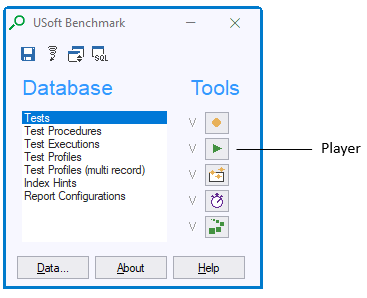

# Recording and playing tests

You can record a test procedure in USoft Benchmark. This test procedure is stored in the Benchmark database. You can then include the test procedure in a **test.** At any later time, you can play back this test (= repeat the steps of the test procedure or procedures included in the test).

You can have a number of reasons for playing back tests. Most importantly:

- By playing back, you can prove that what worked before, still works (*regression tests*).
- By playing back, you can measure how fast the Rules Engine is (*performance tests*).

## Recording a test procedure

To record a test procedure:

1. Open the client/server version of your application with USoft Benchmark running in it. See "” for details.
2. In the Benchmark toolkit window, in the Tools group, click the Recorder button.


3. In the Recorder dialog, click the Record button.


4. Drag the Recorder dialog to the side of your screen (by its title bar) so that it does not get in the way. In your application, perform whatever steps you want to record as a procedure. Do this by mouse-clicking and keyboard-typing as you would do if you were not recording. Notice that a indicates that the recording is ongoing and that a keeps a count of the steps you are recording:


5. When you are done, press the Pause button, then press Save to save the recorded steps to the Benchmark database. The procedure will be saved under the generated name visible in the "Procedure” field, but you can rename in the next step.


6. Press Close. Back in the Benchmark toolkit window, in the Database group, double-click and then key F2-F3 to query recorded test procedures. The procedure you have just recorded should be among them.
7. Rename the procedure if you like.

> [!WARNING]
> If you rename, Save the new name by pressing Save in the **Benchmark toolkit window**, not by pressing Save in your application menu:

 


8. Notice that the GUI objects you have affected (the ), the actions you have performed, and the values you have selected or typed, are relatively easy to recognise as the Target, Action and Parameters attributes of each Procedure Step. You can  Targets, Actions and Parameters manually if you wish:


Notice also that USoft Benchmark records an Application Status and a Record Status value for each procedure step:


Each time you play back the test procedure, for each step, you can have USoft Benchmark compare the Application Status and Record Status value detected at runtime with the Application Status and Record Status value recorded.

Here is the meaning of **Application Status** values:

|**Value**|**Meaning**|
|--------|--------|
|unchanged|No uncommitted data manipulations (INSERT, UPDATE, DELETE) have occurred since the most recent commit or rollback, or since the session started.|
|changed |One or more uncommitted data manipulations (INSERT, UPDATE, DELETE) have occurred since the most recent commit or rollback, or since the session started.|


 

Here is the meaning of **Record Status** values:

|**Value**|**Meaning**|
|--------|--------|
|changed |The current record has been queried and there HAVE been field value manipulations (UPDATE) in the record since it was queried or since it was last stored.|
|created |<p>The current record is a user-created unstored record:</p><p>- a new completely empty line has been created by the user calling the Create Record event; or<br/>- such a user-created empty line is in the process of being filled out with field values, but the record has not yet been stored; or<br/>- an ordinary empty line (with initial record status: 'new') is in the process of being filled out with field values, but the record has not yet been stored.<br/></p>|
|new     |The current record is an ordinary empty line. This applies when			<p>- an info box is first opened as an empty box, and also when<br/>- the user scrolls to the standard empty line that USoft generates below the last queried record line in a queried set of records.<br/></p>|
|query   |The application is currently in Query Mode. Any field values in the current record line have the status of query conditions.|
|unchanged|The current record has been queried and there have NOT been any field value manipulations (UPDATE) in the record since it was queried or since it was last stored.|
|(null)  |(The current context is not a record in an info box.)|


 

When scripting in the USoft Action Language, you can refer to the current Application Status and Record Status values like so:

```
:applicationStatus
:recordStatus
```

## Including your test procedure in a test

To play back a test procedure, you must first turn it into a **test**, or include it in some already existing test.

To turn the test procedure you just created into a test:

1. In the Benchmark toolkit window, in the double-click 
2. In the Test Name field, type the name of the test.
3. In the Executed Procedure field, type the name of the procedure you want to play back. Use the lookup button to the right if you want to select the procedure from a list.
4. Press Save to save work.

> [!WARNING]
> Make sure you press Save in the **Benchmark toolkit window,** not by pressing the Save button in your application menu:


## Playing back a test

> [!TIP]
> If you still have the Tests window open, instead of going through the steps below, it is easier to query or select the test you want to play and then press Run.

To play back a test:

1. In the Benchmark toolkit window, in the Tools group, press the Player button.



2. In the Select Test dialog, in the Test Name field, enter the name of the test you want to play. Use the lookup button to the right if you want to select the test name from a list. Press OK.
3. In the Player window, press Settings if you want to make any special settings for your test run:

|**Setting**|**Description**|
|--------|--------|
|Logfile |The location of the logfile being written to on the file system. The result of the test is concurrently shown in the Player window and written to a log file.|
|Interval|The number of milliseconds idle time between one procedure step and the next.|
|Procedure Checks|<p>If you set this to Yes, procedure checks are executed.</p><p>If you set this to No, procedure checks are ignored.</p>|
|Status Check|If you set this to Yes, for each procedure step, the Application Status and Record Status values recorded for that step are compared to the Application Status and Record Status detected at the time just after the step was played back, and if the two are found to differ, an error is raised with message “Application status lists different” or "Record status lists different”.|
|Stop testrun on error|<p>If you set this to Yes, the test run is aborted if and when an error is raised.</p><p>If you set this to No, the error is recorded in the logfile and the next procedure step is played.</p>|
|Profiler|If you set this to Yes, the Profiler tool is activated during the execution of the test run. This is equivalent to switching the Profiler on (by pressing Profiler in the Benchmark toolkit window), then executing the procedure steps manually, and then switching the Profiler back off.|


4. In the Player window, press Play Next repeatedly to play back (= execute) the procedure steps one-by-one, or press Play All to execute all the steps in one go. After Play All, you can interrupt execution by pressing Pause. You can press Rewind to go back to the beginning of the procedure:


5. Follow the result by reading the Result field for each procedure step, or click Logfile to inspect the log file of the procedure as a whole.