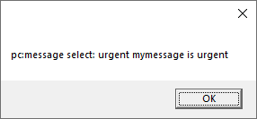

# pc:message


> [!NOTE]
> This article is about the **pc:message**[ Blend directive](/docs/Repositories/Blend_directives).

## **pc:message**

Displays a message in a pop-up alert box.

*Syntax*

```
<pc:message>  *content*  </pc:message>
```

The required *content* is the message displayed. The pc:message element name, along with the names and values of its attributes (if any), are also displayed.

*Example*

```language-xml
<pc:message select="urgent">
    mymessage is <pc:value-of select="//pc:message/@select"/>
</pc:message>
```

This example produces this alert box:



 