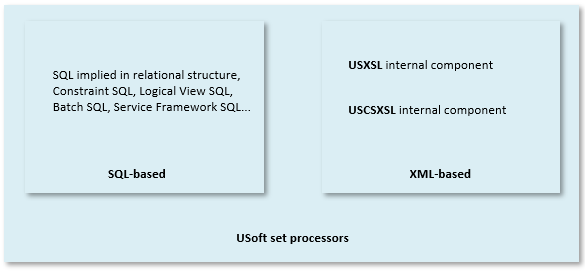
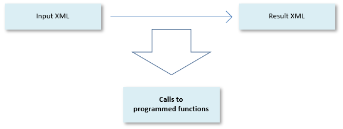

# Understanding USoft Blend

This article offers information about the concepts behind the USoft Blend scripting framework.

## Directives, functions, resources and utilities

### Directives

Directives are the nearest equivalent to Powershell **commands**. Here is an example script with 3 directives or commands. The first 2 are instances of the **pc:assign-string** directive. The first assigns the directory from which the Blend script was started to a variable called **workingdir**. The second uses this assignment to create a further variable called **deletefile** which identifies a file to be deleted. The last directive actually deletes that file:

```language-xml
<?xml version="1.0" encoding="UTF-8"?>
<mydocument xmlns:pc="Processing.Command">
   <pc:assign-string workingdir="{directories:Get()}"/>
   <pc:assign-string deletefile="{path:Combine($workingdir,'deletethis.xml')}"/>
   <pc:DeleteFile source="{$deletefile}"/>
</mydocument>
```

As you can see, the directives take the form of XML elements (a small amount take the form of XML attributes). The **pc:** prefix refers to the **xmlns:pc** namespace declaration at the top of the script. The prefix and the namespace declaration are necessary to set Blend directives apart from any other XML elements.

Directives use XML structure (element nodes, attribute nodes, text nodes) in different ways, but a typical structure is that input parameters are passed as attribute values, as the example demonstrates.

Blend directives are listed by name and by subject in [Blend directives](/docs/Repositories/Blend_directives).

### Functions

Functions are much like directives, but their syntax and structure is closer to the function calls that programmers are familiar with. Input parameters are passed between parentheses and separated by commas, and functions return a *return value*. An example is the **Combine** function in the **path** namespace, which is able to combine 2 or more elements into a path expression that points at a directory or file on the file system, and then to return that path as a string value, as in this context:

```language-xml
   <pc:assign-string deletefile="{path:Combine($workingdir,'deletethis.xml')}"/>
```

Blend functions are listed by name and by subject in [Blend functions](/docs/Repositories/Blend_functions).

### Resources

Resources are code examples of frequently used Blend scripts that USoft supplies for your convenience and that you can tweak to your specific needs. The command :

```
> *usoft-bindir*\ublendit.exe resources
```

gives you a full list of USoft Blend resources.

To export the code example(s) for the AskValue resource to a file called “AskValue.xml” in your working directory, give this command:

```
> *usoft-bindir*\ublendit.exe getresource:AskValue > AskValue.xml
```

To call (run, execute) the AskValue resource, give this command:

```
> *usoft-bindir*\ublendit.exe resource:AskValue
```

> [!NOTE]
> The **pc:call** directive has a **resource** attribute that allows you to call a resource from a script.

### Utilities

Finally, USoft supplies utilities. They are ready-made, stand-alone Blend scripts for general needs that teams often have. You can simply call (run, execute) these scripts when you need them.

Rather than design-time building blocks, utilities are runtime software. The only relationship with Blend is that they happen to be Blend implementations technically.

The command:

```
> *usoft-bindir*\ublendit.exe
```

(without anything following the program name **ublendit.exe**) gives you a list of common USoft Blend utilities with a short explanatory text.

> [!WARNING]
> usoft-bindir is the "\\BIN” or "\\BIN64” subdirectory of your USoft installation. Try:

The command:

```
> *usoft-bindir*\ublendit.exe help
```

gives you a more complete list including utilities for advanced developers and utilities with alpha/beta status. To run the **newudevelop** utility (for example), give the command:

```
> *usoft-bindir*\ublendit.exe newudevelop
```

## Anatomy of a USoft Blend script

### What is a USoft Blend script?

A USoft Blend script is a valid XML 1.0 document that is meaningfully transformed by the Batch.1.0.xsl transformation found in the \\xsl\\Util subfolder of your USoft installation folder.

In practice, a Blend script contains Blend directives: XML elements and XML attributes associated by the Batch.1.0.xsl transformation with an extension function. Each Blend directive is in a predefined namespace, most typically the "Processing.Command" namespace associated with the **pc:** namespaceprefix. The predefined namespaces for Blend directive are declared at the top of the Batch.1.0.xsl transformation. To use a Blend directive in your script, you must copy the associated namespace declaration to your script. The namespace declaration(s) are most commonly declared as attributes of the document node (the top-level node of the script).

In practice, it is the namespace prefix that signposts a given element as being a Blend directive as opposed to just any XML element.

The document node (the top-level visible node) can have any name and is not associated with a namespace. In practice, this name is irrelevant. In practice, all the remaining elements are Blend directives.

USoft Blend scripts are processed in such a way that the Blend directives are executed and any remaining XML nodes are copied to the output. In practice, the latter hardly applies.

*Example*

This script deletes the "deletethis.xml" file from the file system:

```language-xml
<?xml version="1.0" encoding="UTF-8"?>
<mydocument xmlns:pc="Processing.Command">
   <pc:assign-string workingdir="{directories:Get()}"/>
   <pc:assign-string deletefile="{path:Combine($workingdir,'deletethis.xml')}"/>
   <pc:DeleteFile source="{$deletefile}"/>
</mydocument>
```

The standard output of this script looks like this:

```language-xml
<mydocument>
  <!--files:DeleteFile(c:\myworkingdir\deletethis.xml) -->
</mydocument>
```

If this script is in a file called "myscript.xml", it is executed from the command line like so:

```
> *usoft-bindir*\ublendit.exe myscript.xml
```

### How is a USoft Blend script processed?

This section describes how your USoft Blend script is processed in the typical situation that is it transformed by the Batch.1.0.xsl transformation found in the \\xsl\\Util subfolder of your USoft installation folder.

The XSLT processor traverses all the XML nodes in document order. Each node encountered is, by default, copied to the result tree or standard output (identity transformation) unless there is a matching XSLT template with a different instruction for that node. This mechanism ensures that all the nodes in the script are visited.

In practice, the nodes in the script are Blend directives: they are such that there will be a template matching them, in which case the functionality associated with the template is executed, as opposed to the node being copied to the result tree.

Like any valid XML document, a USoft Blend script has a document element. This is the top-level element in the script. It can have any element name and is, by default, copied to the result tree. The document element typically contains Blend directives which are executed from top to bottom. The Blend directives do not show up in the return document but they could lead to information, warning and error messages being written to the output. Such messages are output as XML content of the document node.

*Example*

This script deletes the "deletethis.xml" file from the file system:

```language-xml
<?xml version="1.0" encoding="UTF-8"?>
<mydocument xmlns:pc="Processing.Command">
   <pc:assign workingdir="{directories:Get()}"/>
   <pc:assign deletedfile="{path:Combine($workingdir,'deletethis.xml')}"/>
   <pc:DeleteFile source="{$deletedfile}"/>
</mydocument>
```

When this script is processed:

- The \<mydocument> element is copied to the standard output.
- The "Processing.Command" namespace is declared. This causes the \<pc:assign> and \<pc:DeleteFile> elements to be qualified as Blend directives.
- The workingdir variable is assigned the folder path leading to the working directory.
- The deletedfile variable is assigned the file path leading to the file to be deleted.
- The file is deleted.

The standard output of the transformation looks like this:

```language-xml
<mydocument>
  <!--files:DeleteFile(c:\myworkingdir\deletethis.xml) -->
</mydocument>
```

## Understanding the USoft Blend architecture

### USoft set processors

USoft processes structured data sets in a set-oriented way, using primarily SQL-based and XML-based techniques.

SQL-based set processors execute SQL written in USoft constructs such as constraints, Logical Views, batch jobs, and SQL statements in other tools such as the Service Framework. A number of relational structures such as Delete Rules for relationships are also implemented using a SQL-based set processor.

XML-based set processors use XSLT to transform an XML data set (presented as an XML document) into a different XML dataset. These processors are RDMI (Rules-Driven Method Invocation) components in USoft, meaning that they can be called from a SQL context.

Further XML-based components have been added to provide a full XML toolkit, especially the XML.IMPORT and XML.EXPORT methods that allow you to move relational data between repositories and exchange them between a USoft application and other software.



Both USoft XML-based set processors allow you to:

- Process file-based XML as well as inline XML.
- "Mix in" data sets into the input XML or into the XSLT stylesheet before the XSLT transformation is executed. For details of "mixing in" click [here]().
- Cache compiled XML and XSLT for faster processing.

More explanation on RDMI is [What is an RDMI component](/docs/Extensions/RDMI_Components/What_is_an_RDMI_component_and_how_do_you_create_one.md).

### The USXSL internal component

The [USXSL internal component](/docs/Extensions/USXSL_internal_component/USXSL_internal_component.md) is an XSLT 1.0 processor written in Xalan/C++ that allows you to apply XSLT 1.0 transformations to XML data sets.

This component supersedes the earlier XSL off-the-shelf component, an XSLT 1.0 processor written in Xalan/Java now supported for backward compatibility only.

### The USCSXSL internal component

The [USCSXSL internal component](/docs/Extensions/USCSXSL_internal_component) is an XSLT 1.0 processor written in .NET/C# that allows you to apply XSLT 1.0 transformations to XML data sets.

You can invoke this component in the same way as any other RDMI component from a USoft context, but you can also call it from the command line using ublendit.exe.

This XSLT processor has been extended with a library of extension functions. This added library sets USCSXSL apart from the USXSL internal component. Compared to the USXSL component, this component has the special characteristic of being aware of the functions referenced in the Batch.1.0.xsl stylesheet found in the \\xsl\\Util subfolder of your USoft installation folder. This makes this component suitable for executing these operations on input XML documents referred to as USoft Blend scripts.

As any internal RDMI component, USCSXSL may be called by executing an INVOKE or SELECT statement from a USoft SQL context. Alternatively, you can call USCSXSL from the command line.

One typical use of USCSXSL is for it to be passed a valid USoft Blend script and to apply, to that input XML, the standard Batch.1.0.xsl transformation found in the \\xsl\\Util subfolder of your USoft installation directory. In this use case, USCSXSL applies an identity transformation to the Blend script.

### USCSXSL as an extended XSLT processor

In its role of an extended XSLT processor, USCSXSL allows you during the transformation to:

- Access XSLT 2.0-like functions such as dynamic XPath expressions, string manipulators, regular expression engines, and Math functions.
- Add convenience functions not found in XSLT 1.0, such as diffs on node sets, file IO functions (path, directory, file, copy, move, zip), date formatting functions, device info functions, Text2XML converters, registry manipulation functions, or a stopwatch.
- Store string values and XML fragments in variables, and then retrieve these values at a later point for use by a different part of the XSLT transformation. Variables can be queued, stacked, listed, and contained in dictionaries.
- Add interactive behaviour to your XSLT transformation (dialogs, console).

### USCSXSL as a Blend script processor

When used to apply the Batch.1.0.xsl transformation, USCSXSL allows you to process directives defined for the "Processing.Command" namespace. These directives take the form of instructions (elements) in the XSL stylesheet that translate, via a set of predefined XSL templates, into the execution of extension functions. You can use this technique to perform standard USoft tool routines programmatically and in the context of a command script that is an ordered sequence of directives. Standard USoft tool routines include:

- Dropping and re-creating a repository.
- Running Create-Tables for an application.
- Importing or exporting application data.
- Generating flat files.
- Synchronising consumed modules.
- Publishing a server as in USoft Service Definer.
- Publishing a web application as in USoft Web Designer.

USCSXSL allows you to blend-and-mix USoft routines with more generic routines such as moving and dropping files and folder on the file system, executing OS commands from the command line, or calling the USoft Rules Service in scope and tell it to perform a query or data manipulation.

### Identity transformation

When you use USCSXSL to process a Blend script, you call the Batch.1.0.xsl stylesheet. This stylesheet performs an identity transformation: it traverses all the nodes of the input XML and outputs each encountered node to the result tree. In the process, for each node processed, function calls encountered in the stylesheet are executed. A  function may perform any kind of operation on the computer, including data manipulation in a USoft application or directly in the RDBMS; file system operations; and the execution of OS commands. The primary purpose is not to obtain the result tree, but rather to obtain that functions are applied to specified XML nodes.



The point of using USCSXSL to execute a Blend script is not so much to obtain the result XML, but principally to call extension functions 