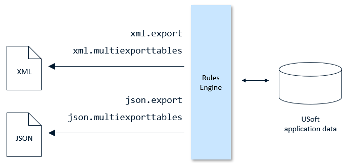
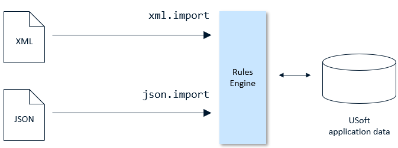
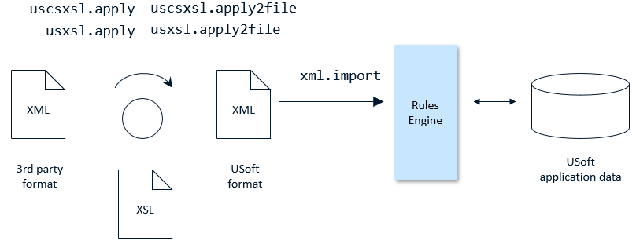
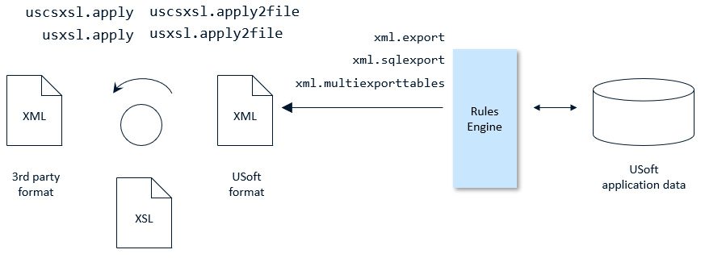

# Data flow control with XML or JSON

## Exporting and importing XML or JSON data

The principal capability of the Rules Engine's XML and JSON support is data exchange:

- **Exporting** data from a USoft application to an XML file or JSON file.

- **Importing** data from an XML file or JSON file into a USoft application.

The facility is offered as a small collection of *internal components.* Internal components are [RDMI components](/docs/Extensions/RDMI_Components) that come as part of the USoft installation: you do not need to install these components separately.

You can export data to XML by calling [XML.Export](/docs/Extensions/XML_internal_component/XMLExport.md) (for a single table) or [XML.MultiExportTables](/docs/Extensions/XML_internal_component/XMLMultiExportTables.md) (for multiple tables).

You can export data to JSON by calling [JSON.Export](/docs/Extensions/JSON_internal_component/JSONExport.md) (for a single table) or [JSON.MultiExportTables](/docs/Extensions/JSON_internal_component/JSONMultiExportTables.md) (for multiple tables).

:::warning

You can also call [XML.SQLExport](/docs/Extensions/XML_internal_component/XMLSQLExport.md) for an output format with more metadata information, but this format is not automatically re-importable.

:::

You can re-import XML data exported in this way. Call [XML.Import](/docs/Extensions/XML_internal_component/XMLImport.md).

You can re-import JSON data exported in this way. Call [JSON.Import](/docs/Extensions/JSON_internal_component/JSONImport.md).

## Transforming XML data

When you import data from XML to USoft, you need to make sure that this data has the USoft-specific data format that the Rules Engine expects. This data format is described as the USoft XML format. If you have data coming in from 3rd party sources, you frequently need to **transform** this data so that it fits the USoft data format.

One way to achieve this kind of data transformation is to apply an XSLT stylesheet to the data.

Call the **apply** or **apply2file** methods of the [USXSL](/docs/Extensions/USXSL_internal_component) or [USCSXSL](/docs/Extensions/USCSXSL_internal_component) components:

The same scenario applies also in the other direction, for example, if you want a USoft application to deliver XML reports in a format expected by an external report writer or publication software:

 