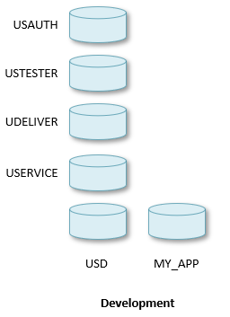
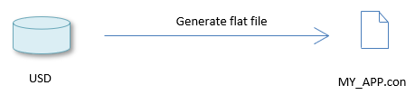
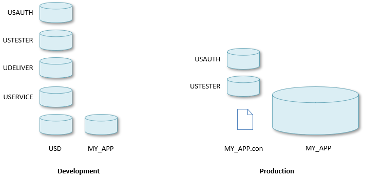
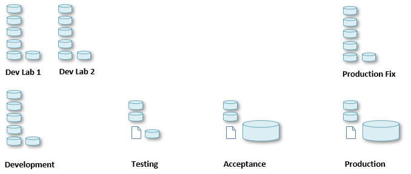
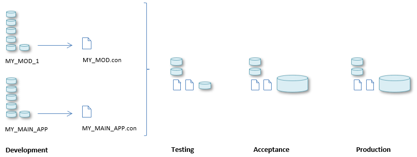
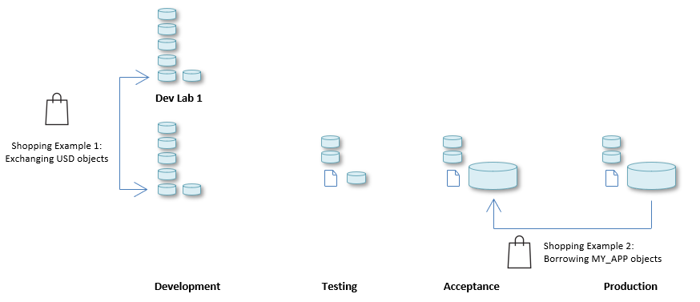

# Introducing repositories

The USoft platform is strongly data-oriented. It is **repository-based** not only because it allows you to create applications that interact with end user data, but also because all the data held by the USoft development tools is equally stored in structured database records.

A **repository** in USoft is any set of tables in a database that have a common purpose and that form an **application**.

In USoft, you develop your application, say an application called MY_APP. You do this primarily by working in USoft Definer. USoft Definer’s application name is USD. So, when you start development in USoft, you have at least 2 repositories: one with USD tables and another with MY_APP tables.

You need the MY_APP tables in Development because, during development work, you regularly need to run an example of the evolving application for testing and debugging. You need the USD tables in Development simply because the USoft Definer tool is repository-based: everything you declare is stored in a database record.

The MY_APP repository in Development will be relatively small: it has representative end user data, but not many.

In Development, you also run the USoft Authorizer or USAUTH application. This runs from its own tables: a third repository. Depending on your needs, you may run also USoft Benchmark (USTESTER), USoft Delivery Manager (UDELIVER) and USoft Service Definer (USERVICE). All these USoft applications again run their own repository.

These repositories may or may not co-exist in the same underlying database or database account, depending also on the structure of your RDBMS. If they co-exist, table name prefixes keep them separate:

|**Application**|**Technical name**|**Table name prefix**|
|--------|--------|--------|
|USoft Authorizer|USAUTH  |T_AUTH_...|
|USoft Benchmark|USTESTER|T_TEST_...|
|USoft Delivery Manager|UDELIVER|T_UDL_...|
|USoft Service Definer|USERVICE|T_SVC_...|
|USoft Definer, Windows Designer, Web Designer|USD     |T_(other)...|
|Your application under development|(any other name)|(any other)|

In Production, the situation is similar, except that a typical strategy is to create a flat file from the USD repository for deployment in Production. You do this by running the Generate Flat File routine in USoft Definer:

The principal flat file has the .**con** extension, but there are other flat files you can create (not shown here).

In Production, you must run USoft Authorizer for dynamic authorisation, and you may or may not run USoft Benchmark from repository. You typically don't run any of the other development tools. But the MY_APP runtime database will typically be much larger than in Development, because this is where the end users interact with data.

This picture visualises these differences between Development and Production:

A full-fledged USoft DTAP ecosystem (Development-Testing-Acceptance-Production) will multiply these repositories in a variety of ways in different environments, depending on your needs and preferences: for example:

## Working with repositories

A repository must be stored in a slot in a relational database. Precise terminology differs slightly between databases. A repository may be stored in a *database schema* in a specific *database* (SQL Server), or in a *database account* (Oracle), although Oracle increasingly uses the term *database schema* rather than *database account.* In any case, all the tables of a repository are *owned* at database level by the same *user.*

To work with repositories effectively, you need to know how to perform the following basic tasks:

- (At RDBMS level:) Creating the database slot.
- (At RDBMS level:) Dropping the database slot.

- Creating the (empty) database tables that form a given repository. This is called "create-tables” or "creapp” in the USoft community.
- Dropping the database tables that form a given repository. This is called "drop-tables” in the USoft community.

- Populating the database tables that form a given repository with *data*.
- Emptying the database tables that form a given repository.

USoft offers many tools and utilities to perform these 6 basic tasks. In addition, USoft offers ways of dealing effectively with *part repositories:* this allows you to do things like splitting a repository into parts, releasing one part independently from the rest, or copying, dropping, moving, merging and splicing repository parts. See "Part repositories” later in this article.

## Tools and utilities for basic repository management tasks

This section discusses different ways of performing the 6 basic repository management tasks identified in the previous section.

### USoft Binder

USoft Binder offers not only access points to repositories from a Windows tool. It also offers menu options for creating and dropping repository tables. Right-mouse-click on a Binder item and choose Create Tables to create database tables. In the dialog, there is a "Drop Existing Tables” option. If you set this option, any existing tables will first be dropped.

> [!CAUTION]
> Drop Existing Tables = Yes will cause all your existing work to be dropped permanently from the database. There is no option to recover this data.

A quick and easy way to set up a USoft environment is to create a database schema at RDBMS level and then perform these steps:

1. Open USoft Binder.
2. In File, Project Properties, Database, point at the database schema (the empty slot in the database where you want your USoft repositories).
3. In the menu, choose Item, New. Check at least the boxes for Authorizer, Definer and User Application.
4. In the item list in the main tool window, right-mouse-click on Authorizer and choose Create Tables.
5. In the item list in the main tool window, right-mouse-click on Definer and choose Create Tables.

> [!TIP]
> The reason you first need to create the Authorizer repository is that "Create Tables” for Authorizer will authorize the database user (the owner of the tables) to access the USAUTH applications. This is a necessary bootstrap action. Once this is done, there is an Authorizer entry to allow the user access to any repository. Step 5, Create-Tables for Definer, automatically adds access rights for the user to USD = the USoft Definer tool, and so on.

You are now  ready to start developing your application. Double-click Definer and start work. As soon as you want to see the runtime result of your work in a default client/server interface:

1. In the item list in the main USoft Binder tool window, right-mouse-click User Application and choose Properties. In the property sheet, set Application Name.
2. Right-mouse-click User Application again, and now choose Create Tables.
3. Double-click User Application to access the application you are developing.

> [!TIP]
> Step 2 will physically create the tables you have been declaring in Definer and will also (in Authorizer) add the user to the list of people who are allowed access to your application. To see this, double-click the Authorizer item and browse the catalog on the left.

### USoft Delivery Manager

In spite of the name, the purpose of the USoft Delivery Manager tool is not only to deliver (versions of) finished applications, but also to make it easy for you to do basic repository management tasks.

Delivery Manager lets you define basic tasks (called [actions](/docs/Continuous%20delivery/Delivery%20Manager%20actions%20by%20name)) such as creating tables in a database slot, or importing, exporting, copying, moving data from and to tables in repositories.

### Repository management wizards

A number of command line tools let you perform basic [repository management wizards](/docs/Repositories/Introducing%20repositories/Repository%20management%20wizards.md) by filling out dialogs (wizard steps).

### USoft command line

Certain basic USoft repository management tasks can be run [from the command line](/docs/USoft%20for%20administrators/USoft%20command%20line%20syntax).

### Blend scripting framework

You can script sequences of basic repository management tasks using the [Blend scripting framework](/docs/Repositories/Blend%20scripts%20for%20repository%20management). This is an alternative to using PowerShell. It has the advantage of offering comprehensive commands for typical USoft routines such as create-tables and load-data.

## Part repositories

USoft offers 2 principal techniques for managing parts or subsections of repositories:

- Modular development.
- Object shopping.

The sections below explain. The 2 techniques compare as follows:

|**Modular development**|**Object shopping**|
|--------|--------|
|Labour-intensive, requires design of deployment scenarios|Quick and easy for ad-hoc purposes|
|Long-term benefits|Short-term benefits|
|Suitable when part of an application is re-used by multiple teams and remains relatively unchanged|Suitable for a range of smaller tasks|
|Suitable when a large application is developed by distinct teams whose work must be combined|

## Modular development

The principle of modular development is that you develop different parts or **modules** of application functionality in distinct repositories. You then use Generate Flat File to create flat files of each. In non-Development environments, these flatfiles together form "the application". The application is modular ONLY in Development, apart from the fact that multiple flat files exist in non-Development environments:

 

## Object shopping

The principle of object shopping is that you define "shopping baskets" of USoft objects in one repository, and then export them for import in a different repository. For example, such a "basket" could be a subset of tables that cover some specific business area.

Object shopping has many use cases. The picture below just visualises 2 examples. In Example 1, some part of the development repository is temporarily moved to a separate Lab in Development, perhaps so that other team members are not hindered by its development, or because you want to debug this part away from the activities of others. When you are done, you can "shop back" what you need. In Example 2, end user data are shopped from Production into Acceptance to get realistic data for performance tests there.

Example 1 is an example of **metadata** management: metadata is the data that describes the application. Example 2 is an example of **application data** management.

USoft implements object shopping as a framework of XML import and export utilities that share a common [USoft XML format](/docs/Repositories/USoft%20XML%20formats/USoft%20XML%20formats.md):

- In USoft Definer, more advanced tooling allows developers to create, export and import "baskets" of related objects declaratively.
- In USoft Delivery Manager, you can compose tasks that call actions for exporting, importing, transforming and comparing both metadata and application data.
- At a lower, more technical level, you can program calls to the [XML internal component](/docs/Extensions/XML%20internal%20component). You can string these calls together by using a scripting framework such as MS Powershell, but also the USoft Blend scripting framework.

## USoft XML formats

The USoft platform has a range of tools, features and APIs for selecting, importing, exporting, moving, comparing data from and between repositories. These tools share common **USoft XML formats** or XML schemas: common ways of representing relational data.