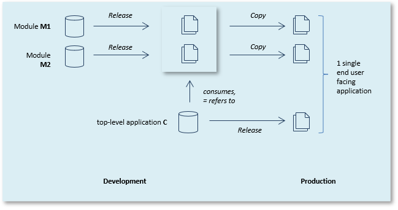

# Modules as a concept

USoft allows you to develop modular applications (**modules**) that you can deploy as part of one or more other USoft applications. These other applications are *consumers* of the module functionality. The modules themselves are the *providers* of the functionality.

At runtime, the modules are merged into a single application. End users do not see providers and consumers.

## Why modules?

If you have clearly delineated functionality that is re-used by multiple consumers, modules solve the problem of having to do double work to maintain duplicates.
Another problem that modules may be able to solve, is that when you have a single, large repository, you must always release it as a whole. Small projects may have to wait for larger projects to complete. Modules make you more flexible: you can develop and deploy a module relatively independently of its consumers.

## A word of caution

Splitting a USoft application into modules is a big strategic decision that cannot be rolled back easily. It can yield lasting benefits in the long term. But to make modules a success, you also need to put in a great deal more project management and organisation effort than when you have a single USoft application.

Every situation is different so it is difficult to give general guidelines. One driver for modularisation is that you already have a module that is used in a different application, and that you want to re-use. Another driver for modularisation is that you already know that you want to separable applications developed by distinct teams, and that it is better to connect the 2 at a later time.

In general, in greenfield situations it is **not** recommended to split the work in modules straight away because of the unnecessary overhead and because at the start, you are not in the best position to estimate how the material is best broken up into modules. It is much better to start with a single application. You can use object shopping facilities to separate the repositories into modules later, if necessary.

## Architecture

Here is a picture of a consumer C of 2 modules M1 and M2. The picture shows 3 USoft applications (C, M1, M2). Each is developed in its own repository:



 

In Development, C refers to M1 and M2. To test-run the solution as a whole, module flatfiles must be available in the \\APP subdirectory of the local USoft installation directory. When you run Create Tables for C (for the C/S User Application in Development), you can see that not only C's "own" database tables are created, but also the tables described in the "M1.con" and "M2.con" flatfiles.


At release time, typically, flatfiles are also created for C, and the entire collection of flatfiles (for C, M1, M2) is deployed in Production.

In Production, the runtime user of C is confronted with a single application. The modules are a separate reality only in Development, not in Production.

## Adding a module to an application

To add an application M1 as a module (as a provider of functionality) to another USoft application C (the consumer):

1.    Develop M1 in its "own" repository.
2.    Generate flat files for M1.
3.    Copy these files to the \\APP directory of the USoft installation directory in the Development environment for C.
4.    In USoft Definer for C, choose Tools, Manage Internal Interfaces, Modules from the main menu. The Application Modules window opens.
5.    In the Module Name column, declare the module name (here: M1). Make sure Load Module = Yes (the default). Save work.
      When you next create application tables for C, the tables declared in "M1.con" are also created within C. They are visible when you choose View, Objects in the runtime C/S application.

## Interface objects and synchronisation

It is one thing that C refers to the M1 application as a whole. This makes C a consumer of M1: M1 becomes part of the C application in Production, and also earlier, when C is test-run in Development or in Testing.

It is another thing that C may be allowed to refer to specific M1 objects (domains, tables...). The C development team can only refer to M1 objects that have been made interface objects by the M1 development team.

Interface objects are the equivalent of public classes in object-oriented programming. Non-interface objects are the equivalent of private classes. In the same way as in programming, interfaces allow developers of modules to expose certain objects whilst at the same time keeping other objects private. This way, dependencies between consumer and provider are minimised. This avoids communication overhead. It also makes the solution more flexible, easier to deploy, and less error-prone. This is particularly true if the number of interface objects can be kept to a minimum.

USoft offers a number of synchronisation features to help the C development team refer to interface objects of M1 in a controlled way, and especially, to deal with changes in the interface. The C development team can synchronise the C application with a (new) module.con flatfile. Synchronisation advertises the M1 interface objects in the C repository, so that C developers can reference them, but also removes references to dropped interface objects. It also provides automatic listings of correct and no-longer-correct interfaces.

## Exposing an interface to an application

> [!WARNING]
> Consider carefully if you want to expose an interface to a consumer. There is no quick way of getting rid of all the interface objects if you decide you do not want them after all.

To expose an interface (= the entire collection of interface objects) defined in a module M1 to the Development environment of a consumer C:


1.    In the Development environment for M1, identify the objects (domains, tables...) that you want to be interface objects. Do this by setting Interface = Yes for these objects.
2.    Make sure that M1 is known to C as a module. To do this, follow the earlier "Adding a module..." steps.
3.    In USoft Definer for C, choose Tools, Manage Interface Interfaces, Consumed Interfaces.
4.    On the Synchronization tab, type the Module name ("M1" in the example), then in the same record, in the "File to be used..." field, enter the filepath to the "M1.con" file that you want to be used as a basis for synchronisation.

If you do not provide an an absolute path, the Definer will look in the \\APP subfolder of the USoft installation folder. You are also allowed to use environment variables in this field, for example:

```
%SystemDir%\app\%USCurrentVersion%\MyModule.CON
```

5.    Read the Dialog text carefully. If you are sure you want to go ahead, click the Synchronize Internal Interfaces button.
6.    Perform necessary actions to solve Incorrect Interfaces, if any.