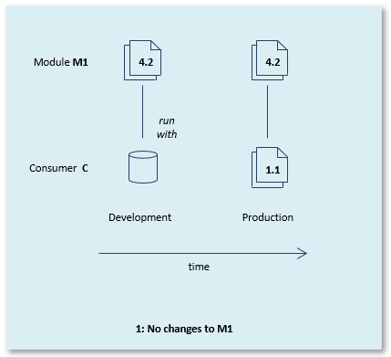
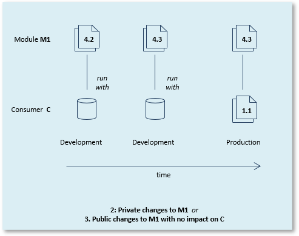
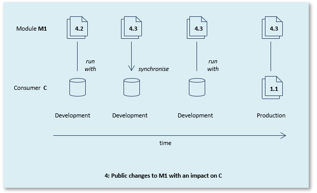

# Modules as a working agreement between teams

If done well, modular development gives teams more freedom because it makes them less dependent on each other.

But to get it right, careful communication is required between those developing the module and those developing the consumers of the module. Each consumer-module relationship is a working agreement between teams.

How much discussion and exchange of information is needed, depends on how interdependent the applications are. The easiest is when the module is completely self-sufficient and there are few interface objects (or none at all). The most difficult is when consumer and module are intertwined to a large degree and there are many interface objects.

Here are some examples with varying degrees of dependency. The pictures show a situation in which a version 1.1 of a consumer application C is being prepared in Development and then released into Production. Application M1 has been added to C as a module.

## Example 1: Module does not change

In this example, there is no change in module M1. This could be because the C team has decided they are not interested in a newer version of M1, or because the M1 team has not produced any later M1 version, or because the teams have decided together that there is no advantage in changing the M1 version that C runs with.

A version 4.2 of M1 has been supplied to the C development team. For test-run purposes, they run the evolving version 1.1 of C with the 4.2 flatfiles of M1 in Development. When the solution is ready, 1.1 flatfiles of C and 4.2 flatfiles of M1 are all released into Production.

If version 1.0 of C already ran with version 4.2 of M1, the C development team requires no further communication with the M1 team at any time during the production of 1.1. In that case, the 4.2 flatfiles of M1 were released to Production previously: they do not need to be re-released for 1.1.

## Example 2: Module has only private changes

In this example, module M1 has private changes. There are changes compared to version 4.2, but these are only in non-interface objects. A version 4.3 of M1 must be supplied to the C development team, so that they can test-run with version 4.3, but because the changes are only private, the C development team does not need to worry about how the changes might affect their own work. The M1 team is free to implement this kind of change without explaining to consumers what they are doing. When the solution is ready, 1.1 flatfiles of C and 4.3 flatfiles of M1 must be released into Production.

## Example 3: Module has public changes with no impact on the consumer

In this example (same picture as for Example 2), there are **public** changes to version 4.2 of the module. They are changes to interface objects. However, teams have discovered that these changes have no impact on how C uses M1. For example, it could be that a new interface table has been added to M1, but teams have concluded that C has no interest in addressing this new table.

As before, a version 4.3 of M1 must be supplied to the C development team, so that they can test-run with version 4.3, but otherwise the C development team does not need to worry about how the changes might affect their own work.

Even in this Example 3, there is **still no need for the C team to (re-)synchronise C with M1**. This is true in spite of the interface having changed.

## Example 4: Module has public changes with an impact on the consumer

In this example, there are public changes to version 4.2 of the module. They are changes to interface objects. This time, teams have discovered that these changes have an **impact** on how C uses M1.

Perhaps C needs to refer to a new 4.3 interface object that was not available in version 4.2. Another example of impact could be that C still refers to an interface object that no longer exists as an interface object in the 4.3 interface, but at the same time there are pressing reasons in other areas for the C team to upgrade to version 4.3.

This time, a version 4.3 of M1 must be supplied to the C development team **and then the C team must (re-)synchronise C with M1.**

In this synchronisation step, conflicts between the old C use of M1 and the new M1 situation could surface; if they do, they are reported as Incorrect Interfaces and they must be solved manually by the C team. 