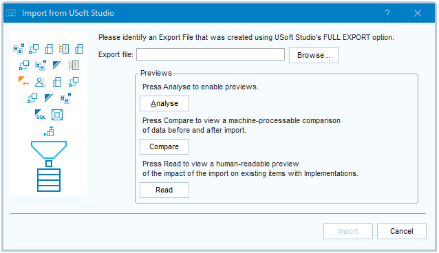

# Importing from USoft Studio into USoft Definer 10

 

> [!NOTE]
> **See also**
>  

----

`< 10.0.1D``{.vs_10}`

Before USoft 10.0.1D, on import, all Business Rules no longer in USoft Studio (ie., not found in the export file) were automatically dropped from USoft Definer if they did not have related Implementations attached to them. In 10.0.1D and later, only Business Rules with Source = USOFT STUDIO are automatically dropped, but the import fails if it attempts to drop a Business Rule with related Implementations.

Before USoft 10.0.1D, the import utility was not aware of USoft Studio version control. In 10.0.1D and later, if Studio has multiple versions of the same formulation, the import utility selects the correct version for import.

Before USoft 10.0.1D, the import utility did not transfer Motivation values. Motivations were also special in that they had a cascading Delete Rule to Business Rules. Since 10.0.1D, Motivations are transferred by Import using the same UPSERT principle as other rule attribute values. Since 10.0.1J, Motivations have a nullifying Delete Rule to Business Rules, same as other rule attributes.

Before USoft 10.0.1D, it was possible to customise the XSLT transformation in the "Import from USoft Studio” wizard dialog. In 10.0.1D and later, this is discouraged, and only possible by setting the UREQUIRE_INPUT_XSL Rules Engine Parameter.

----

`10.0.1D``{.vs_10}`

With a few clicks, you can get data from a USoft Studio project into USoft Definer 10.

Go to the USoft Studio project as an Owner, press **Administration** (Du.: Beheer), then press **Export Full** (Du.: Export Volledig). An XML export file is downloaded.

From the USoft Definer 10 menu, choose Teamwork, Object Shopping, Import from USoft Studio. Or click this icon in the icon ribbon:


You can now see this dialog:



In the **Export file** field, point at the XML file you just downloaded from USoft Studio.

At this point, you can do one of 3 things:

- Import****the Studio data straight away into Definer. Press **Import**.
- Inspect a "Compare” preview report first. Press **Analyse**, then **Compare**.
- Inspect a “Read” preview report first. Press **Analyse,** then **Read**.

> [!WARNING]
> The import utility potentially overwrites or deletes records in the Business Rules table. The preview reports can help you decide if you are OK with that.

----

----

## Import

This section describes in detail what happens when you press **Import**.

The import procedure has 3 steps. In Step 1, the input data is *filtered:* only a subset of the information coming from Studio is selected for import into Definer. In Step 2, this selected data is actually *imported*. In Step 3, Business Rules in Definer that are no longer in Studio are *deleted* under certain conditions. These steps form a single transaction: if anything goes wrong, the entire procedure is rolled back.

### Step 1: Filter

This step filters out information from Studio that does not map to Definer, or is considered inappropriate for import into Definer. This is a filter operation: the result is a subset of the full data set exported from Studio. There is 1 exception: the operation also adds 1 record for the Source table, as explained below.

This filter is implemented by the “ImportFromUSoftStudio.xsl” XSLT transformation in the \\xsl\\Util subdirectory of your USoft installation directory. If you like, you can play back and inspect how the filter works. Do this by executing:

```sql
SELECT  usxsl.apply(
    *Studio-export-file*.xml
,   *usoft-install-dir*\xsl\util\ImportFromUSoftStudio.xsl
)
```

You can customise this filter. See the “Customising the import filter” section at the end of this article.

The result set that is output by the filter operation contains records for the following Definer tables only:

- Business rules
- Classifications
- Motivations
- Sources (1 record only)
- Business areas
- Business objects
- Rule sets

Studio "Formulations" (even formulations that are not intended as business rules) map to Definer "Business rules". The other tables map in obvious ways (a Rule Set in Studio is a Rule Set in Definer).

The result set contains a single Source record with source name "USOFT STUDIO", regardless of what Sources (if any) have been defined in Studio.

The result set does not contain Studio detail lines.
The result set does not contain Studio formulations with Classification = Location (these correspond to diagrams).
The result set only contains formulations with Requires Implementation = Yes.

The result set only contains Formulations

- with Status = Current. These are current according to Studio version control.
- with Status = Planned and for which there is no other formulation with the same ID and Status = Current. These come from a Studio project that is not (yet) under version control.

For Formulations (imported in Definer as Business Rules), the result set contains only the following attributes:

- ID
- Classification
- Formulation
- Motivation
- Source
- Business area
- Business object
- Rule set
- Defined
- Defined By
- Requires implementation
- Approved
- Approved By

### Step 2: Import

The result set is imported into USoft Definer following the “[UPSERT](/docs/Extensions/XML_internal_component/XMLImport.md)” principle:

- Any item found in Studio but not in Definer is **added**.
- No item is **deleted**.
- For any item found both in Studio and in Definer, but with differences in non-key columns, the Definer column value is **changed** to the Studio column value.

As a special measure, the Source of every Formulation / Business Rule in the result set is automatically set to USOFT STUDIO.

> [!TIP]
> In theory, this last measure allows you to have Business Rules from other sources than Studio. But in practice, if you are using the Import facility from Studio, it is better to have just USOFT STUDIO as a Source, if you can.

### Step 3: Delete obsolete business rules

This step deletes all Business Rules in Definer with Source = USOFT STUDIO and an ID that no longer appears in the Studio export file.

This is only successful if all the Business Rules in this set are without Implementations. If there are Implementations, an error is raised and the entire Import operation is rolled back. This is because in Definer, you cannot drop a Business Rule that has remaining Implementations.

## “Compare” preview report

This report offers a full comparison between Studio and Definer of all the items in the following tables:

- Business rules
- Classifications
- Motivations
- Sources
- Business areas
- Business objects
- Rule sets

This report describes differences by using [DML instruction tags](/docs/Repositories/USoft_XML_formats/DML_instruction_tags.md), a standard feature of USoft XML:

|        |        |
|--------|--------|
|`<Insert>`|The item is found in Studio, but not in Definer.|
|`<Delete>`|The item is found in Definer, but not in Studio.|
|`<Update>`|The item is found both in Definer and in Studio, but there are differences in non-key columns.|


If your “Compare’ report contains this item:

```language-xml
<Rule_Sets documentName="Rule Sets">
  <T_RULE_SET NAME="Address change" BUS_AREA="General" DESCRIPTION="">
    <Delete/>
  </T_RULE_SET>
</Rule_Sets>
```

this means that the Definer “Address change” rule set is not (or: no longer) found in Studio. If you run **Import**, this rule set is not actually deleted from Definer. Import never deletes rule sets, as explained in the previous section.

The "Compare” preview report is machine-processable. If you like, you can remove a difference, or a set of differences, by passing it to XML.Import. This gives you complete control, but the primary purpose of the “Compare” preview report is not to offer an executable but rather to allow you to inspect and analyse the differences. USoft recommends you use the standard **Import** routine (previous section) to transfer data from Studio to Definer, except perhaps in special cases when you have a reason to tweak manually.

> [!NOTE]
> This kind of comparison report is a standard feature of USoft Blend and USoft Delivery Manager.
> [Compare in USoft Blend](/docs/Repositories/Blend_directives/pcCompare.md)
> [Compare in Delivery Manager](/docs/Continuous_delivery/Delivery_Manager_actions_by_name/Compare_data_files.md)

## “Read” preview report

This HTML report is human-readable and non-machine-processable. It reports on 2 specific topics that it identifies by the words **Deletes** and **Updates**:

|**Topic**|**Description**|
|--------|--------|
|Deletes |Business Rules that have one or more Implementations in Definer, but are not (or: no longer) found in Studio.|
|Updates |Business Rules that have one or more Implementations in Definer, but now have a different formulation text in Studio.|


At the top of this report, there is 1 message indicating the severity level of the situation. This message depends solely on the presence or absence of what is called "Deletes” and "Updates” here. As long as there are any Deletes, the severity level is 4, regardless of any Updates. Otherwise, as long as there are any Updates, the severity level is 3. Next, as long as there are any remaining changes to the Business Rules table other than Deletes or Updates, the severity level is 2, otherwise 1. At severity level 4, as the message text states, you cannot run the Import routine. At the other levels, you can.

|**Severity level**|**Message**|
|--------|--------|
|4       |> [!CAUTION]
> This import will fail because the import will attempt to delete items that have remaining Implementations. These items are in Section A below.

|
|3       |> [!WARNING]
> This import will change formulation texts for items that have remaining Implementations. These items are in Section B below. If this is not what you want, make changes before or after the import, as appropriate and convenient.

|
|2       |> [!TIP]
> This import can go ahead. There are no remaining Implementations for items that the import will delete or change.

|
|1       |> [!NOTE]
> This import will not affect the Business Rules table in any way.

|


In Sections A. and B. of this report, a list is provided of all the Deletes and Updates. This list identifies each item, showing also the change in formulation text in the case of Updates. For each item, the Implementation(s) found in Definer are identified by name, in the same way as on the Implementations tab in the Business Rules window in Definer.

## Best-practice tips for importing from USoft Studio

The Import utility has been designed for teams who want to use USoft Studio and the USoft Platform in parallel. It provides a "bridge’ between the 2 tools.

### Run the Import often

Run the Import often, so that Studio and Definer remain in sync. You can always use the preview reports to inspect any unwanted consequences ahead of time, but if you run Import often, you will become used to what it does and does not do.

### Make edits in 1 place only

Never edit data elements in Definer that could be overwritten the next time you run the Import bridge from Studio.

For many teams, in practice, the best convention is that no team member makes any edits in the Teamwork area of Definer at all, except by editing in Studio and then letting the Import bridge make the edit in Teamwork. The only Teamwork data elements you should allow people to edit directly in USoft Definer screens are:

- Implementations attached to Business Rules.
- Built, Built By, Tested, and Tested By fields.

> [!NOTE]
> Definer has special [..._NO_STUDIO roles](/docs/USoft_for_administrators/Creating_a_USoft_Development_environment/Authorising_team_members_for_USoft_100.md) that guarantee that the Definer user does not manipulate Business Rules that should be manipulated in USoft Studio instead.

### Defined, Defined By, Approved, Approved By

These 4 fields are in the bridge. Make sure that you edit them in Studio and not in Definer. The edits will be duplicated in Definer the next time you run the Import.

### Built, Built By, Tested, Tested By

These 4 fields are not in the bridge. Make sure that you edit them in Definer and not in Studio. It is a good idea in Studio to take these fields off the screen. You can do that in the Workspace (Du. Werkruimte) area after pressing the Administration (Du. Beheer) button in the Home screen.

## Customising the import filter

Advanced users can write a custom XSLT transformation to change what happens during Step 1: Filter of the Import routine.

> [!WARNING]
> Do this only if you have a special reason, and keep changes minimal. Some forms of customisation impair the import utility as it was intended by USoft. This applies, for example, if you customise the way in which the Source attribute is used by the import utility.

To customise:

1. Write your custom XSLT transformation. You probably want to do this by altering the USoft default, which is the "ImportFromUSoftStudio.xsl" file in the \\xsl\\Util\\ subdirectory of the USoft installation directory. To find the USoft installation directory, query:

```
SELECT   rulesengine.getproperty( 'SystemDir' )
```

You can test and debug your custom XSLT in SQL Command by calling:

```sql
INVOKE   usxsl.apply WITH
SELECT   *filepath*\*Studio-export-file*.xml'
,        *filepath*\*your-transformation*.xsl'

```

2. Place the custom XSLT transformation in some location on the file system.

3. In the Rules Engine Parameters table, for the UREQUIRE_INPUT_XSL parameter, replace the setting '(null)' with the filepath and filename of your custom XSLT transformation. You can test if this filepath and filename is processed as an existing file. This is the case if the following (run from SQL Command) returns 1 and not 0:

```
SELECT   usd_files.existing( *filepath-and-filename* )
```