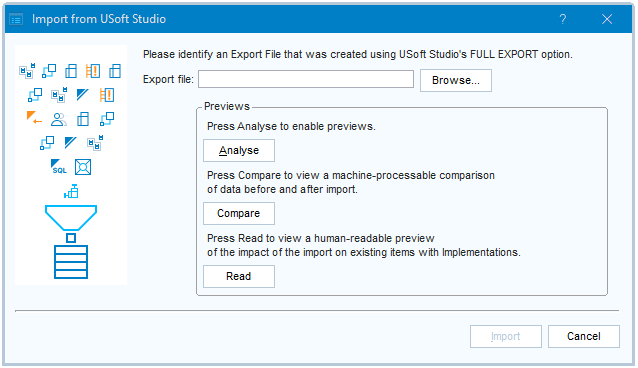

# Importing from USoft Studio into USoft Definer 11

> [!NOTE]
> **See also**
>  

----

> [!CAUTION]
> This import works only if your data come from **USoft Studio 4.2**. You can see the Studio version in the footer bar of Studio.
> We offer a workaround utility for exports from USoft Studio 4.1. Perform the following 2 temporary steps.

> [!TIP]
> We also offer a workaround utility for **migrating earlier Business Rules from Definer (Teamwork) to Studio**. Please go to the bottom of this article: [Formulations in USoft Definer](/docs/Collaboration/Between_business_rules_and_implementations/Formulations_in_USoft_Definer.md).

To import data from USoft Studio 4.1:

1. Apply the special  utility transformation to your export file before you import:

```sql
invoke uscsxsl.apply2file with select
	'*filepath*\export.xml'
,	'*usoft-installation-dir*\xsl\Util\Studio41ToStudio42.xsl'
,	'*filepath*\export.xml'
```

2. After import, in USoft Definer, choose Teamwork, Preparation, Vocabularies from the menu. Find the Vocabulary that the imported formulations belong to. In the Vocabulary record, manually add the URL leading to the origin of the formulations (this is a one-time action):

*Syntax*

```
*base-url*/pages/*instance*/app.usoft#p=Workspace&bid=*project*
```

*base-url* is the same as when you log on to Studio web pages, namely **https://studio.usoft.com** if you use Studio Production, and **https://acc-studio.usoft.com** if you are using Studio Acceptance.

*instance* is the USoft Studio instance that your export data come from. If you use **https://studio.usoft.com/my_instance**to log on, then *instance* is **my_instance**. While you are interacting with Studio, you see [https://studio.usoft.com/pages/my_instance](https://studio.usoft.com/pages/my_instance) in the address bar of your browser.

*project* is the project number displayed in the Studio Home page, for example **#163** for project number 163.

*Example*

```
https://studio.usoft.com/pages/course3/app.usoft#p=Workspace&bid=163
```

If you like, the 2nd, 3rd… time you use this utility, you can combine it with the Import itself in 1 script. Run in SQL Command of Definer:

```sql
invoke uscsxsl.apply2file with select
	'*filepath*\export.xml'
,	'*usoft-installation-dir*\xsl\Util\Studio41ToStudio42.xsl'
,	'*filepath*\import.xml'
;
invoke batchrunner.import_from_studio with select
    '*filepath*\import.xml' filepath
;

```

----

`USoft 11``{.vs_11}`

With a few clicks, you can get data from a USoft Studio project into USoft Definer 11.

Go to the USoft Studio project as an Owner, press **Administration** (Du.: Beheer), then press **Export Full** (Du.: Export Volledig). An XML export file is downloaded.

> [!NOTE]
> From USoft Studio 4.2, the Export Full button is also available in the footer bar of the Formulations screen. You no longer need to be Owner to use this function. Application User privileges are sufficient.

From the USoft Definer 11 menu, choose Teamwork, Object Shopping, Import from USoft Studio. Or click this icon in the icon ribbon:


You can now see this dialog:



In the **Export file** field, point at the XML file you just downloaded from USoft Studio.

At this point, you can do one of 3 things:

- Import****the Studio data straight away into Definer. Press **Import**.
- Inspect a "Compare” preview report first. Press **Analyse**, then **Compare**.
- Inspect a “Read” preview report first. Press **Analyse,** then **Read**.

> [!WARNING]
> **Import** potentially overwrites or deletes records in the Business Rules table. The preview reports can help you decide if you are OK with that.
> The idea of **Import** is that you use it to keep in sync a *single* vocabulary (on the Studio side) and a *single* repository (on the Definer side). If you act otherwise, you must ensure manually that Business Rules have unique IDs across Vocabularies because, in USoft Definer, a Business Rule is identified uniquely by its ID, not by the combination (Vocabulary, ID). **Import** does not affect Business Rule items in Vocabularies other than the Vocabulary you are importing.

----

----

## Import

This section describes in detail what happens when you press **Import**.

**Import** has 3 steps. In Step 1, the input data is *filtered:* only a subset of the information coming from Studio is selected for import into Definer. In Step 2, this selected data is actually *imported*. The result of this Step 2 may include new data being added, or existing data being changed, or both. In Step 3, Business Rules in Definer that are no longer in Studio are *deleted*. These 3 steps form a single transaction. if anything goes wrong, the entire **Import** is rolled back.

### Step 1: Filter

This step filters out information from Studio that does not map to Definer, or is considered inappropriate for import into Definer.

After this step, the result contains records for the following Definer tables only:

- Business areas
- Business objects
- Business rules
- Motivations
- Rule sets
- Sources
- Vocabulary (by definition, the set contains exactly 1 Vocabulary)

Studio "Formulations" (even formulations that are not intended as business rules) map to Definer "Business rules". The other tables map in obvious ways (a Rule Set in Studio is a Rule Set in Definer).

The result does not contain Studio detail lines.

The result only contains Formulations:

- with Status = Current. These are current according to Studio version control.
- with Status = Planned and for which there is no other formulation with the same ID and Status = Current. These come from a Studio project that is not (yet) under version control.

For Formulations (imported in Definer as Business Rules), the result contains only the following attributes:

- ID
- Label
- Formulation
- Requires implementation
- Priority
- Implement as
- Vocabulary
- Motivation
- Source
- Business area
- Business object
- Rule set
- Defined
- Defined by
- Defined on
- Deprecated
- Deprecated by
- Deprecated on
- Approved
- Approved by
- Approved on
- Built
- Built by
- Built on
- Tested
- Tested by
- Tested on
- Cross-checked
- Cross-checked by
- Cross-checked on
- Requires documentation
- Documented
- Documented by
- Documented on

### Step 2: Import

The items are imported into USoft Definer following the “[UPSERT](/docs/Extensions/XML_internal_component/XMLImport.md)” principle:

- Any item found in the exportfile but not in Definer is **added**.
- No item is **deleted**.
- For any item found both in the exportfile and in Definer, but with differences in non-key columns, the old value in Definer is **changed** to the new value in the exportfile.

### Step 3: Delete obsolete business rules

This step deletes from the Business Rules table in USoft Definer all the records that no longer appear in the Studio exportfile being imported. This applies only to those Business Rule records that are in the Vocabulary named in the exportfile.

> [!TIP]
> Previous versions of USoft did not allow you to delete Business Rules that had remaining Implementations. This restriction has been dropped. Implementations are now silently dropped along with the Business Rule they belong to (cascading delete).

## “Compare” preview report

This report offers a full comparison between Studio and Definer of items in the following tables:

- Business rules
- Classifications
- Motivations
- Sources
- Business areas
- Business objects
- Rule sets

This report describes differences by using [DML instruction tags](/docs/Repositories/USoft_XML_formats/DML_instruction_tags.md), a standard feature of USoft XML:

|        |        |
|--------|--------|
|`<Insert>`|The item is found in Studio, but not in Definer.|
|`<Delete>`|The item is found in Definer, but not in Studio.|
|`<Update>`|The item is found both in Definer and in Studio, but there are differences in non-key columns.|


If your “Compare’ report contains this item:

```language-xml
<Rule_Sets documentName="Rule Sets">
  <T_RULE_SET NAME="Address change" BUS_AREA="General" DESCRIPTION="">
    <Delete/>
  </T_RULE_SET>
</Rule_Sets>
```

this means that the Definer “Address change” rule set is not (or: no longer) found in Studio. If you run **Import**, this rule set is not actually deleted from Definer. Import never deletes rule sets, as explained in the previous section. The only exception to this rule is that Import deletes obsolete *Business Rules.*

The "Compare” preview report is machine-processable. If you like, you can remove a difference, or a set of differences, by passing it to XML.Import. This gives you complete control, but the primary purpose of the “Compare” preview report is not to offer an executable but rather to allow you to inspect and analyse the differences. USoft recommends you use the standard **Import** routine (previous section) to transfer data from Studio to Definer, except perhaps in special cases when you have a reason to tweak manually.

> [!NOTE]
> This kind of comparison report is a standard feature of USoft Blend and USoft Delivery Manager.
> [Compare in USoft Blend](/docs/Repositories/Blend_directives/pcCompare.md)
> [Compare in Delivery Manager](/docs/Continuous_delivery/Delivery_Manager_actions_by_name/Compare_data_files.md)

## “Read” preview report

This HTML report is human-readable and non-machine-processable. It reports on 2 specific topics that it identifies by the words **Deletes** and **Updates**:

|**Topic**|**Description**|
|--------|--------|
|Deletes |Business Rules that have one or more Implementations in Definer, but are not (or: no longer) found in Studio.|
|Updates |Business Rules that have one or more Implementations in Definer, but now have a different formulation text in Studio.|


At the top of this report, there is 1 message indicating the severity level of the situation. This message depends solely on the presence or absence of what is called "Deletes” and "Updates” here. As long as there are any Deletes or Updates (or both), the severity level is 3. Otherwise, as long as there are any remaining changes to the Business Rules table other than Deletes or Updates, the severity level is 2, otherwise 1.

|**Severity level**|**Message**|
|--------|--------|
|3       |> [!WARNING]
> This import has Deletes or Updates (or both) for items that have remaining Implementations, as listed in Sections A and B below. If this is not what you want, make changes before or after the import, as appropriate and convenient.

|
|2       |> [!TIP]
> This import can go ahead. There are no remaining Implementations for items that the import will delete or change.

|
|1       |> [!NOTE]
> This import will not affect the Business Rules table in any way.

|


In Sections A. and B. of this report, a list is provided of all the Deletes and Updates. This list identifies each item, showing also the change in formulation text in the case of Updates. For each item, the Implementation(s) found in Definer are identified by name, in the same way as on the "Implemented by” tab in the Business Rules window in Definer.

## Best-practice tips for importing from USoft Studio

The Import utility has been designed for teams who want to use USoft Studio and the USoft Platform in combination. It provides a "bridge” between the 2 tools.

### Think: Synchronise

Think of the bridge as a synchroniser. The intention is to keep the 2 tools in sync. The bridge happens to go from Studio to Definer, not the other way. But the intention is not to suggest a procedural order of working. Don't first do all the Studio work, then import (convert) once into Definer, then do all the Definer work.

### Run the Import often

Run the Import often, so that Studio and Definer remain in sync. You can always use the preview reports to inspect any unwanted consequences ahead of time, but if you run Import often, you will become used to what it does and does not do.

### Make edits in 1 place only

Never edit data elements in Definer that could be overwritten the next time you run the Import bridge from Studio.

For many teams, in practice, the best convention is that no team member makes any edits in the Teamwork area of Definer at all, except by editing in Studio and then letting the Import bridge make the edit in Teamwork. The only Teamwork data elements you should allow people to edit directly in USoft Definer screens are:

- Implementations attached to Business Rules.

> [!NOTE]
> Definer has special [..._NO_STUDIO roles](/docs/USoft_for_administrators/Creating_a_USoft_Development_environment/Authorising_team_members_for_USoft_100.md) that guarantee that the Definer user does not manipulate Business Rules that should be manipulated in USoft Studio instead.

### Allow team members access for editing Studio and Definer concurrently

The intended use of USoft Studio is to be complementary to USoft Definer. The 2 tools are best treated as 1 integrated development environment.

If you can, allow all team members access for editing Studio and Definer concurrently.

One example is status flags. All status flags in USoft 11 (Defined, Defined By, Defined On, but also: Built, Built By, Built On...) are in the import bridge. As a consequence, if you are using all the status flags, you want all those concerned to be able to set appropriate flags in Studio, ready for (re-)importing these settings into Definer.