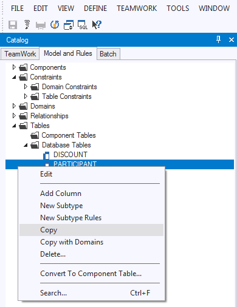

# Object shopping via the clipboard (copy-paste)

As an alternative to shopping via an export file, you can also copy-paste the following types of implementation from one repository to another.

### Step 1: Copy

In the source repository:

1. In USoft Definer, open the Catalog on the left hand side and click the Model and Rules tab.

2. In the tree view, identify the implementation you want to copy-paste to the other repository.

3. Right-click on the implementation and choose Copy.

In the case of Database Tables, you can choose to copy also the underlying Domains: choose "Copy with Domains".

### Step 2: Paste

In the target repository:

1. In USoft Definer, open the Catalog and click the Model and Rules tab.

2. In the tree view, identify the **folder** where you want to paste the implementation, for example, the "Database Tables" folder.

3. Right-click on the folder icon and choose Paste.

### Limitations

You can only copy-paste the following types of object:

- Database tables *
- Component tables
- Logical Views
- Components
- Domains
- Jobs
- Relationships
- Table Constraints
- Decisions

* Be careful with subtype constellations; see Conflict resolution.

### Conflict resolution

If the implementation you are copying already exists in the target repository by that name and that type of implementation, then a **copy** is made with the prefix COPY_... .

Be careful with copying subtype constellations because this "COPY_..." behaviour applies only to the top-level supertype table and subtype tables will be overwritten. Also, if you choose to copy Domains of a Table, the "COPY_..." behaviour applies only to the Table; the Domains will be overwritten.

### Multi copy-paste

It is also possible to copy multiple objects via the clipboard in one go:

- In the source repository, copy the first object as described in "Step 1"
- Press and hold down the 'Ctrl' key.
- Whilst keeping the 'Ctrl' key pressed, copy the second object in the same way as the first object. The second object does not have to be of the same type.
- Continue to copy objects until all objects to be copied have been added.
- Go to the destination repository, and Paste as described in "Step 2". Since the copy now contains multiple (different kind of) objects, the paste can be done in any folder in the catalog where copy-paste functionality is available.

:::note

the Conflict Resolution as described in the section above does not apply to multi-copy paste actions: when an object (or objects) already exists in the target repository, it will be overwritten.

:::
