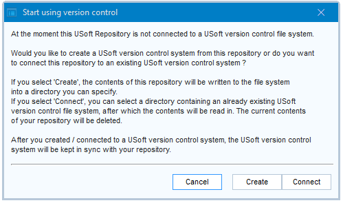

# Version control: Connect

> [!NOTE]
> **See also**
> [Version-controlled repositories](/docs/Repositories/Version_control/Versioncontrolled_repositories.md)
> [Version-controlled local branches](/docs/Repositories/Version_control/Versioncontrolled_local_branches.md)
> [Version control: Create](/docs/Repositories/Version_control/Version_control_Create.md)
> [Version control: Synchronise, Temporarily Disable, Disconnect](/docs/Repositories/Version_control/Version_control_Synchronize_Temporarily_Disable_Disconnect.md)

`USoft 11``{.vs_11}`

As a team member in a USoft project, to start participating in a version-controlled USoft repository, you initially need to Connect to the version control arrangement.

As a prerequisite, you need to have a locally installed RDBMS system or you need some way of connecting to a private location a remote database server.

You also need to have the USoft tool set installed. Create a USoft Binder file where you specify the database connect string that points to your database (SQLServer) or database account (Oracle). Then, create an empty local USoft project. From USoft Binder, first create tables for USoft Authorizer. This creates an authorization layer that gives you access to the USoft tools. You now have an empty USoft development environment where you can participate in a shared, version-controlled USoft repository.

Finally, you need to be connected to a Git (or other) repository for file-based version control. You need to have pulled the remote tree to your local system at least once. These operations are not USoft-specific.

Version control is by USoft application. If your team uses multiple applications, for example USoft Definer but also USoft Service Definer, then you need to perform the Connect operation multiple times.

Version control is by definition read-write, not read-only. Make sure that in Authorizer, you have read-write privileges for each USoft application to which you want to contribute. Read-only users are not invited to Synchronize, and if they attempt to Synchronize manually, it’s an error, so they cannot be up-to-date.

In order to connect, you need to be given the location of a shared "*application.*usv” file, for example, a "USD.usv” file in the case of USoft Definer. Ask the person who has created the version-controlled repository to supply this location.

The steps below use USoft Definer as an example. They tell you how to start participating in a version-controlled repository for USoft Definer.

1. From the USoft Binder file, run Create Tables for USoft Definer. This gives you an empty local USoft repository for USoft Definer.
2. If for some reason you don't start from scratch, but from a Definer instance that so far you used locally, then make sure that in Authorizer, you have read-write privileges on Definer (the USD application), not just read-only.
3. Open USoft Definer. From the main menu, choose Tools, Version Control, Version Control Configuration. This dialog appears:

Click the **Connect** button. A file system dialog appears with title "Select USoft version control system”. Browse the location of the "USD.usv” file in your local copy of the shared file tree, then click Save or OK.

> [!CAUTION]
> At this point, any contents of your USoft Definer tables will be deleted and replaced.

Your local USoft Definer tables will now be populated for the first time with the development work stored in the file tree that you pulled. This may take some time. This operation is the equivalent of a [Synchronize](/docs/Repositories/Version_control/Version_control_Synchronize_Temporarily_Disable_Disconnect.md) operation for the whole of the repository.

When this step is completed, you are ready to start [working with the version-controlled repository](/docs/Repositories/Version_control/Version_control_Synchronize_Temporarily_Disable_Disconnect.md).