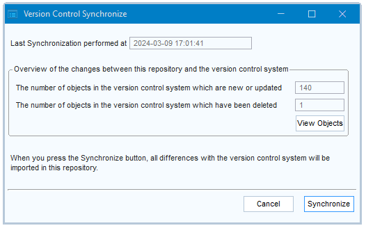

# Version control: Synchronize, Temporarily Disable, Disconnect

> [!NOTE]
> **See also**
> [Version-controlled repositories](/docs/Repositories/Version_control/Versioncontrolled_repositories.md)
> [Version-controlled local branches](/docs/Repositories/Version_control/Versioncontrolled_local_branches.md)
> [Version control: Create](/docs/Repositories/Version_control/Version_control_Create.md)
> [Version control: Connect](/docs/Repositories/Version_control/Version_control_Connect.md)

`USoft 11``{.vs_11}`

This article describes how you work as a development team member with a version-controlled USoft repository.

To do that, you must have [Connected](/docs/Repositories/Version_control/Version_control_Connect.md) to such a repository as a one-time action.

## Pull, synchronize, push

Once you are connected to a version-controlled USoft repository:

- Before you begin a chunk of work, pull the remote tree in Git (or other). Then, open the version-controlled USoft application (eg., USoft Definer). If any changes have been pulled that you do not yet have in your local USoft repository (the RDBMS tables), this dialog pops up when you open the application:	

- All you need to do is press the **Synchronize** button to confirm.
- After you have finished a chunk of work, USoft will have automatically written this work to the local file tree. You are ready to push these changes so they become available to the whole team. This last step is not USoft-specific.

> [!TIP]
> **Synchronize: Troubleshooting**
> If errors occur during synchronization, so that Synchronize leaves you with differences, then trying to synchronize again may continue to yield the same errors. In this situation, you have a conflict that Synchronize cannot fix.
> To solve this conflict:
> Temporarily disable version control. From the menu, choose Tools, Version Control, Version Control Configuration. Press “Temporarily disable”.
> Delete the conflicting object(s) from your repository. Note: if you made any changes to these same objects that you want to keep, "stash” these first: make a temporary backup copy on your local system.
> Enable the version control again. From the menu, choose Tools, Version Control, Version Control Configuration. Press “Enable”.
> Re-run Synchronize. From the menu, choose Tools, Version Control, Synchronize. Press “Synchronize”.
> This should resolve the problem.

## Temporarily Disable

You can temporarily disconnect from a version-controlled USoft repository, ready to reconnect at a later time. This can occasionally be useful if you want to try out something locally and you are certain you do not want other team members to share this local work.

During the time that you are disabled, USoft will not write your local work in the RDBMS tables to the Git (or other) files.

> [!WARNING]
> Next time you synchronize, you will automatically lose the work you did while being disabled.

To disconnect temporarily from the version-controlled USoft repository:

1. Choose Tools, Version control, Version control configuration.
2. Press the Temporarily Disable button.

To reconnect after having been temporarily disconnected:

1. Choose Tools, Version control, Version control configuration.
2. Press the Enable button.

## Disconnect

You can disconnect from a version-controlled USoft repository. You will be left with a stand-alone USoft development environment that is no longer connected to other members of your team.

> [!CAUTION]
> You should not normally disconnect except for reasons of major debugging or maintenance action.

To disconnect:

1. Choose Tools, Version control, Version control configuration.
2. Press the Disconnect button.