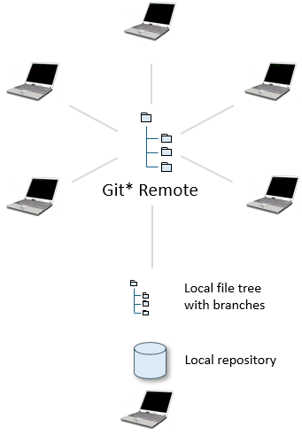
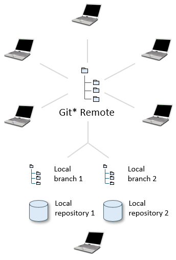

# Version-controlled local branches

> [!NOTE]
> **See also**
> [Version-controlled repositories](/docs/Repositories/Version%20control/Versioncontrolled%20repositories.md)
> [Version control: Create](/docs/Repositories/Version%20control/Version%20control%20Create.md)
> [Version control: Connect](/docs/Repositories/Version%20control/Version%20control%20Connect.md)
> [Version control: Synchronise, Temporarily Disable, Disconnect](/docs/Repositories/Version%20control/Version%20control%20Synchronize%20Temporarily%20Disable%20Disconnect.md)

`USoft 11``{.vs_11}`

## Not recommended: multiple local branches, same local repository

If you have a version-controlled repository, you can use the Version Control software to switch between different branches. The file tree you have locally reflects these branches. You use the local repository for the branch you are currently working on. The repository will synchronize with the new situation and will update the database to reflect the new situation in the Version Control repository. Although this will work, it is probably not the best way of working for a number of reasons:

- Using the same repository to work on different branches  can easily cause problems if you happen to forget which branch it is currently on. You might even easily end up committting and pushing changes to the wrong (not the intended) branch.

- Updating a database repository to a completely new situation (a new branch) can be a time-consuming job. The synchronize routine has to update, insert and delete each and every object to reflect the situation in the local branch (the local folder under Version Control).

NOT RECOMMENDED## Recommended: separate repositories for separate branches

To avoid these problems it is better to work with separate folders on your filesystem for separate branches and also with separate local database repositories, where each database repository is connected to one specific branch.

By naming the folder and the database repository with logical names, mistakes can easily be avoided. Also, the synchronize process will be much faster, since it only has to handle the delta since the previous synchronize instead of updating the complete database repository.

RECOMMENDED 

 