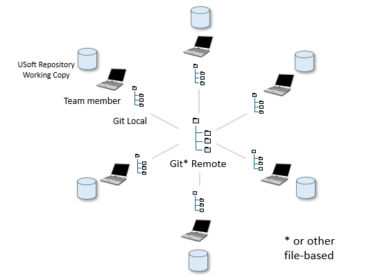
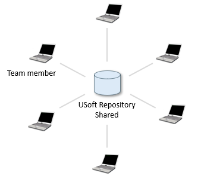

# Version-controlled repositories

> [!NOTE]
> **See also**
> [Version-controlled local branches](/docs/Repositories/Version%20control/Versioncontrolled%20local%20branches.md)
> [Version control: Create](/docs/Repositories/Version%20control/Version%20control%20Create.md)
> [Version control: Connect](/docs/Repositories/Version%20control/Version%20control%20Connect.md)
> [Version control: Synchronise, Temporarily Disable, Disconnect](/docs/Repositories/Version%20control/Version%20control%20Synchronize%20Temporarily%20Disable%20Disconnect.md)

`USoft 11``{.vs_11}`

## Version-controlled USoft repositories

As you work on a USoft application, you gradually fill a repository of RDBMS tables with implementations. These are the source of the runtime application you deliver to end users.

Your team can decide to bring this shared USoft development repository under a file-based version control system such as Git. In this arrangement, there is no central database. Instead, each team member holds his or her own local working copy of the USoft repository:

Version-controlled USoft repositoryFor each team member, USoft version control keeps repository work in sync with a local Git tree. All team members are connected to a single, central, remote, shared Git tree. A team member pulls the latest version of the central Git tree before starting work. When finished, the team member pushes changes back to the central tree. The interaction between local trees and a shared remote tree is not USoft-specific. It is common practice in coding environments.

The advantage of working in this way is that each contribution to the USoft application remains traceable and may be inspected or rolled back if needed.

USoft supports version control for any version control system that is completely file-based. Git is completely file-based.

Version control is something you must [put in place](/docs/Repositories/Version%20control/Version%20control%20Create.md). As long as you don't, the default USoft development environment applies where team members connect to a shared, central database:

Default USoft development environmentThe advantage of working in this way is that each member is immediately aware of neighbouring changes, a form of pessimistic locking. In version-controlled repositories, conflicts between changes do not emerge until the work is pushed, a form of optimistic locking. On the up side, version control tools for systems such as Git give you multiple ways to mitigate conflict.

## Version control is for a whole team

To work effectively with version control for a USoft application, all team members on a USoft project need to work with it in the same way. Each team member needs to have a computer or laptop that is powerful enough to host a local working copy of the USoft repository. Each team member must be instructed to pull changes made by others before starting a (sub)task, and to push changes back to the remote Git (or other) repository after completing the (sub)task.

## Version control is development-time

USoft version control applies to your Development environment only. It allows you to control emerging versions of your development work.

This has nothing to do with versions of the application that you deliver to end users in Production. USoft Delivery Manager is the tool of choice to manage the release of different versions and keep a history of deliverables.

Also don't confuse USoft version control with various features around versioning that exist inside the USoft tool. For example:

- USoft Definer has a simple but rudimentary system for naming repository versions. This system is completely optional.
- All versions of all Business Rules are automatically logged to a history table.
- USoft Studio has an elaborate (but optional) version control system for naming and managing versions of Business Rules within a Vocabulary.

## Version control is by USoft application

USoft version control is *by USoft application*. If you want version control for multiple applications, you need to put it in place separately for each application.

USoft version control is available for all USoft applications except USoft Authorizer.

Work in the UI design tools (USoft Web Designer, USoft Windows Designer) is stored in the Definer repository. If you put in place version control for USoft Definer, this automatically gives you version control for the UI design tools.