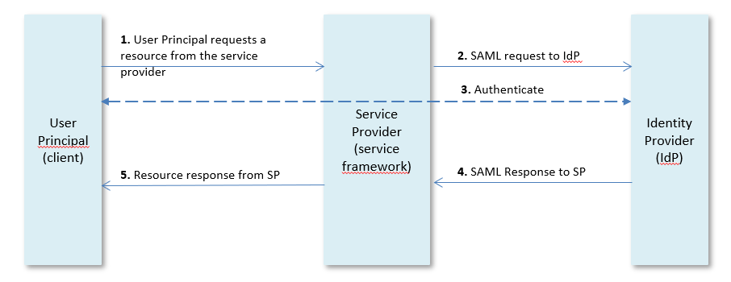

# SAML authentication

SAML(Security Assertion Markup Language) is an open standard for exchanging authentication information between an identity provider (IdP) and a service provider (SP). That means that you can use one set of credentials to log into many different websites, and to accomplish web browser single sign-on (SSO).

The authentication moment is the moment when the request enters the service framework. That means that a service always needs credentials.

If the **Session expiration seconds** field of the connection used to connect to the rule service has a value bigger than 0, then a session is created on the server side, and the client gets a SAML authentication cookie in the response. With this cookie, the client can connect again and use the same server session.

## How SAML SSO works

In a SAML login process there are three roles:

- The **user principal** (client) that requests a resource from the service provider (service framework) and provides an unique attribute (e.g. e-mail address) as user name.
- The **service provider (SP)** redirects the user principal to the identity provider (IdP) for authentication.
- The **identity provider (IdP)** validates the credentials and if valid the identity provider creates a SAML response assertion for the service provider. The user principal has now access to the resource.



## AuthSaml annotation syntax

You specify SAML authentication for a server by a setting in Service Definer, as explained below.

You specify SAML authentication for a service or method by setting an **AuthSaml** annotation.

This section shows **AuthSaml** annotation syntax. The next sections in this article tell you how to apply this **AuthSaml** syntax in different situations.

*Syntax*

```language-java
@AuthSaml |
@AuthSaml( "*entity-name*" ) |
@AuthSaml( *settings* )

*settings*  ::=  *name*=*value* [ , *name*=*value*... ]

*name* ::= { 
      value  | 
      entity | 

      wantsAssertionsSigned | 
      signMessages          |

      enableArtifactResolution |
      enableSoap
 }


```

The @AuthSaml annotation by itself, without parenthesised content, is a special use. It is only used to specify SAML authentication for a specific method if other methods in the service do not use SAML.

The @AuthSaml annotation with a single *entity-name* is a shortcut for:

```language-java
@AuthSaml( value=”*entity-name*” )
```

Otherwise, @AuthSaml uses a comma-separated *settings* list of one or more *name=value* pairs.

In each setting, *name* is an unquoted name from the closed set of names discussed here.

In each setting, *value* is double-quoted if a string value, and unquoted if a numeric value or a boolean value (true or false).

The names **value** and **entity** expect string values. They identify the SAML Security Configuration that you have identified by the "Entity name” attribute in USoft Service Definer. Use **value** by default. The use of **entity** is discussed later in this article.

The remaining names expect boolean values:

If **wantsAssertionsSigned** is not set to false, the service will accept only signed assertions. Any unsigned assertions may get rejected. The default is true.

If **signMessages** is not set to false, any SAML messages sent by the service are signed by its signing key (if present). This also includes its own metadata. The default is true.

If **enableArtifactResolution** is not set to false, the usage of artifact resolution is enabled. The assertions themselves are sent by default over SOAP, using an "artifact string" sent by regular HTTP POST as its identifier. The default is true.

If **enableSoap** is set to false, any SOAP endpoints are disabled. In this case, the service will be forced to use HTTP POST as the default method for sending and receiving assertions. Also, artifact resolution will be disabled (regardless of any setting for enableArtifactResolution) since artifact resolution would require SOAP. The default is true.

*Example*

```language-java
@AuthSaml(value="adfs", wantsAssertionsSigned=false)
```

## How to specify SAML authenthication for a server

1. In Service Definer, open the server window for which you want to specify SAML authentication.

2. On the Security tab, select a value for the Default Security Configuration from the list.

All services that do not have a local authentication annotation will now use SAML authentication according to this configuration.

## How to specify SAML authentication for a service

1. In Service Definer, open the window for the service for which you want to specify SAML authentication.

2. Set the Annotation attribute of the service to one of the following equivalents:

```
@AuthSaml( "*entity-name*" )
@AuthSaml( value="*entity-name*" )

```

where *entity-name* is a valid entity name of a SAML Security Configuration. When using a connection to the Rules Engine for this service, the connection session name must be the same as the SAML configuration entity name.

Alternatively, to allow multiple connections in a service using the same SAML configuration, set the Annotation attribute of the service to:

```
@AuthSaml( entity="*entity-name*" )

```

In this case, the session name of the connection used in the service may have any value.

## How to specify SAML authentication for a method

You can also set SAML authentication for an individual method of a service. Do this by setting the Annotation attribute of that method to one of the following equivalents:

```
@AuthSaml( "*entity-name*" )
@AuthSaml( value="*entity-name*" )

```

You can also set SAML authentication for an individual method in a service that uses (for other methods) a different authentication mechanism than SAML. Do this by setting the Annotation attribute of the method to the **AuthSaml** annotation without parenthesised parameters:

```
@AuthSaml
```

This causes the default SAML configuration set for the server to be used for the method.