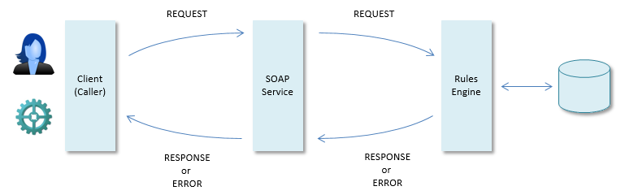
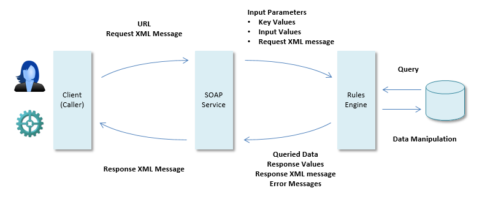

# Designing a SOAP service

To design a SOAP service properly, you need to analyse the components involved in calling it.

## Request and response events

The principal stages in the process of using a SOAP service are the initial client **request** and a server **response.** As in computing generally, the **response** can be a normal message or, if something goes wrong, it can be a response with the status of an **error:**

## Input and output of a service call

SOAP (Simple Object Access Protocol) is a messaging protocol that allows platform-independent, application-to-application communication using HTTP and XML.

When a SOAP service is called, the input of the automated process is contained in the request and the output is the response. The request and response messages are XML-formatted. The root element of a request or response message is called Envelope. This element contains two message elements: the Header and the Body. The structure of these message elements is described in a WSDL file. In case of an error, the Envelope element in the response contains an Fault element.

## Elements of a SOAP service facility

This section identifies in general terms all the relevant components of a USoft SOAP service facility.

A SOAP service is always called by submitting a **URL** to a browser.A request URL is a single string of characters made up of a series of mandatory and optional elements, in a way that is prescribed by W3C's URL standard.

SOAP is a very strongly typed messaging framework. All the methods that a SOAP service may be called by, as well as the structure of the request and response XML for these methods are explicitly defined in WSDL (Web Service Definition Language).

When calling a USoft SOAP service, the Services Framework always calls a specific method of that service. Which method is selected depends on the URL and on the contents of the request XML message.

USoft SOAP services perform tasks requested by clients. They do this by asking an underlying Rules Engine to query or manipulate application data. Typically, in USoft SOAP service calls to a Rules Engine, pieces of information are passed that are variable, and thereby specific to the individual call: one or more input parameters.

Input parameters are usually either key values or input data. Key values identify WHICH data the Rules Engine must query or manipulate. Key values are typically passed to WHERE clauses. In the case of data manipulation, input data are new data fed to the Rules Engine. Input data are typically fed to either a VALUES clause of an INSERT statement, or a SET clause of an UPDATE statement.

The distinctive feature of the Rules Engine is that it performs queries and data manipulations SUBJECT TO BUSINESS RULES. These business rules may cause the Rules Engine to transform data before passing it to the RDBMS, or to refuse duty, even if the request is otherwise well-defined.

Depending on what the Rules Engine had been asked to do, it typically returns queried data to the caller, or (if its main function was to manipulate data) it passes confirmation such as an OK message, or some other short feedback on how the execution of the task went. A request may affect a single-row or multi-row data set, but it may also execute a composite procedure via a batch job or a RDMI component.  If an error is raised, the Rules Engine is hopefully programmed to return a useful error message.

Since communication with a SOAP service is via the HTTP protocol, the service will return an HTTP status code as a standard element of the response to the client.