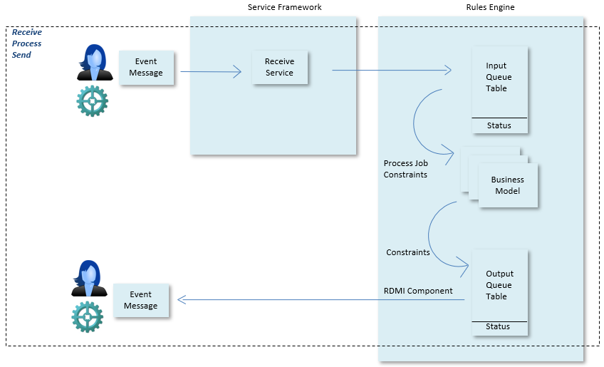
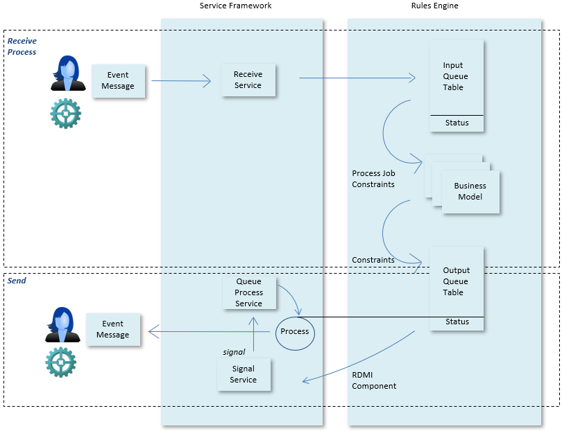
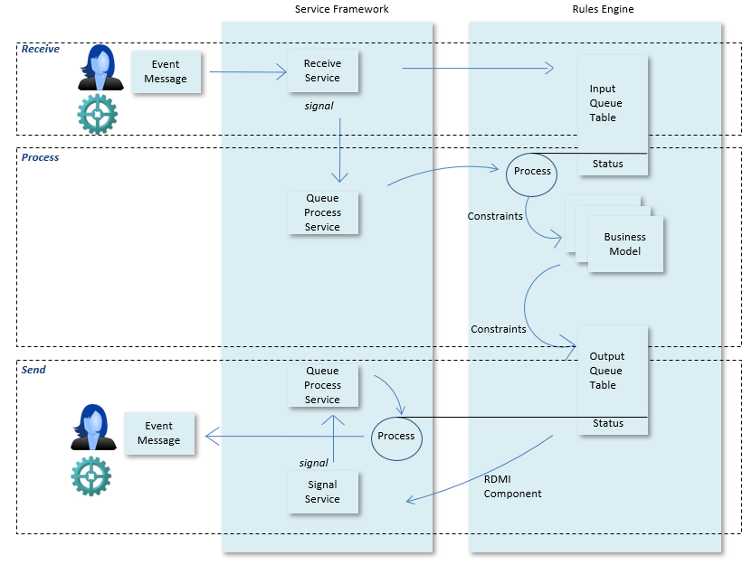

# Design patterns for event processing

Event-driven architecture gives you a type of solution where events are key. An event is something that happens in the real world, has a business meaning, and carries information. Depending on the business case and on system requirements, different patterns will emerge that turn out to achieve the best result. They can be classified as:

- Synchronous input processing with synchronous result
- Synchronous input processing with asynchronous result
- Asynchronous input processing with synchronous result
- Asynchronous input processing with asynchronous result

Asynchronous patterns may be implemented with different levels of asynchronicity.

## Synchronous input processing with synchronous result

In synchronous processing, the input is processed immediately when it arrives. If a response is needed, that response is sent directly as a result of the processing.

In this pattern, the same process that receives an event also handles the event, so a queue table is not strictly needed. It is, however, best practice to use a queue table in any case, even if only for traceability.

**When to consider**

This pattern is a good choice when:

- Events have low frequency and can be processed one-by-one.
- Processing the event does not require a lot of resources and does not take much time, or the necessary processing time is acceptable to the caller.
- Events do not have to be processed in a specific order and an enterprise message bus is used to scale the workload.

**Advantages**

- Easy to write and to understand.
- Simple deployment procedure.
- Simple to monitor in a production environment.

**Disadvantages**

- Does not scale.
- Is based on the request-response principle, so the caller has to wait for the response.
- Is not ready to deal with unexpected event frequency.
- Cannot guarantee the delivery of output events (this can be achieved by using an asynchronous result).

## Synchronous input processing with asynchronous result

Synchronous processing, in which the input is processed as soon as it arrives, may be combined with asynchronous results: if a response is needed, the response message is placed in a queue table and sent when the system is available.

This pattern must be considered when input processing does not take much time but creating and sending an output message is relatively costly. It is also useful if the responding service must guarantee the delivery of output messages: if an output message cannot be delivered because of an error, the system must retry after a period of time.

The advantage is that you are still using the easiest way to process input. Because output processing is asynchronous, it may be dealt with by a parallel process if needed.

## Asynchronous input processing with synchronous result

In asynchronous input processing, the input is stored in a queue table when it arrives and a separate queuing service will pick it up for processing. As part of this processing, a response is sent immediately if necessary.

**When to consider**

This pattern is a good choice when:

- Events have a high frequency and cannot be processed one-by-one, or:
- The processing of an event requires a lot of resources, or:
- The processing of an event takes much time.

**Advantages**

- Scalable in time. If the number of events grows in time, events may be processed in parallel for a better overall performance.
- Tolerant to failure in that this pattern allows fault isolation: if the processing service fails, the receiving service is still available.

**Disadvantages**

- More difficult to write and understand than synchronous input processing.
- Often more complex to deploy.
- Testing is more complex and may require more time and resources.
- Monitoring of the system in the production environment is required.
- Cannot guarantee the delivery of output events (this can be achieved by using an asynchronous result).

## Asynchronous input processing with asynchronous result

Asynchronous input processing, in which input is stored in a queue table and picked up from there, may be combined with asynchronous results: if a response is needed, the response message is placed in a second queue table and sent when the system is available.

This is a variation on asynchronous input processing with synchronous result.It is useful if the responding service must guarantee the delivery of output messages: if an output message cannot be delivered because of an error, the system must retry after a period of time.

 