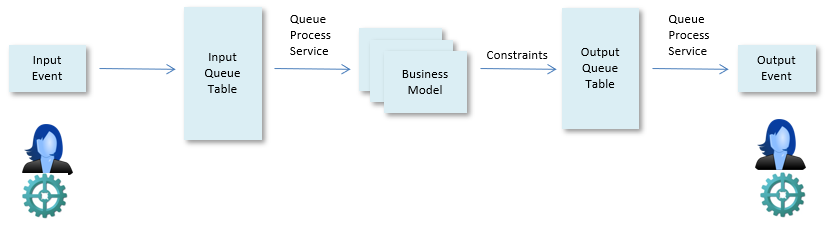

# Event processing

Event-driven architecture is an asynchronous architecture pattern used for scalable systems. The role of an event-driven system is to detect, consume and produce events.

Event processing in USoft enables applications to analyse information and react to it in real time. This allows you to easily adapt to change, distribute the load on multiple event processing engines, and implement fault-tolerant behaviour.

An event-driven system in USoft consists of event processing services that :

- Receive events.

- Process the information carried by the events, where the USoft Rules Engine is responsible for enforcing business rules on the event data.
- Produce events based on business rules.

 