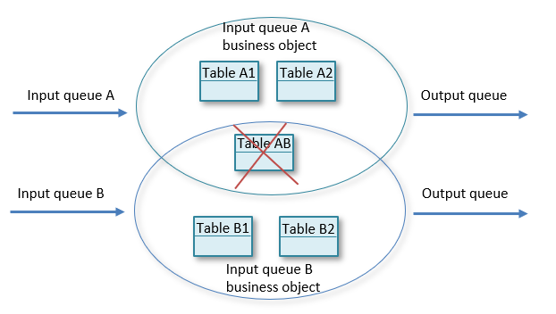
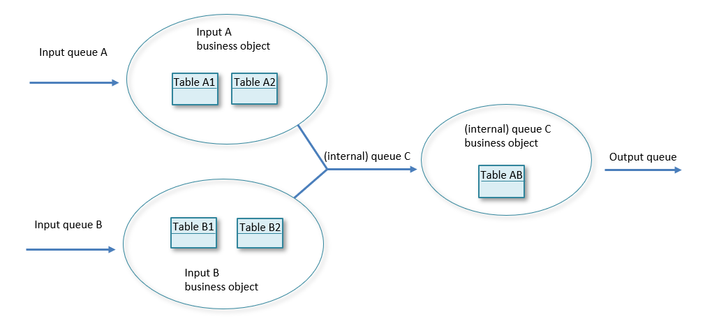

# Event processing best practices

When you create an event processing model in USoft, you look at data flow in terms of information items that must be filtered and combined to achieve your goal. Multiple flows of data are processed continuously at the back end, without user interaction.

To build such a system in USoft, a different approach is needed than for traditional USoft client/server or web applications.

The help topics in this section are primarily for developers who have experience building traditional USoft applications. They contain best-practice tips on how to build *differently* for event processing, at 4 levels:

- Model best practices
- Rules best practices
- Error handling best practices
- Logging best practices

## Model best practices

In USoft, a model may be *described* using Business Areas and Business Objects in USoft Teamwork. A Business Object is a topic or an area of interest in the business or in the information system and is a subdivision within a Business Area. Within a Business Object you can specify which domains, tables and relationships belong to the area of interest.

In USoft, such a model is *implemented* by declaring domains, tables, columns and their attributes in USoft Definer. At runtime, a model implementation is used to store data. In the case of an event processing system, which will need to combine two or more streams of data, the model must be designed in such way that data coming from different streams may be stored in different logical model partitions that are not overlapping. If tables are shared between two different logical partitions, and two events from two different streams are processed at the same time and are updating the same record at the same time, locks may occur. Finding and debugging lock problems is a difficult task, especially if they are not noticed until the system goes live.

In USoft's data-oriented approach to event processing, data streams are shaped as input queues and output queues into and out of the tables that you model. Business Objects have *data contents* that allow you to express how tables belong to different areas of interest (in this case, different data streams). A table may be shared by neighbouring Business Objects, but you can also express that a table is *owned* by 1 specific Business Object.

When designing your logical partitions in this way, you may find that a table is logically shared by two different Business Objects, In an event processing context, such a design is not appropriate because it is an indication that two data streams will be entangled and could lock each other out:

The solution is that you disentangle the model by extending it. For example, you can accommodate two input queues successfully by breaking up the flow structure, creating a new (internal) queue that picks up data from both input queues. Instead of belonging to 2 overlapping areas, tables are pulled further apart: they end up belonging to 3 distinct areas. In this way you can detect and preclude possible lock issues in the design/implementation phase.

## Rules best practices

USoft Rules are typically implemented in USoft Definer by setting attributes of *domains*,  *tables*,  *columns,* and *relationships,* and by defining *constraints* that are expressed in SQL statements.

### Productive rules

USoft Definer lets you define *restrictive* rules and *productive* rules. With a restrictiverule, at runtime, if a user attempts to manipulate data in such a way that the new data violates the rule, the transaction is blocked and an error is raised.

In a traditional USoft application, where humans have an interactive role, this behaviour often works well: it makes the user understand the role, or prompts her to supply different data that does fit the rule, or to take an altogether different course of action.

In an event processing context, restrictive rules typically do not work well. Data flows without user interaction are involved. It is more often important that data can continue to flow without transactions being blocked or warnings or errors being raised. For this reason, it is often better to choose productive rules. A typical way of converting restrictive into productive behaviour is to react to an error by writing error information to a log table as part of the standard operation, as opposed to blocking the transaction and issuing an error by way of exception.

Of course, even in an event processing context you may occasionally want to abort a process when a rule is violated, and in this case a restrictive implementation is called for.

### Transitional constraints

Use **transitional constraints** when working with master data tables. Master data is data that rarely changes and when it does change, this does not affect the history of transactional data. As an example of master data, imagine system configuration data such as an admin e-mail address that is different for each physical machine or environment to which the application is deployed. To such an e-mail address, a message is sent if an exception occurs. Implement rules that lookup this e-mail address as transitional constraints. Make sure that the constraint's Transition Table is not the master data table where the e-mail address is stored, but the transactional table(s) that make(s) use of the e-mail address.

For how-to instructions on how to create transitional constraints, see the USoft Model And Rules Guide in USoft Definer Help.

For advanced tips on transitional constraints, see the USoft Rules Engine Guide, equally in USoft Definer Help.

### Post-commit constraints

Use **post-commit constraints** when you want to control the flow of event processing, for example, in a design pattern for synchronous input processing, when you want to start processing input events from a queue. Or, in a design pattern with synchronous result, when you want to add messages to the output queue.

Run the processing of events as a sequence of short-time transactions. Processing data in smaller chunks is more reliable. Use **post-commit constraints** to create a transaction chain.

For how-to instructions on how to create post-commit constraints, see the USoft Model And Rules Guide in USoft Definer Help.

For advanced tips on post-commit constraints, see the USoft Rules Engine Guide, equally in USoft Definer Help.

### Time/State rules

Processing rules may also be classified depending on the type of trigger:

- Time-based rules - The business function executes on a recurring basis, running at pre-determined schedules. Use a timer service in Service Framework to implement time-based rules.
- State-based rules - An action will execute when the system reaches a specific state. Use constraints to implement state-based rules.

## Error handling best practices

In a system that processes events without user interaction, the system must be designed to be fault-tolerant. The level of fault tolerance differs per system. Error handling becomes part of the system design, since the potential impact on the system of each type of failure must be assessed design-time, and an appropriate failure action must be developed. In other words, business rules must define what is the desired conduct on failure.

### Options for dealing with failure

You have several options for dealing with failure.

You can stop processing. Implement this as a restrictive constraint. The error message is visible only in the Rules Service log file.

You can stop processing with an error flag. You stop processing but in addition, an error flag in the model allows you to trace back to the initial event. The implementation is based on restrictive constraints. The processing of an event may start by calling a job with the Commit Type = Task and Abort Error = "Abort Task on Error" settings. Use the StartCatchingErrors and StopCatchingErrors methods of the Rules Service component to catch and save errors. If processing is implemented in a single job task, the processing task stops on error, and the error can be saved in a field. See example: Job that processes queued input events.

You can stop processing and retry later. The implementation is similar to the previous option. You stop processing and in addition, an error flag in the model allows you to trace back to the initial event. A retry mechanism will make sure that the processing of the event will happen later. It is usual to specify a retry count, that is the number of times the event will be re-offered for processing. This kind of error handling is used in the communication with external services as a solution to temporary non-availability of external systems. See also Queue services run-time properties.

You can continue processing and leave an error trace in the model. Implement this as a productive constraint. On failure, set a status field or write a record to a log table.

### Error types

Errors are of different types in different settings.

Business logic errors occur when the conditions laid down in business rules are checked. This type of error is best implemented by stopping processing without retry. One option is to set an error flag on the record that caused the failure and add an error description text.

External components availability errors occur when external systems are temporarily not available. A typical way of handling these errors is to stop processing and retry later.

### Considerations

Consider the following when you are creating an event processing system:

- Use asynchronous processing patterns. Synchronous processing patterns propagate the failure. In the case of asynchronous communication, the retry mechanism of a queue service may be configured for dealing with failures.
- Implement a recovery-after-failure strategy. For example, on your production environment, set "Restart the service on failure" for Windows services that implement USoft Rules Services and USoft Service Framework servers.
- Create views in the default client/server application for the benefit of the administrator of the system. This way, it is easy to identify erroneous situations, for example, to get an overview of processed and unprocessed events.
- Move or delete transactional data from current transactional tables after a while. In event processing systems, transactional data quickly turns into history data. Do not keep data in transaction tables if it is no longer needed. If it is history data, archive it away from the transaction table. This strategy helps improve application performance.
- Design a log system that will log the events, errors, and violated business logic.
- Use an external tool for monitoring, for example to check for errors or warnings in Service Framework and Rule Service log files in real-time, or in near-real time.
- Monitor resources for your system, eg., memory and CPU, as a standard procedure.

## Logging best practices

Logging is a fundamental part for analyzing and solving problems, especially on production systems. A well design logging system will save time for system administrators and developers. When designing a log system, it is important to think at who will read the logged information: a monitoring system, a developer, a non-technical person. In case of event processing systems, it is usual to have a monitoring system in place that will analyze log files from different perspectives (performance, errors, process status) and presents the information in a graphical form.

### Logging in Service Framework

In USoft Service Framework you have two ways of adding messages to a log file.

You can use the default server/service log file. Service Framework uses log4j file format for its logging. You can configure logging for servers, services or classes. Each log file can be configured to have its own log level. See also Logging and tracing servers, services and classes.

You can use custom logging written to a different file. Service Framework is built on Java technology and it allows writing custom Java code. You can use Java to create your own custom logging.

### Logging in the Rules Engine

In USoft Rules Engine you have different ways of adding messages to a log file.

You can use the Rules Service log file. All messages from constraints are added to the Rules Service log file by default. Messages from restrictive constraints are added as an error. Messages from productive constraints are added as warning messages.  

You can use the MessageLanguage method of the RulesEngineinternal component to add messages to the Rules Service log file.

You can use custom logging written to a different file. Use the USFile internal component to add custom logging to a different file than the Rules Service default log file.

See USoft Definer Help for details on how to use RulesEngine and USFile components.

### Logging in database tables

USoft is a model-based tool. You have the option of modelling a custom logging strategy in the database. Creating a logging strategy in the database gives you the possibility to query in a structured way (using SQL) for errors. You can also easily provide overview client/server screens on log information and add business rule logic to be executed on error.

Modelling a logging strategy also has disadvantages. It is slower than writing to file. It is less reliable: if the database connection is broken, the logging is gone.

In practice, the best solution is often a combination of logging to the database and logging to a file. Log the status of processed events to a database table dedicated to holding messages. This log status could indicate whether the item was new, successfully processed, processed with errors, and (if an error) what the problem was. This way, you can use SQL to trace and analyse errors, thus solving problems more easily.