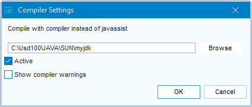

# Compiling Java in Service Definer

By default, Java in USoft Service Definer is compiled using javassist, but you can instead specify your own compiler as a path to your JDK.

> [!WARNING]
> This must be a JDK, not a JRE. This JDK must be the Java version used by your USoft installation, which is currently Java 15 for USoft 10 patches.

To specify your own compiler in place of javassist:

1. From the Service Definer menu, choose Tools, Compiler Settings.

2. Type the path that points to the JDK you want to use.

3. Set Active = Yes. To revert temporarily to javassist, set Active = No.

4. Set “Show compiler warnings” = Yes if you want to see any warnings issues by the compiler. If you leave “Show compiler warnings” = No, you will only see errors.

5. Click OK. The settings are saved in the "UServiceCompiler.xml” file in the \\APP folder of your USoft installation folder.