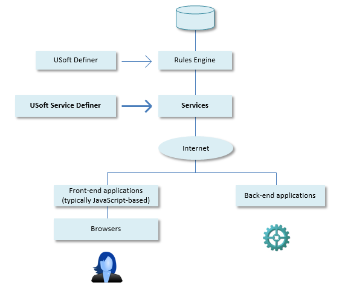
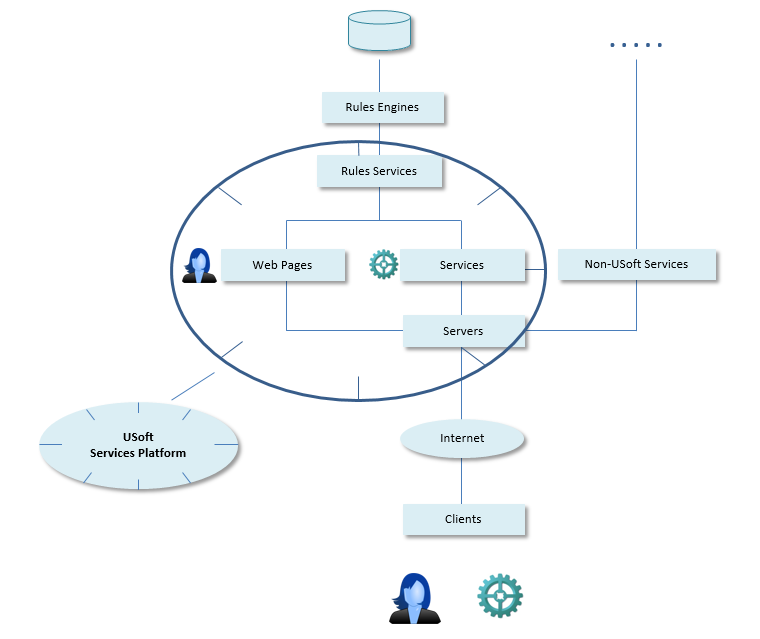

# Introducing USoft Services

USoft Services is an umbrella term for the runtime services that you can create with the USoft toolset.

These services allow data resources managed by a USoft Rules Engine to be accessed and used by web clients. This way, human agents and software agents can be allowed to retrieve resources, add new resources (such as bookings in a booking system), or manipulate or drop existing resources.

USoft Definer is the primary tool for creating a Rules Engine. USoft Service Definer is the primary tool for creating the service layer.

In a USoft services setting, resources may be used by both front-end and back-end applications. Front-end applications concentrate on letting human end users interact with data. They typically use JavaScript or a framework built on top of JavaScript to mix data and human interfaces (screens on devices). Back-end applications also interact with the resources but their main concern is not to offer a human-facing GUI, but rather to access an API exposed by USoft.

In slightly more detail, a runtime USoft services layer typically contains a collection of different objects:

- **Rules Engines** that implement desired application behaviour, enable model-driven development and safeguard data quality.

- **Services** that offer functionality to web clients.
- **Servers** that are responsible for handling runtime traffic between clients and services.
- **Web pages,** whether built in USoft or outside USoft,that let human browser users interact with the USoft application(s)  (this applies only if you wish to run a web GUI).

The USoft Services platform acts as a roadmap for USoft web products and will be completed and enriched gradually. In USoft 9.0, REST services were introduced, as well as the ability to set up USoft servers which remove dependency on Internet Information Server (IIS) as a web server. In upcoming releases, SOAP services will be moved from USoft Definer to USoft Service Definer and a richer catalogue of off-the-shelf services will be offered, opening also the way for tool-to-tool communication such as service-based access to USoft Studio functionality.