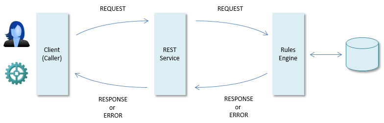
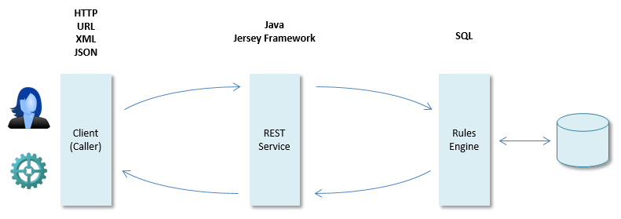

# Technologies used in USoft REST

With USoft Service Definer, you build REST services or SOAP services that connect with a USoft Rules Engine.

This help topic takes REST services as an example. In USoft REST, on behalf of the caller or client, this Rules Engine will retrieve or manipulate data (referred to as *resources* in the context of REST). Non-REST services may be less data-oriented but otherwise share most of the characteristics discussed in this help topic.

**Request-response events**

The principal stages in the process of using a REST service are the initial client **request** and a server **response.** As in computing generally, the **response** can be a normal message or, if something goes wrong, it can be a response with the status of an **error:**

**Technologies involved**

You build the REST service in USoft Service Definer as a Java object layer using a library referred to as the Jersey Framework. USoft 9.0.1E uses version **2.7** of the Jersey Framework. Java libraries used include JAX-RS for REST services, JAX-WS for SOAP services, and JAXB for serialisation and deserialisation of structures to XML and JSON.

The Java code sets up request and response communication with the USoft Rules Engine in the form of SQL statements. Using the SQL, the Rules Engine knows how to execute rules whilst retrieving and storing data in the underlying database. For this purpose, it transforms the "USoft SQL" commands into more technical commands addressed to the RDBMS. This transformation step is fully automated and transparent.

Clients who access the REST service need to know how to call it. The technologies involved here are URL syntax and the HTTP protocol (including the use of HTTP headers and the interpretation of HTTP status codes).

Some uses of REST require nothing more than a URL string to be sent as a request, and an HTTP status code to be received as a response. In other cases, there is a need to send or receive a more elaborate message. This may be done using either XML (eXtensible Markup Language) or JSON (JavaScript Object Notation).

 