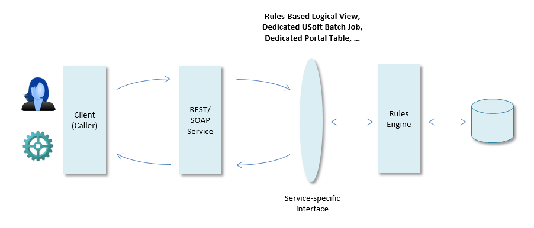

# Designing service-specific interfaces

USoft Definer allows you to make service-specific interfaces to its Rules Engine.

These are constructs that are specially made for letting REST or SOAP services interact easily with USoft.

For general information about designing services, go to Designing REST Services with USoft and Designing SOAP Services with USoft. The remainder of the current help topic discusses specific strategies.

### Logical View as service-specific interface

In USoft Definer, you can create Logical Views that present relational data differently than that they are stored in tables and columns. The nature of a Logical View is defined by a SQL statement. USoft Logical Views are essentially the same concept as Views (as opposed to Tables) in an RDBMS.

A Logical View can hide certain data from users by only selecting columns that are intended for them.

A Logical View can also combine data from multiple tables and present them as a single record. In this case its SQL statement contains a join between multiple table instances.

Logical Views are well-suited to act as REST-specific interfaces because they allow you to introduce differences between the way in which REST methods access and present data, and the way in which those same data are physically named and organised in the RDBMS.

For an example of a Logical View acting as a service-specific interface, go to help topic " Example: a REST service for retrieving data (SELECT) ".

### Rule-based Logical View as service-specific interface

In USoft Definer, a rule-based logical view allows you to present a record structure to the outside world that is seemingly a simply table in which you can INSERT, UPDATE and DELETE data through simple actions, whereas in reality a number of underlying Rules CHANGE what really happens to the data at a lower level.

As an example, imagine that Customer details are stored in a Customer table, but details of various Customer Addresses (such as Home Address, Work Address, Billing Address) are stored in a Customer Address child table.

If a service client had to interact with this table structure directly, 3 separate calls would be needed to INSERT personal details, Home Address details and Billing Address details on the same new customer. Using a Rule-Based Logical View, you can let the service client submit a single message that lists all these data in a single record structure, and have underlying Rules distribute these data across the Customer table and 2 instances of the Customer Address table.

For more details, please search for Rule-Based Logical Views in the USoft Definer help.

### USoft Batch Job as service-specific interface

The USoft Rules Engine is able to execute complex rule structures and to guarantee data integrity bidirectionally, that is, independently of the procedural order in which data are manipulated. While this has many advantages, it is sometimes easier to manipulate data in a more procedural way. In USoft Definer, you can define set data manipulation procedures by writing USoft batch jobs. These are data manipulation actions that are executed in a predefined order but run against the Rules Engine so that all underlying rules are respected.

In the context of service design, this is very useful for a range of different reasons. In a batch job you can control the order in which actions are executed and potential errors appear. You can group and organise a batch of related tasks neatly, and you can draw up a neat list of input parameters and output parameters for such a batch, that map directly to variables in input and output messages.

For an example of how to build a REST services that calls a USoft batch job, go to help topic " Calling a Batch Job with USoft Job Resource ".

### Portal table as service-specific interface

A portal table is a regular Database Table (as defined in USoft Definer) that is created for the special task of storing incoming requests. Portal tables are perhaps associated more with batch processing or SOAP services than with REST, but they can offer great flexibility even for REST if your solution involves such tasks as message queuing, advanced logging or asynchronous handling.