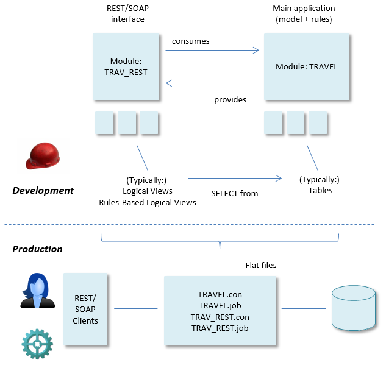

# Modular service (REST, SOAP) development

You can organise USoft applications in such a way that areas of development (development teams) become relatively independent of each other: modular development.

This is an opportunity for REST/SOAP design. It allows you to deliver a new version of your REST interface without having to wait for the team that builds the main functionality of the application.

A typical pattern is that you create a separate development-time module for the REST/SOAP interface. This module typically contains Logical Views or Rules-Based Logical Views used as REST-specific interfaces, rather than the actual Database Tables.

In the picture below, this module is TRAV_REST. It is the REST interface for the TRAVEL application. The TRAVEL module contains the main application functionality. The relationship is that the TRAV_REST module is the consumer and the TRAVEL module is the provider:

**Develop modules separately and combine them in Production**

Development-time interfaces between the 2 modules are kept to a minimum and carefully managed. This makes it possible for the teams to work independently. At runtime, development work from both teams is combined by delivering the flat files of each (or by delivering flat files for the consumer module and running the provider module from repository).

For more information about modular development, please go to the USoft Definer Guide.