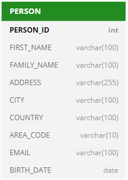
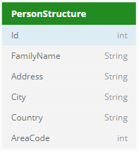

# Example: a REST Service for manipulating data (UPDATE)

In this example, you change the details of a customer that already exists in the database. You can use the **PUT** or **PATCH** HTTP verbs. This help topic discusses both. For details, go to Defining REST methods).

This example shows how you can quickly generate a REST service from a SQL statement.

In this particular example, an input parameter is used that is part of the request URL path, but you have a number of other options when designing input parameters.

*Example*

You have the following database table:



Database TableYou have the following Service Definer Structure:



Service Definer StructureThe Service Definer Structure will be the resource we use. Notice that our resource doesn't contain the Email and the Birth_Date fields that are defined in the database table. This is data we do not want to update in the example and thus we do not make this part of our resource.

## Defining SQL in the normal application

1. In the User Application, in SQL Command, write and test a SQL statement that will change the family name, address, city, country and area_code of an existing person identified by PERSON_ID, for example:

```sql
UPDATE    person
SET       
(
              family_name
,             address
,             city
,             country
,             area_code
) =
(
    SELECT    'CARRINGTON'
,             'Carlton Street 4'
,             'London'
,             'England'
,             '020'
)
WHERE     person_id = 173
```

## Defining SQL in Service Definer (using PATCH)

1. In Service Definer, create a variant of this statement that indicates the REST input parameters. To do this, choose Define, SQL Statements from the menu, then create a statement record with the following values:

Statement name: PATCH_UPDATE_PERSONApplication name: TRAVELStatement:

```sql
UPDATE    person
SET       
(
              family_name
,             address
,             city
,             country
,             area_code
) =
(
    SELECT    DECODE(
                  :PersonStructure.FamilyName
              ,   NULL
              ,   family_name
              ,   :PersonStructure.FamilyName)
    ,         DECODE(
                  :PersonStructure.Address
              ,   NULL
              ,   address
              ,   :PersonStructure.Address)
    ,         DECODE(
                  :PersonStructure.City
              ,   NULL
              ,   city
              ,   :PersonStructure.City)
    ,         DECODE(
                  :PersonStructure.Country
              ,   NULL
              ,   country
              ,   :PersonStructure.Country)
    ,         DECODE(
                  :PersonStructure.AreaCode
              ,   NULL
              ,   area_code
              ,   :PersonStructure.AreaCode)
)
WHERE     person_id = :id
```

Notice that the ID used to identify the individual person is passed as a standard input variable introduced by a colon (":id"), whereas the name and location values are passed as elements of a structure called "PersonStructure". Information in this structure that is not send is NULL and the old value is used.

This design is followed through in the entire REST design: the caller passes the ID as part of the request URL, and the rest of the information as part of an XML message.

2. Save work. Click the Check button to have your SQL syntax checked. If it is correct, the Correct = Yes flag is set.

## Defining SQL in Service Definer(using PUT)

1. In USoft Services Definer, create a variant of this statement that indicates the REST input parameters. To do this, choose Define, SQL Statements from the menu, then create a statement record with the following values:

Statement name: PUT_UPDATE_PERSONApplication name: TRAVELStatement:

```sql
UPDATE    person
SET       
(
              family_name
,             address
,             city
,             country
,             area_code
) =
(
    SELECT    :PersonStructure.FamilyName
,             :PersonStructure.Address
,             :PersonStructure.City
,             :PersonStructure.Country
,             :PersonStructure.AreaCode
)
WHERE     person_id = :id
```

The difference with the PATCH construct is that the values are always overwritten because PUT will update the whole resource instead of part of the resource. This is why there is no decode for the NULL check. Also, notice that the ID used to identify the individual person is passed as a standard input variable introduced by a colon (":id"), whereas the name values are passed as elements of a structure called "PersonStructure".

This design is followed through in the entire REST design: the caller passes the ID as part of the request URL, and the rest of the information as part of an XML message. You can also make an INSERT statement for this if the person does not exist yet.

2. Save work. Click the Check button to have your SQL syntax checked. If it is correct, the Correct = Yes flag is set

## Generating a REST method based on SQL

1. Define a custom REST service and make sure that this new service is exposed by a Server. For details on how to do these 2 things, step out to help topic " Setting up your own REST service ".

2. On the Methods tab, create a record (we are using PUT here, but you can use PATCH if you like):

|        |        |
|--------|--------|
|Method Name|PutPerson|
|Relative URI Path|/Person |
|REST HTTP Verb|PUT     |


 

3. Press the "Generate from SQL" button.


4. On the SQL Statements tab, click in the record for the statement that you want the REST method to be generated from.

5. Press the Generate button.

In the REST Services window or tab, values for Signature, Implementation and Parameters are generated.In the Catalog on the left-hand side, a Structure with name PersonStructure is offered for inspection.


:::note

If you use PUT, alter the method implementation for checking whether a resource must be updated or created.

:::

6. Save work.

## Organising input for the ID parameter

With the following steps, you organise the passing of the person ID as part of the request URL:

1. In the REST Services window, make sure you have your REST service in view. On the Methods tab, make the following setting:

|        |        |
|--------|--------|
|Relative URI Path|`/Person/{id}`|


2. On the Parameters tab for this method, make the following setting for the **id** parameter:

|        |        |
|--------|--------|
|Annotation|@PathParam("id")|


 

## Publishing the solution

1. Choose Define, Servers, and retrieve the record of the Server where you expose the service.

2. With input focus on this record, choose Publish, Publish and Restart from the menu.

## Testing the implementation

1. Open a Google Chrome browser window, search the download site for the “POSTMAN – REST Client” program, and download it to your browser.

Once installed, this program can be opened easily from a your pc.

2. Open POSTMAN, and specify the following URL:

```
http://host-name:port-number/service-uri/method-uri/id-parameter-value
```

for example:

```
http://localhost:8090/mycustomservice/Person/17
```

3. Set the HTTP verb to PUT.

You are given a form in which to submit a message.

4. Specify that your message is XML, then submit the following message:

```xml
<PersonStructure>
  <Id>17</Id>
  <FamilyName>LOGAN</FamilyName>
  <Address>Carlton Street 4</Address>
  <City>London</City>
  <Country>England</Country>
  <AreaCode>020</Address>
</PersonStructure>
```

5. Press the Send button.

See that HTTP status code "200 OK" is returned as a response. In the User Application, check that the record with ID = 17 in the PERSON table has been correctly updated with the new name values.

Another popular design of this type of REST call is to pass back the result data in a response message. For this design, go to help topic " Example: a REST Service for returning manipulated data ".
