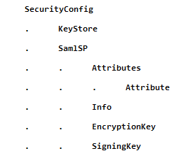

# Security configuration

## Security general remarks

Security is an integral part of any software development project. It must be addressed whenever you develop web APIs such as REST Services, SOAP Services, and WebSocket Services.

TLS, CORS, and Security HTTP Headers are some of the technologies that aim to ensure the security of your web APIs.

For more on these subjects, see Server configuration.

## Transport Layer Security (TLS)

Transport Layer Security (TLS) is based upon the older Secure Sockets Layer (SSL) technology and is now the industry-standard method for protecting web communications. The TLS security protocol provides data encryption, server authentication, message integrity, and optionally, client authentication for a TCP/IP connection. Because TLS is built into all major browsers and web servers, simply installing a digital certificate turns on their TLS capabilities.

## CORS (Cross-Origin Resource Sharing)

CORS (Cross-Origin Resource Sharing) is a mechanism that allows servers to specify who can access the resources on the server, and also how this resources can be accessed.

## Security HTTP Headers

Security HTTP Headers provide a layer of security by helping to reduce security vulnerabilities. When a user tries to access a page, the server response has a content and HTTP response headers. Those headers contain meta data, status error codes, etc. A subset of those headers are security headers which tell the browser how to behave when it handles the content.

## Security configuration file

Service Definer's Publish feature outputs a **"SecurityConfig.xml"** file when you publish a server. This file contains security configuration properties.

There is only a single "**SecurityConfig.xml**" file per server. The file is published in the Publication File Path of the server. When it is published, the file contains configuration values defined in the Service Definer tool. The file can be configured to accommodate servers in target environments at runtime.

**Security configuration element hierarchy** 

The "**SecurityConfig.xml**" file contains a hierarchy of configuration elements:

