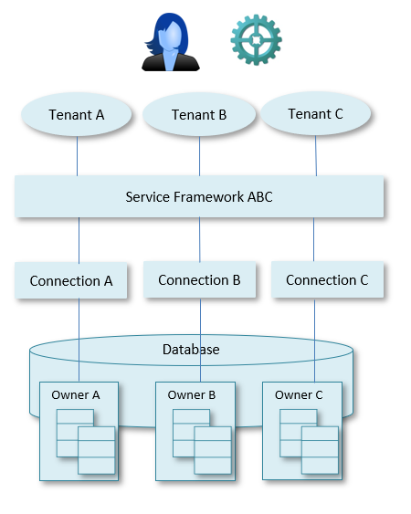
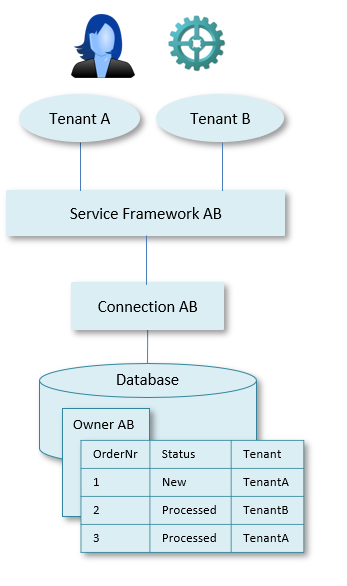
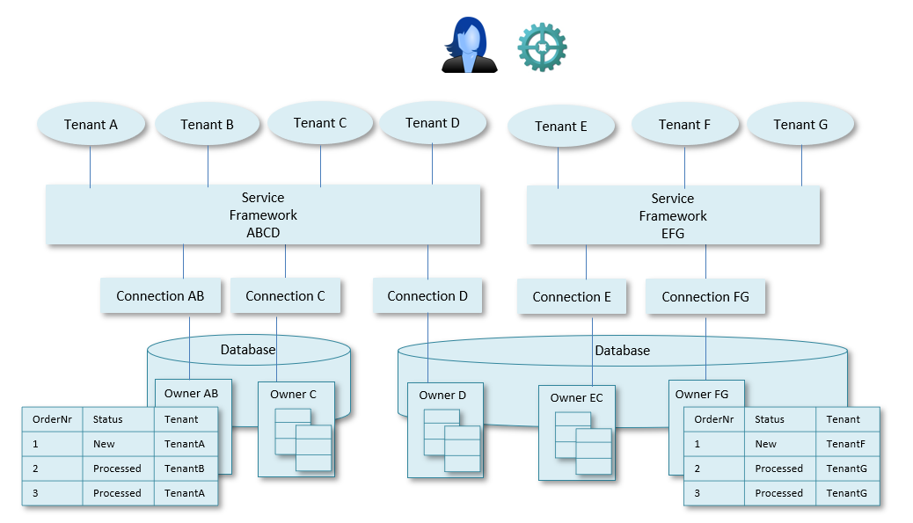

# Multi-tenancy

Multi-tenancy is an architectural pattern that enables a single instance of a software application to run on a server and serve multiple customers.

Multiple clients (individual end users and their devices) may access the application on behalf of a specific organisation, team or department. Each such organisation, team or department is a "customer" or *tenant* of the application.

Multi-tenancy is especially relevant in Software-as-a-Service (SaaS) applications. It can be cost-effective because it allows software development, deployment, maintenance and infrastructure costs to be shared across customers.

The deployment of multi-tenancy is relatively complex. It requires a high level of configurability and a good isolation between the tenants, with respect to security, but also with respect to performance.

To build a USoft SaaS application you need multiple software components:

- A database.
- Business rules. They are business logic defined in USoft Definer and run in a Rules Engine accessed by a Rules Service. The Rules Service is a Windows service.
- Services. They are connectivity interfaces defined in Service Definer, or browser-based user interfaces designed in Web Designer, or both. Services are run in a Server defined in a runtime USoft Service Framework.

Applications built with USoft may combine multi-tenancy features on one, two, or all three of these levels in order to achieve optimal tenant isolation. The chosen architecture depends on:

- the number of tenants,
- the storage needed per tenant,
- the workload per tenant,
- the frequency of schema changes,
- the customisation level needed per tenant,
- cost and budget.

Three possible architecture principles are discussed below. Ongoing monitoring of services will enable you to find the optimal tenant design for your services.

### Owner-based multi-tenancy

**Owner-based multi-tenancy** uses a different owner of the application tables for each customer. USoft makes use of the Owner field in USoft Binder  to specify the owner of the application tables:

Each customer corresponds to a different owner. This way, customer isolation is easier and the Rules Engine does not need to be aware of the multi-tenancy architecture. For details on Owners, please go to the USoft Binder Guide and look for the settings on the Database tab of the Project Properties property sheet.

### Table-based multi-tenancy

**Table-based multi-tenancy** allows data for multiple customers to access database tables owned by the same database owner. Some sort of identifier column that indicates the tenant associated with each record must be added to all tables shared between customers:

Make sure that each customer has access only to his own section of the data. Do this by place restricting authorisation conditions on the column that identifies the tenant. For details, see the USoft Authorizer Guide.

### Service-based multi-tenancy

**Service-based multi-tenancy** allows you maximum flexibility by using different levels of the service architecture to make distinctions between tenants. This allows you, at database level, to use a mix of table-based and owner-based distinctions. Tenants use connections available in a USoft Service Framework instance. Connections are configurable at deploy time via the Connections element in the "config.xml" configuration file of a server in Service Framework. See also the Multiple connections and Rules Services help topic.

The current product has restrictions:

- Connection-based multi-tenancy is not possible when using SAML authentication.
- CORS-configurations and headers in a service framework server cannot be configured per tenant.
- Active services in a Service Framework service cannot be configured per tenant.

Because of these restrictions, in practice, the distinctions you make for different tenants will currently be made at connection level only.