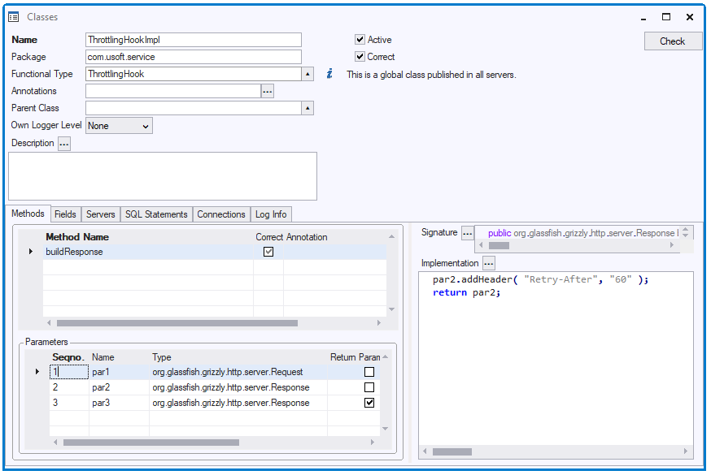

# Extending your response when a request is throttled

When throttling of requests is enabled for a Server, if the number of incoming requests exceeds the throttling limit, you will get a status code 429 and a message that the server is getting too many requests.

You can add your own text to the default response message by using the functional type ThrottlingHook in a class. For example, if you want to inform the user that he can try again after a predefined time, you can add the "Retry-After" header.

To achieve this:

1. Create a new class.

2. Press the lookup button at the Functional Type field. In the Functional Types window, select the **ThrottlingHook** functional type. If this functional type does not exist yet, insert it in a new record by setting:

Functional Type = ThrottlingHook

Implemented Interfaces Names = com.usoft.uservice.server.IThrottlingHook

3. Press OK to confirm that your new class has the ThrottlingHook functional type. Save Work.

4. Choose Actions, Add Unimplemented Methods from the main menu.

This will add a method ‘buildResponse’ with 2 input parameters, a request and a response, and a return parameter.

5. Add your logic to the incoming response object and return that response.

6. Click the Servers tab in the Classes window and add the class to the desired server(s).

Your class could now look like this:

 