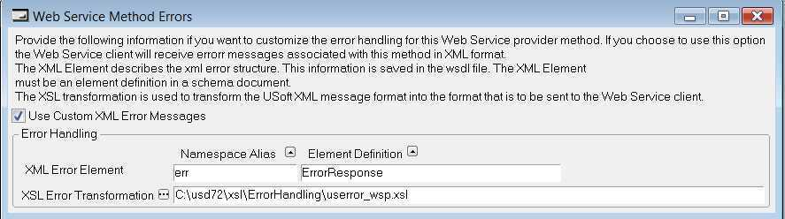

# Web service error messages

----


> [!CAUTION]
> In USoft 11.x, the functionality described here is **deprecated**.
Web service providers will be removed from USoft Definer and USoft Authorizer in USoft 12.x. Please use USoft Service Definer instead.

----


## Web service error messages

**Deserializing parameter <parameter name>: Could not find deserializer for type {<namespace>}<xml type name>**

**Cause:**

This error occurs for an RPC-oriented method if the type specified in the WSDL file does not match with the type specified by the response message (in case of an RPC-oriented method call the type name occurs in the message). The namespace and the type must be the same.

**Solution:**

If the web service provider is a USoft web service and the service is published in the Definer, make sure that the namespace used in the Authorizer is the same as the namespace used in the Definer.

**A fatal error occurred during XML parse at line <line number> column <column number>. Invalid document structure.**

**Cause:**

This usually happens if the USoft web client expects an XML message as parameter and the value is not in XML format.

**Solution:**

If the web service provider is a USoft web service and the method is a Document-oriented method or an RPC-oriented method with complex parameters, check that the values of output parameters are XML values.

**The request was unsuccessful due to an unexpected condition encountered by the server.**

**Cause:**

This is a generic message that occurs if the Microsoft XML component is not installed, the Rules Service is not started, or the host and port number specified by the web service provider are not correct.

**Solution:**

- Check that the Microsoft XML component is installed.
- Check the host and port number specified for the web service.
- Check that the Rules Service is running.

## Web service error handling

You can improve the default error message behavior by using customized XML error messages or USoft XML error messages (or a combination). Both types of XML error messages apply an XSL transformation to the default error message.

Customized XML error messages are defined per web service provider method, and generate a wsdl:fault element in the WSDL schema. This makes the structure of the error message available to the web service client.

The main characteristics of both types of error messages are:

|**Customized XML Error Messages**|**USoft XML Error Messages**|
|--------|--------|
|Each method has its own XSL transformation. A default transformation is provided (userror_wsp.xsl).|Each USoft installation uses one XSL transformation, for example userror.xsl or userror_enduser.xsl|
|The <soap:detail> element in the soap fault message contains the transformation result. This can be XML.|The result of the transformation is a string and goes into soap:faultstring and soap:detail elements in the soap fault message.|
|The WSDL schema contains fault information.|The WSDL schema does NOT contain fault information|
|Only the error messages reported by a web service method are changed.|Changing userror.xsl or userror_enduser.xsl changes all error messages reported by the Rules Service or by the application running.|


 

## Customised XML error messages

A WSDL schema can describe the structure of web service error messages. These messages can also be in XML format.

For each web service provider method, you can customize the error handling by clicking the Advanced button in the Web Services (Provider) window, and then selecting the Use Custom XML Error Messages checkbox.

The default error message structure for customized XML error messages is:

```language-xml
<ErrorResponse xmlns=" http://www.usoft.com/Solutions/USoft/Product/Messages">
<Code>code </Code>
<Message>message</Message>
</ErrorResponse>
```

The default XSL transformation (userror_wsp.xsl) transforms the error xml into this format. For example, if the error is caused by a constraint, then the error code is the constraint name and the error message is the constraint message. A unique code is assigned also for errors from:

- Mandatory columns – USMANCOL
- Relationships – USREL
- Min Max value for a domain - USDOMMIN and USDOMMAX
- Allowed values for a domain – USDOMALLOWED
- Column width – USCOLWIDTH
- Uppercase – USCOLUPPER
- Unique key - USUNIQUEKEY

All other errors have a generic USOFT999 error code.

You can change the default XSL transformation:

```
usoft-installation-folder\xsl\ErrorHandling\userror_wsp.xsl
```

You can also change the element definition for the error message in the underlying XML schema:

```
usoft-installation-folder\xsl\ErrorHandling\userror_wsp.xsd
```

## Filtering error messages

If you change the userror.xsl transformation with the one described in

```
usoft-installation-folder\xsl\ErrorHandling\userror_example.xsl
```

only the following messages are displayed: table constraints, domain constraints, mandatory columns, relationships, min/max values for a domain, allowed values for a domain, column width for a domain, uppercase constraint for a domain and unique key.

In all other cases, the string "Administrative error" is displayed.

## Example: Customised XML

This example is based on Web Service Example 3: RPC-oriented method with a complex type parameter based on a domain with allowed values.

One of the inserted column values is a maximum age. The corresponding AGE domain has four allowed values. When the request message contains 36 as value for max_age, you will get an error message, because 36 is not an allowed value. The soap error message is:

```language-xml
<soap:Envelope xmlns:soap="http://schemas.xmlsoap.org/soap/envelope/">
<soap:Body>
<soap:Fault>
<faultcode>soap:Server</faultcode>
<faultstring>main
Value 36 in field "max_age" not an allowed value in Domain "AGE" Cannot bind input</faultstring>
<detail>main
Value 36 in field "max_age" not an allowed value in Domain "AGE" Cannot bind input</detail>
</soap:Fault>
</soap:Body>
</soap:Envelope>
```

To change this default error for a web service method, click the Advanced button in the Web Services (Provider) window, and specify the following settings:



The soap error message is now:

```language-xml
<soap:Envelope xmlns:soap="http://schemas.xmlsoap.org/soap/envelope/">
<soap:Body>
<soap:Fault>
<faultcode>soap:Server</faultcode>
<faultstring>main
Value 36 in field "max_age" not an allowed value in Domain "AGE" Cannot bind input</faultstring>
<detail>
<ErrorResponse xmlns="http://www.usoft.com/Solutions/USoft/Product/Messages">
<Code>USDOMALLOWED</Code>
<Message>Value 36 in field "max_age" not an allowed value in Domain "AGE"</Message>
</ErrorResponse>
</detail>
</soap:Fault>
</soap:Body>
</soap:Envelope>
```

> [!TIP]
> To provide a different structure for the detail element in the soap message, or to handle more errors than USoft provides by default, either change the default XSL transformation in:

```
usoft-installation-folder\xsl\ErrorHandling\userror_wsp.xsl
```

OR save this file under a different name (e.g. MyErrors.xsl), change the contents as required, and change the value of the XSL Error Transformation field in the Web Service Method Errors dialog to: MyErrors.xsl.

To create a different structure, change the schema definition of the Namespace with Namespace Alias:

```
err
```

by adding a new complex type or simple type in:

```
usoft-installation-folder\xsl\ErrorHandling\userror_wsp.xsd
```

You can also save this file under a different name, change the contents as required, and change the value of the XSL Error Element field in the Web Service Method Errors dialog.