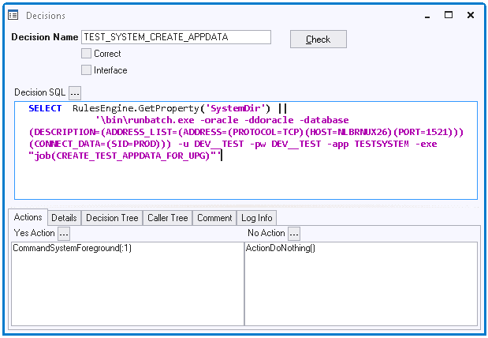

# Decisions

A **decision** is a programmatic construct in USoft Definer that allows you to:

- Mix logic expressed in SQL with logic expressed in action scripts.
- Add branching and looping to SQL statements and action scripts.

This is a technical concept. Do not confuse it with the business concept of 'decision' as used in Decision Engines and Decision Modeling and Notation (DMN, the OMG standard first published in 2014). The USoft Rules Engine can functionally act as a Decision Engine, but it is not technically defined in terms of decision trees or decision calls. Instead, it automatically implements business rules in response to data manipulation events. As such, it is constructed entirely by implementing Business Rules and does not need Decision as a modeling concept.

A Decision is defined in the Decisions info window, which displays the 4 attributes that make up every decision:

- Decision Name.
- Decision SQL.
- Yes Action.
- No Action.

*Example*

The decision shown in the picture below uses SQL to retrieve the name of the system directory and concatenate it with a command-line instruction. The result is passed to the operating system (and represented by the **:1** placeholder in the Yes Action) for execution.

If, for some reason, the SQL statement does not yield a result, nothing happens (No Action). This is probably not expected in this particular situation.

The decision is executed when it is called from an Action Task in a job, from another (or indeed from the same) Decision, from a GUI element in Windows Designer or Web Designer, or from an action script in a SQL Command window. The call from an Action Task looks like this:

```
ActionDecision( TEST_SYSTEM_CREATE_APPDATA )

```

You can also place ActionDecision( ) in the Yes Action or No Action of a Decision. This allows [branching and looping](/docs/Task_flow/Decisions/Decision_branching_and_looping.md) between decisions.

To call a decision from a SQL context, for example the SQL Command window, you must use the **action** keyword :

```
action ActionDecision( TEST_SYSTEM_CREATE_APPDATA )

```



## Defining and checking a decision

To define a decision:

1. Choose Define, Decisions from the USoft Definer menu. The Decisions window is opened.

2. Fill out the Decision Name , Decision SQL , Yes Action , and (if used) No Action. For details, see the sections later in this article.

3. Press the Check button. This will check that the Decision SQL syntax is correct.

- If the syntax is correct, the Correct flag is set.
- If the syntax is not correct, you get an error message.

4. Save work.

## Calling a decision

To call the decision you have defined, use the [ActionDecision()](/docs/Task_flow/Action_Language_reference_A-C/ActionDecision.md)****action.

## Decision Name

The required Decision Name must be unique across the repository and is the handle whereby a decision is called. Decision Names may contain alphanumeric characters, hyphens, and underscores, but no spaces, single quotes or double quotes.

## Decision SQL

The Decision SQL statement is a valid SQL SELECT or INVOKE statement, or a valid SQL fragment.

The Decision SQL is executed when the Decision is called. If it is a SELECT statement:

- If the query retrieves 1 row, the Yes Action script is executed once. If the Yes Action contains placeholders ( :1, :2 ... ), then these are substituted by values from the SELECT output list for the retrieved row.
- If the query retrieves more than 1 row, the Yes Action script is executed once for each row. If the Yes Action contains placeholders ( :1, :2 ...), each time these are substituted by values supplied by the row that is currently processed.
- If the query does not retrieve any rows, the No Action script is executed once.

If Decision SQL is an INVOKE statement, the INVOKE statement is executed, and then the Yes Action script is executed. If the Yes Action contains placeholders (:1, :2 ...), then these are substituted by result values returned by the invocation.

> [!NOTE]
> For more on placeholders, go to [Decision variables and placeholders](/docs/Task_flow/Decisions/Decision_variables_and_placeholders.md).

In Decision SQL, if you do not need to access the database, you can omit the FROM clause. if you only need to evaluate a SQL function in the SELECT clause, you only need to write a SELECT clause. If you only need to evaluate a condition, you only need to write a WHERE clause. If you have only a WHERE clause, you can even drop the WHERE keyword, so  that even the following is still a valid Decision SQL value:

```sql
:1 = :2
```

In this case, the Yes Action is executed once if the condition evaluates to true. The No Action is executed once if the condition evaluates to false.

If you have only a SELECT clause, the Yes Action is executed once.

If the Decision SQL is empty, the Yes Action script is executed once.

## Yes Action

The required Yes Action is a script containing one or more actions from the [USoft action language](/docs/Task_flow/Action_Language_reference). Multiple action statements are separated by newlines.

The Yes Action script is executed when the Decision is called and the Decision SQL produces 1 or more rows. The Yes Action is executed once for each row.

*Example 1*

If the contents in the clipboard look like a valid import, an attribute value is extracted and passed to a second decision called CP_PASTE_2:

(Decision SQL:)

```sql
SELECT   USXSL.Value( TO_CLOB( Clipboard.GetText() ) , 'MultiImport/@type' )
WHERE    TO_CLOB( Clipboard.GetText() ) LIKE '%<MultiImport type%'
```

(Yes Action:)

```
ActionDecision( CP_PASTE_2, :1 )
```

*Example 2*

In this GUI example, 2 global variables are set and a window is opened if a datatype is one of a list of specific datatypes (Yes Action). Otherwise, an error message is produced (No Action).

(Decision SQL:)

```sql
SELECT   'global_query_name:'  || :query.name
,        'global_query_confn:' || :query.constraint_file 
FROM     dual
WHERE    :datatype in ('DECIMAL', 'INT', 'INTEGER', 'NUMBER', 'NUMERIC', 'SMALLINT', 'TINYINT')
```

(Yes Action:)

```
ResourceFileUpdate( :1 )
ResourceFileUpdate( :2 )
WindowCreate(Constraint Violation Report)
```

(No Action:)

```
MessageLanguage(USoft Benchmark Message, BM_NOT_A_CONFIG, WARNING)
```

## No Action

The No Action is a script containing one or more actions in the USoft action syntax. Multiple action statements are separated by newlines.

The No Action script is executed once when the Decision is called and the Decision SQL retrieves 0 rows. If Decision SQL contains a condition only, the No Action is executed once if the condition evaluates to false.

A typical design pattern for No Action is to give an error or warning message. This is illustrated in Example 2 in the Yes Action section above.

If it is possible in your application to branch into the No Action, but no action is required in that case, good practice is to set No Action to:

```
ActionDoNothing()
```

 