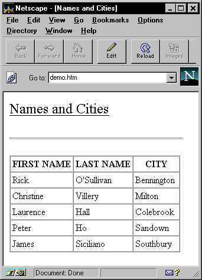

# Creating a Template for exporting to HTML

Using your own pre-defined templates, you can define exactly how pages are to look, including colors, fonts, and so on. You must save your templates in the \<install_dir>\\TEMPLATES\\HTML folder. You may want to look at the default templates to get an idea of what you can do in your own templates.

You can also define how the data is to be laid out in the HTML file, by writing the appropriate HTML code. You can use any editor to create your template. If you already know HTML, you can of course use any text processor to create the template. It is worth viewing the template before you use it, to make sure that it appears the way you want before the data is inserted.

You can include anything in your template that is possible using HTML, such as fonts, color, and so on, or links to remote pages on the World Wide Web. You can also use images in your templates, to be displayed in the final HTML pages. These may be any image type that is supported by your browser, and must be stored in the \<install_dir>\\TEMPLATES\\HTML\\IMAGES folder.

The placeholders that you put in your template to include the exported data are not HTML commands, but special placeholders used by USoft Batch. After the data has been inserted, these are removed. The placeholder codes you can use are:

1. @header@

2. @data@

3. @template@


:::note

You must supply the @data@ placeholder: the other two are optional.

:::

The @header@ placeholder specifies where the heading (which you specify when you define the external set) is to appear. If you do not use this placeholder, then no heading will be used.


:::note

Do not confuse the @header@ with the page title: you must not specify anything between the \<TITLE> and \</TITLE> commands, as this will be handled by USoft Batch.

:::

The @data@ placeholder specifies where the data is to be included in the page.

You can place both placeholders on the same line. You can also include the placeholders within standard HTML code on the same line, so that the generated page keeps any formatting you have specified in the HTML code (color, justification, and so on). For example, the code:

```language-xml
<FONT COLOR="#FF0000">@data@</FONT>

```

would result in the data being inserted and being displayed in red.

The @template@ placeholder is used to identify the table structure into which you want the table to be placed. Since you may have several other tables on the page, you must use this placeholder to indicate the table that is to be filled with the data.

The following HTML fragment is an example of what your template could look like.

```language-xml
<HTML>
<HEAD></HEAD>
<BODY>
<P>
<FONT SIZE="5"><U>@header@</U></FONT>
<P>
<P ALIGN="centre"><FONT COLOR="#008000">@data@</FONT></p>
<DIV ALIGN="center"><CENTER>
<TABLE BORDER="1" CELLPADDING="3" CELLSPACING="0"
BORDERCOLORDARK="#800000" BORDERCOLORLIGHT="#808080" @template@>
    <TR>
        <TD>&nbsp;</TD>
        <TD>&nbsp;</TD>
    </TR>
    <TR>
        <TD>&nbsp;</TD>
        <TD>&nbsp;</TD>
    </TR>
</TABLE>
</CENTER></DIV>
</BODY>
</HTML>

```

The resulting HTML page would then look something like this:




:::note

If you use frames, the number of frames in the frame template must match the number of sets using the Frames navigation style, otherwise you will get unexpected results.

:::

## Using more than one layout

If you export a parent and one (or more) child sets, you can define different layouts for each set. For example, you could have the parent information displayed in a table, and each of the child sets as lists.

In this case, you must define a table structure in your template to hold the parent data using \<TABLE> and \</TABLE> commands (as shown in the fragment), and put the @template@ tag into it.

You must then define a list structure to be used for the child data (using the \<UL> and \</UL> commands), and place the @template@ tag in that as well.

For example, you could write the following HTML:

```language-xml
<ul type="circle" @template@>
    <li>&nbsp;</li>
</ul>

```

You must also choose these layouts when defining the external sets. USoft Batch will then find the @template@ tags and, depending on the layout you have specified at definition time, use the different layouts for the different sets of data.

Remember that the @data@ tag defines WHERE the data will be placed in the HTML files: and that it must always come BEFORE the @template@ tags.

 