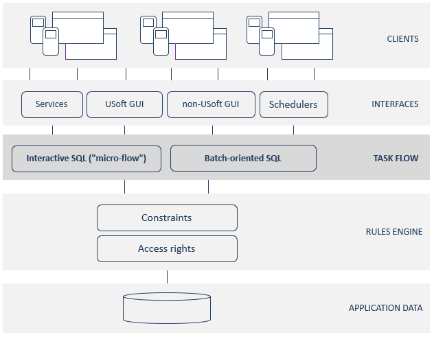
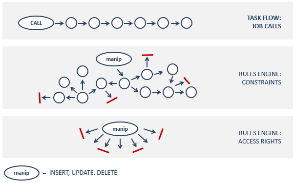
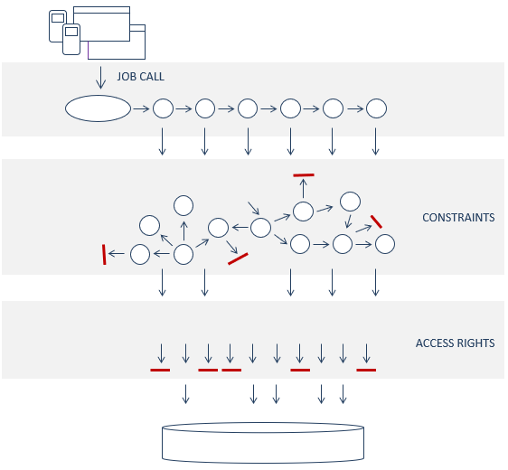

# What is task flow in USoft?

**Task flow** is a collective name for all the functionality in a USoft application that

- is not immediately client-facing at the "surface" level of GUI interfaces or APIs, and at the same time:
- is not immediately rules-oriented or data-oriented at a "deep" level.

In other words, task flow features are located at a "middle level":

Task flow includes interactive functionality or "micro-flows". A micro-flow is a routine with a beginning and an end. A micro-flow is a predefined operation that must run its course before something else can happen, but it is short enough that the client can wait for it.

By contrast, task flow also includes classic batches, as when a financial institution consolidates the transactions of the day by running a scheduled nightly batch.

Both micro-flows and batches are procedural operations, also referred to as jobs, which are activated when clients (human or software) call them.

In a job, steps are taken, branches chosen and loops repeated in a strict predefined processing order. This sets task flow apart from the workings of the underlying Rules Engine, a piece of software that reacts to data manipulation in a non-procedural fashion by enforcing both constraints and access rights. Depending of direction "from which" the client is coming, the Rules Engine is able to react in different ways:

The following table summarises the directionality and type of action at each of the 3 tiers depicted:

|** **   |**Task flow**|**Rules Engine: Constraints**|**Rules Engine: Access rights**|
|--------|--------|--------|--------|
|Directionality|Sequential|Multi-directional|Non-directional|
|Action  |Productive only|Productive and Restrictive|Restrictive only|

 

In a USoft application, two basic principles apply:

- Any data manipulation attempted by a client must always pass via the Rules Engine. Micro-flows and batches "talk to" the Rules Engine and not directly to the database.
- The Rules Engine, in turn, will never perform any data manipulation that the client does not have access rights for, even if an attempt to manipulate or query data is made by a constraint on behalf of a client, rather than directly by the client.

The result is that a USoft application is effectively a stacked layer of 3 tiers that clients traverse whenever they access data:

 

 

 