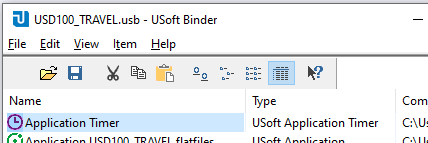

# Scheduling a job

To schedule a job is to make sure that its execution is triggered not by an interactive user action (such as pressing a button), but by the system clock reaching a specified date and time.

The execution of scheduled USoft jobs may be triggered in a number of ways:

- By a timer created in USoft Service Definer.
- By an iterated decision.
- From the OS command line.


:::warning

You can also schedule from a looping Benchmark procedure or by using the T_APP_TIME table. These  strategies are becoming obsolete. They are covered at the end of this article.

:::

## Scheduling by a timer created in USoft Service Definer

This is a good option especially if you are already publishing from USoft Service Definer.

You can create a Server with a USoft timer (**com.usoft.uservice.task.UTimer**) which fires every n minutes and calls a USoft batch job.

 This option was supplied in a reply to this article.

Another option, which we use: create a Service Framework server with a USoft timer (com.usoft.uservice.task.UTimer) which fires every n minutes and calls a batch job.

## Scheduling by an iterated decision

To trigger jobs automatically and without user interaction, you can start a Rules Service that calls an Iterated Decision. You set up such a Rules Service by setting the following 2 parameters during its configuration:

- Iterated Decision = (*the name of the decision you want triggered*)
- Decision Interval = (*the frequency with which you want this to happen*)

Each time the interval expires, the Iterated Decision is called. The effect is just the same as if you activated the [decision](/Task_flow/Decisions/Decisions.md) from a script, by calling:

```
ActionDecision( *decision* )
```

A Rules Service that calls an Iterated Decision is dedicated to doing just that. It is a Windows service “background” process for your USoft application that listens to the system clock and that runs independently from, and in parallel with, "foreground” user processes that allow end users to interact directly with your USoft application.

The decision itself is defined as per normal in USoft Definer. You can only call a single decision as Iterated Decision (but you could have multiple distinct  Rules Services calling different decisions). You cannot pass input parameters: the decision designated as Iterated Decision is not allowed to refer to input parameters.

### How to set up Iterated Decision calls

To set up Iterated Decision calls:

1. Define the decision in USoft Definer (see next section for tips).
2. .
3. During configuration, set  to the name of the decision, and  to the desired frequency (ie., to a different value than the default 'Never’). Instead of doing this configuration, you can also configure and test the Rules Service as per normal, and then go back using the Previous button to make these 2 additional settings.

### How to define an iterated decision

[Decisions](/Task_flow/Decisions/Decisions.md) give you access to all stored data and they allow branching and looping, so you have complete freedom to decide what is to happen each time the interval expires.

A typical approach is that you [modelfacts around job scheduling](/Task_flow/Job_scheduling/Modelling_scheduled_jobs.md) in your application. You could have a table SCHEDULED_JOB that contains the names of multiple jobs to be triggered, and the time and date when they must be triggered. You could have child tables for parameters and parameter values.

In a very simple scenario with just job names, the decision could look something like this:

*Decision SQL*

```sql
SELECT     job
FROM       scheduled_jobs
WHERE      last_fired < CURRENT_DATE()
```

*Yes Action*

```
update-resource( 'it_job:' || :1 ) 

SqlScript(
  set quitzeroRows False
  set quitOnError True
  invoke batchrunner.runjob with select
	'True'   "-quiet"
,	:"it_job"
;
)
```

## Scheduling from the OS command line

If you have the support of a Windows administrator, you could schedule jobs by placing a [runbatch.exe](/USoft_for_administrators/USoft_command_line_syntax/runbatchexe.md) command in a .bat file and trigger its execution at OS level using the system clock.

The **runbatch.exe** command could trigger a single top-level USoft job that is responsible for calling the execution of any scheduled subjobs with the correct parameters and values. This strategy is appropriate or convenient if you have nightly consolidation batches, especially if these are a combination of USoft and non-USoft routines.

*Example*

```
C:\USoft\bin64\runbatch.exe  -ddoracle -ddowner MY_DD_OWNER -oracle -database MY_DATABASE -u MY_USER -owner MY_OWNER -pw MY_PASSWORD -logfile c:\USoft\logs\MY_JOB.log -wlogfile -app MY_APP -exe "job(MY_JOB)" 
```

## Older strategies for scheduling jobs

These strategies are becoming obsolete.

### Scheduling from a USoft Benchmark procedure

Write a decision that will call the jobs to be executed, much in the same way as you would write an iterated decision as explained earlier in this article.

Now write a USoft Benchmark MY_PROCEDURE procedure that contains the following 2 steps:

*Step 1*

```
Action = ActionDecision( MY_DECISION )
```

*Step 2*

```
Procedure = MY_PROCEDURE
```

The procedure calls the decision, then calls itself, so it executes in a loop.

Define a BenchMark test associated with the procedure.

Run the test run by clicking the Player icon in the BenchMark toolkit window and selecting the new test. Before running, click the Settings button, set the interval at the required number of milliseconds between each decision call, and click Save Settings.

### Scheduling with the Application Timer

By default, USoft constraints cannot be scheduled: they execute in response to data manipulation but not in response to the system clock. An old use is to set up an Application Timer. This consists of writing the current date and time constantly to a table called T_APP_TIME (a table with a single record), and then writing constraints that refer to this record.

A disadvantage of this technique is that the application timer must run continuously. Another disadvantage is that you cannot commit batch processing on a record-per-record basis.

The T_APP_TIME table is delivered by USoft as a default. If you use this default, an INVOKE constraint that triggers a scheduled job could look like this:

```sql
INVOKE    batchrunner.runjob WITH
SELECT    s.job
FROM      scheduled_job s
,         t_app_time t
WHERE     s.last_fired < char_to_date( 
            concat(
			  t.app_day
			, '-'
			, t.app_month
			, '-'
			, t.app_year
			, ' '
			, t.app_hour
			, ':'
			, t.app_minute
			, ':'
			, t.app_second
			)
            , 'DD-MM-YYYY HH24:MI:SS'
          )
```

To set up the process of writing the current date-and-time to the T_APP_TIME table:

1. In USoft Binder, from the menu, choose Item, New, check Application Timer, then click Add. An Application Timer item is added to the entry list:



2. Right-mouse-click the Application Timer and choose settings. Press OK.
3. Double-click the Application Timer item to start. The process appears in a foreground CMD box.

You can stop the process from Task Manager by selecting **USCLOCK.EXE** and then pressing End Task.