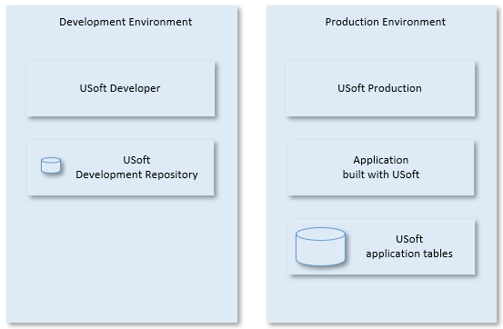
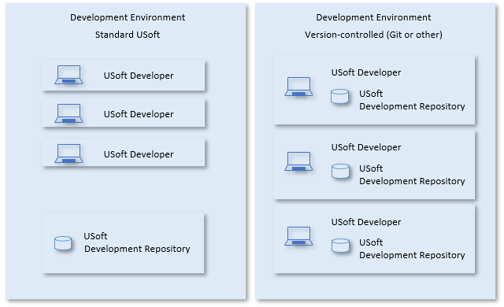

# Installation overview

## General installation steps

General installation steps are as follows:

1. Configure the **system** where you want to install USoft.

2. Install, configure and start the **database product** you want to use for the USoft tables.

3. Install the **USoft product** and create the database tables that are needed in the environment (as illustrated in the pictures in this article).

:::tip

To install the USoft product, you need an executable and a license file. The executable file is named something like "USDSetup-x64.exe”. The license file is named “license.dat”.

:::

## Requirements

[Hardware and operating system requirements](/docs/USoft_for_administrators/Installing_USoft/Hardware_and_operating_system_requirements.md)

[Oracle requirements](/docs/USoft_for_administrators/Installing_USoft/Oracle_requirements.md)

[Microsoft SQL Server requirements](/docs/USoft_for_administrators/Installing_USoft/Microsoft_SQL_Server_requirements.md)

## Environments

The procedure you use to install USoft Series products depends upon the type of environment you are creating. There are two basic types of environment:

- Development Environment
- Production Environment

In a development environment, a team creates one or more USoft applications. In a production environment, a USoft application is accessed and used by runtime end users.

In practice you are likely to have extra environments for special purposes, for example, to test or demonstrate new features.

Some USoft components do not have a clear Development/Production split. USoft Authorizer is used for authorisation in both types of environment; you can use USoft Authorizer in a runtime environment to change the authorisation of Production users without delivering these changes from Development. You can also use the USoft Services Platform to add or change runtime services without delivering these from Development.

USoft applications are created by using the USoft Developer product. This product stores development information in special tables called the USoft Development Repository.

The resulting USoft applications are data-intensive and have a number of interrelated application tables. In practice, when a development team starts work, it will create a copy of such tables also in the development environment, because it is almost impossible to test and debug a USoft application without trying it out on design-time application tables.

Development vs. Production## Standard or version-controlled Development Environment

`USoft 11``{.vs_11}`

From USoft 11, a developer team can connect USoft to a version control system such a Git.

If this option is chosen, installation requirements for individual development machines are higher. Each team member requires a complete Development Environment including his or her own copy of a Development Repository (a database with development-time tables).

If this option is not chosen, developer machines do not need to have an RDBMS installed. The entire team shares a single RDBMS in Development.

Whichever option is chosen, RDBMSs can be installed locally or accessed across a network.

Standard USoft vs. Version-controlled USoft (Development)##  