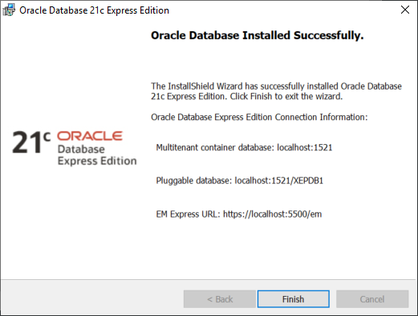

# Installing Oracle XE 21c for USoft

This article tells you how to install Oracle XE 21c for USoft.


:::danger

This article is for developers who want to create a local USoft sandbox installation on top of a free Oracle version.
We have NOT yet tried and tested Oracle 21c for Production environments (as you can see [here](/USoft_for_administrators/Installing_USoft/Oracle_requirements.md)). In client projects, use Oracle 19c****instead.

:::

## Prerequisites

### Unset environment variables

Temporarily unset any ORACLE_HOME and TNS_ADMIN environment variables you may have set. You need to unset these at the system level.

### Remove existing XE installation

There must not be an existing Oracle Database Express Edition Service (XE Service) on your machine left from any previous install. If there is, use Control Panel, Remove Programs, and remove this first.

### Ensure you have Administrator privileges

The user as whom you are logged on to the OS must be a *direct* member of the Administrators group. Being a member of some group that is itself member of the Administrators group is not sufficient.

If you are logged in as a domain user, make sure you are on a network that can reach the domain server. For example, if you usually use a VPN to reach your domain server, make sure you have this VPN turned on. Alternatively, you can create a local user, add that user to the local Administrators group, and then log on and install as that local user.

## Oracle installation

### Download Oracle 21g

Go to:

[https://www.oracle.com/nl/database/technologies/xe-downloads.html](https://www.oracle.com/nl/database/technologies/xe-downloads.html)

Click the appropriate download link. Wait for the ZIP file to download to your computer, then unzip it. Find the unzipped "setup.exe" file.

### Prepare for supplying SYS password

You are about to walk through an easy installation wizard. Simply accept defaults wherever possible, but be prepared that Oracle will ask you to provide an initial password for the SYS, SYSTEM and PDBADMIN accounts. For this password, USoft suggests you invent a high-fidelity password and not a predictable standard password such as ‘manager’.


:::tip

Case-sensitivity of Oracle user names and passwords requires some consideration.
**User names**
The following 2 statements create a user with the *same*, *case-insensitive*, user name. This ties in with the general principle that the SQL language is case-insensitive:
Even with the first statement, the created user can be referred to as DEMO_USER: this is what case-insensitivity is all about. Such case-insensitive user names are still the norm in SQL tools generally, and also in USoft. Furthermore, it is general practice to refer to these names by all-uppercase strings, just like it is customary to write SQL statements in all-uppercase letters.
Oracle does support *case-sensitive* user names: you need to double-quote the name when you create it. But they are not often used. Third-party APIs could well have difficulty with case-sensitive user names.
**Passwords**
In contrast with user names, passwords are case-sensitive automatically, so that the following statements create *different* passwords:
Oracle did not support case-sensitive passwords prior to version 11g, so any tool that predates 11g was not built with that possibility in mind.

:::

### Install Oracle 21c

Double-click “setup.exe” to start the installation wizard.

The installation could take 15-30 minutes depending on characteristics of your system.

The final screen looks something like this:



### Test the XEPDB1 database connect string alias

In a CMD box, type the command:

```
> tnsping XEPDB1
```

The response tells you whether the XEPDB1 alias can actually be translated into a full database connect string. If so, you see a mention such as:

```
OK (20 msec)
```

If you cannot see this success message, open the "**tnsnames.ora**" file.


:::warning

Unfortunately, Oracle changed its default file locations as of version 21c, so you may need to fiddle around to get **tnsnames.ora** in the right place. I found that some contexts looked for connectstring aliases (that is, for the **tnsnames.ora file)** in the location returned by **tnsping**, in my case:
while others looked in:
so that I ended up keeping a copy of **tnsnames.ora** in each of these locations...

:::

Make sure that "**tnsnames.ora**” contains an instruction such as the following. You may find you have to replace "XE" by "XEPDB1" to get this instruction:

```
XEPDB1 =
  (DESCRIPTION =
    (ADDRESS = (PROTOCOL = TCP)(HOST = NLNT56.usoft.com)(PORT = 1521))
    (CONNECT_DATA =
      (SERVER = DEDICATED)
      (SERVICE_NAME = XEPDB1)
    )
  )

```

If you have difficulty getting the XEPDB1 alias to work, you could always fall back on the explicit database connect string when you set up USoft (in the steps below). Instead of the alias, simply use the connect string itself as the value of the Database property in USoft Binder:

```
(DESCRIPTION=(ADDRESS=(PROTOCOL=TCP)(HOST=NLNT56.usoft.com)(PORT=1521))(CONNECT_DATA=(SERVER=DEDICATED)(SERVICE_NAME=XEPDB1)))
```

### Ensure authentication by NTLM

You must ensure that the Windows Networks LAN Manager authentication service (NTLM) is active, in order to avoid error ORA-12638: Credential retrieval failed. Details are [here](https://mikedietrichde.com/2021/03/10/ora-12638-on-windows-only-from-oracle-19-10-0-onwards/). Take these steps:

1. Find the “” file. The filepath leading to this file is in the response given by .
2. In this file, add the following setting or go to Step 3.

```
NO_NTLM=FALSE
```

3. If Step 2 fails to work, and your “” file contains the following line of code:

```
SQLNET.AUTHENTICATION_SERVICES= (NTS)
```

then try replacing this by:

```
SQLNET.AUTHENTICATION_SERVICES= ()
```

### Explore listener process

This step is optional. In a CMD box, type the command:

```
> lsnrctl stat
```

The response gives you detailed information about the listener process that handles calls to the database.

### Explore pluggable databases (PDBs) in the container database (CDB)

This step is optional. From the command line, run the Oracle SQL*Plus tool and log on to the container database (CDB) as follows:

```
> sqlplus

> Enter user-name: / as sysdba
Connected.

```

 This works because the person who installed the database softwere is always allowed to connect as sysdba by a single-sign-on scheme: his Windows username/password is used for access to Oracle ("OS authentication").


:::note

In SQL*Plus, a forward slash with no user name in front of it and no password following it is used to connect using OS authentication. The words "as sysdba” are a suffix that cause the user to log on with special administrator privileges.

:::

 By way of exploration, issue this query:

```sql
SQL> SELECT NAME FROM V$PDBS;

NAME
-----------
PDB$SEED
XEPDB1

```

"PDB$SEED" is a template that the container database (CDB) can use to create new pluggable databases (PDBs). Contrast "PDB$SEED" with the actual PDBs it helps create:

- "PDB$SEED" is system-supplied, but a PDB is user-created.
- "PDB$SEED" is a generic facility, but a PDB contains the data and code required for specific features.
- You cannot create or modify objects in "PDB$SEED", but you can in a PDB.
- There is always exactly 1 "PDB$SEED" but you can have 0, 1 or multiple PDBs.

## Setting up for USoft

### Create a database account for USoft in XEPDB1

Log on as user SYS of the XEPDB1 pluggable database that the Oracle installation process has created by default. Create a DEMO_USER database account for USoft:

```sql
SQL> connect SYS/*password*@XEPDB1 as sysdba
Connected.

SQL> CREATE USER DEMO_USER IDENTIFIED BY DEMO_USER DEFAULT TABLESPACE USERS QUOTA UNLIMITED ON USERS;
User created.

```

Now grant privileges to the new user.

```sql
SQL> GRANT CREATE SESSION, ALTER SESSION, CREATE TABLE, CREATE SEQUENCE TO DEMO_USER;
Grant succeeded.
```

The ALTER SESSION grant is new compared to older USoft scripts of this type. This grant allows you to make important settings at RDBMS level, such as changing a password or changing the way that date values are processed and represented.


:::tip

In a local try-out environment where secrecy is not a must, it is practical to have an identical username and password, with the password in all-uppercase letters. This way, you can easily copy-paste the values for User, Password, and Owner fields in the various tool interfaces.

:::

### Set up access to USoft

Start USoft Binder. USoft Binder is the **usbinder.exe** programme in the \\bin64 directory of your USoft 10.0 installation.

Create and save a new USoft Binder file called "DEMO_USER.usb".

In this file, from the menu, choose File, Project Properties, Database and enter:

|        |        |
|--------|--------|
|**User**|DEMO_USER|
|**Password**|DEMO_USER|
|**RDBMS**|Oracle  |
|**Database**|XEPDB1  |
|**Owner**|DEMO_USER|


Save work. You are now ready to create the USoft repository. The next 2 steps are:

1. Right-mouse-click on the Authorizer item, choose Create Tables, press OK.

2. Right-mouse-click on the Definer item, choose Create Tables, press OK. Now double-click the Definer item to open the USoft development platform.