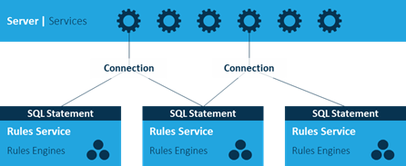
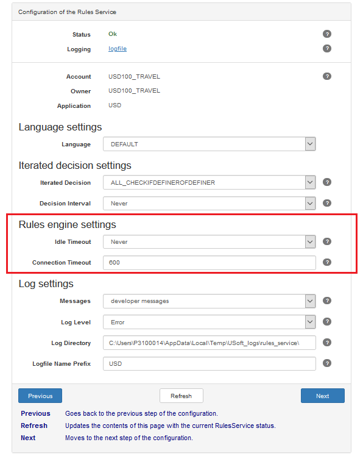
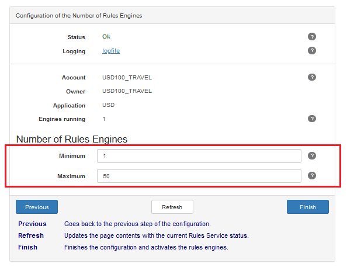

# Scaling

## What is scaling ?

Scaling is making sure that a USoft application has an acceptable performance even at peak periods. You scale an application by extending available resources or by re-organising current resources so that they are used more efficiently (or a combination of both). There are 3 general scaling strategies:

|**Scaling strategy**|**Explanation**|
|--------|--------|
|Applicative scaling|Improvements in application-specific characteristics: application design, Rules Service configuration, or Rules Engine configuration.|
|Vertical scaling|Improved use of available resources (CPU, RAM or DISK) of existing hardware and software.|
|Horizontal scaling|Extension of available processing units or physical nodes through the addition of technical resources: CPU, network bandwidth, RAM size or DISK size.|

This article first offers an overview Quick Guide of the issues involved.

Then, it pays special attention to applicative scaling, taking event-driven, message-intensive USoft solutions as an example.

Finally, at the end of this article, you find general comments on Vertical scaling and Horizontal scaling.

## Quick guide to scaling

### Create a baseline

Good scaling begins with the ability to acknowledge that, in general, a USoft application shows acceptable and expected performance. A **baseline** gives you this ability. A baseline is an environment for performance tests in which you keep a maximum of characteristics stable, so that you can diagnose the impact of change in specific areas when it happens:

- Running benchmark tests against a baseline allows you to signal performance issues even before you see them in Production.
- Fixing and testing against a baseline allows you to determine that a scaling strategy is effective for solving a problem that you have.

A baseline should be single-threaded so that you rule out the influence of accidental user concurrency.

Using (re-)initialisation scripts and documentation should allow you to rebuild the baseline as much as possible in the same way as in the previous run: same architecture, same configurations, same data content, same tested operations.

This article helps you see different application layers. You need different tools to monitor performance at different levels. Use OS tools for CPU monitoring. Use RDBMS diagnostic tools for monitoring database behaviour. Use [USoft Benchmark](/Modeller_and_Rules_Engine/Testing_a_Rules_Engine_with_USoft_Benchmark/Getting_started_with_USoft_Benchmark.md) for monitoring and analysing Rules Engine behaviour. In large applications you may want to mobilise specialised tooling for network and server monitoring, for example, Nagios.

### Troubleshooting

|**If you see this ...**|**… the cause may be this ...**|**… and the solution may be this:**|
|--------|--------|--------|
|You have an event-driven application and there is a delay in processing incoming or outgoing messages.|Queue formation: a build-up of unprocessed messages.|
Review application design.

Review configuration of Rules Services.
			Review configuration of Rules Engines.|
|The processing of individual sub-tasks or overall end-to-end tasks slows down inacceptably.|
CPU resources, or

RDBMS characteristics, or
			USoft application characteristics.|
If CPU load is (structurally) above 60%, scale in CPU resources.

If CPU load is (structurally) below 60%, check database performance.

If database performance is insufficient, scale in RDBMS.

If database performance is sufficient, review configuration of Rules Services or Rules Engines.
|
|At peak hours the RDBMS returns locking errors.|Too many application threads compete for the same resources.|Review application design: serialise the application process that causes the lock.|
|CPU load is at 100% for prolonged periods.|Too many Rules Services consume all available CPU.|
Horizontal scaling:

Improve allocation of available processing units or physical nodes.
			Otherwise, add CPU power.|
|The RDBMS has issues reading or writing data to disk.|Disk I/O traffic is congested because the RDBMS is not tuned optimally.|
Sharding or partitioning;

Extending memory;
			Switching to SSD.|

## Applicative scaling

Typically, USoft web applications have 3 layers that you can scale. In a USoft web UI (a collection of web pages for human interaction), they are:

- The web page as processed by an interactive browser.
- Rules Services and Rules Engines.
- The RDBMS.

In a USoft service-oriented interface (a software layer directed at automated use by other software), they are:

- The interface services, typically offered by a **server** developed in [USoft's Service Framework](/Services/Introducing_USoft_Services/Introducing_USoft_Services.md);
- Rules Services and Rules Engines.
- The RDBMS.

Layers in a USoft service-oriented solutionThis remainder of this article discusses *server-side* performance optimisation: scaling of interface services, Rules Services and Rules Engines, and the RDBMS.

The technology stack has interconnected interface services, connections, Rules Services and Rules Engines. The configuration and tuning of these different components is an important part of applicative scaling possibilities.

### Interface services

**Interface****services** expose USoft application functionality to the outside world. They receive incoming information and forward it to a Rules Service, or they request information from a Rules Service on behalf of an external agent.

A **server** advertises these interface services**.** An interface service uses one or more **connections** which address **Rules Services.** Connections provide load balancing between Rules Services according to the "round-robin” principle.

The number of connections and Rules Services can be configured. Connections can send requests to different Rules Services on one or more Windows servers. The interface services themselves can be installed on separate servers as well.

These types of redundancy at the Windows server level will improve the robustness of the application and might help achieving near 100% up-time. If one service fails, another will still be able to process the request.

However, scaling *for performance* will typically not involve duplicating interface services. Bottlenecks typically lie at the Rules Services level, as we will see in the remainder of this article.

When you use a USoft REST solution, a Java framework by the name of Grizzly is used to enable threading between the interface service and the Rules Service. This layer uses a maximum of 2 threads per (virtual) CPU core by default. If your Windows server has a quad core CPU, an interface service can open 8 connections to a Rules Service at most. If you require more, the solution is to add another Windows server. Trying to alter this Grizzly default is not advisable. This limitation does not apply to other frameworks like JMS. Each Rules Service can start a maximum of 50 Rules Engines.

### Rules Services and Rules Engines

The purpose of a **Rules Service** is to enforce business rules, or business logic, when application data is manipulated, as well as to *provide* this rules-enforced data to external agents. This includes the enforcement of access rules or authorisation rules. The threads spawned by a Rules Service are called **Rules Engines**. Rules Engines connect to the RDBMS and execute data transactions on behalf of the Rules Service. They are the workhorses of the application and the layer where you are most likely to spend time analysing what needs to be done to improve performance.

Duplicating Rules Services that perform the same tasks may or may not improve application performance, depending on the business logic of your application. More Rules Services lead to better performance only if they do not contend for the same data at the same time. The next section on event-driven applications gives an example of the choice between scaling by adding Rules Services and scaling by changing application design.

A Rules Service can activate multiple Rules Engines to allow for multithreading: when one Rules Engine is occupied, the next processing request is picked up by a different Rules Engine. The number of Rules Engines (or *threads*) per Rules Service can be configured. New Rules Engines are started automatically depending on this configuration parameter. As a result, scaling at the Rules Engine level is largely automated. Rules Engines will end their session automatically if they are idle for a given amount of time.

Keeping transactions small is important for systems that process large volumes of messages. If a transaction is small, a single Rules Engine can handle many requests.

You can open a browser-based Rules Service configuration console at a **ure.config** URL, for example, by creating and then using a **Rules Service item** in a [USoft Binder file](/USoft_for_administrators/USoft_Binder/USoft_Binder_for_administrators.md). In this console, you can set **Idle Timeout** and **Connection Timeout** for a Rules Service:

|**Setting**|**Explanation**|
|--------|--------|
|Idle Timeout|When this time-out expires, a Rules Service will free all cached data and exit. Service recovery options on Windows can be used to auto-restart the service. The "Auto Start with service" flag must be set to "Yes" for this.|
|Connection Timeout|When a client is inactive for more than this time-out period (in seconds), the connection is broken. Use this setting to prevent long idle connections to the Rules Service. 0 means that no time-out applies.|

 

You can also set how many Rules Engines the Rules Service must spawn, by setting **Minimum Number of Rules Engines** and **Maximum Number of Rules Engines.** The number of Rules Engines per Rules Service must be between 1 and 50:

### The RDBMS

In a USoft application, the RDBMS handles data requests submitted by Rules Engines.

The ACID model in RDBMS transaction handling ensures that USoft solutions feature strong data integrity. Every consecutive data change is checked so that it complies with all the business rules of the application. Data changes may occur simultaneously provided they do not block each other.

Poor data model design, poorly written SQL, and improper indexing may result in performance penalties, especially when Rules Engines send a high number of SQL statements in a short period of time.

To prevent this, create a performance baseline: a benchmark that allows you to make comparisons. This way, you can detect RDBMS performance deterioration over time, perhaps as a result of an increase in the number of features of your application. If the RDBMS becomes a bottleneck, no hardware or application scaling will be able to counter this.

Each RDBMS vendor offers scaling possibilities of its own. Oracle call their solution Real Application Clusters (RAC), Microsoft uses the name “Always On Failover Clustering”. In a USoft environment the RDBMS is almost exclusively used to store and retrieve data. USoft uses only a few elemental database features in the area of business logic, notably:

- Mandatoriness of database columns and
- Uniqueness of indexes.

To take scaling measures at RDBMS level, you need to mobilise RDBMS-specific tooling for performance measurement and diagnosis.

## Applicative scaling for event-driven solutions

This section discusses applicative scaling of *event-driven* USoft solutions. The purpose of event processing with USoft is to enforce business rules by analysing incoming information and reacting to it in real time. This allows you to adapt to change, distribute workload on multiple event processing engines, and implement fault-tolerant behaviour.

An event-driven system in USoft consists of [event processing](/Services/Event_processing) services that:

- Receive events;
- Process the information carried by the events, where the USoft Rules Engine is responsible for enforcing business rules on the event data by executing *constraints*;
- Produce events based on business rules.

This type of solution has typical design patterns:

- **Synchronous** input processing & **synchronous** result.
- **Synchronous** input processing & **asynchronous** result.
- **Asynchronous** input processing & **synchronous** result.
- **Asynchronous** input processing & **asynchronous** result.

Your application’s design pattern determines available options for applicative scaling.

You need to select the optimal design pattern in view of the application's technical and functional requirements. This may change over time as requirements evolve. Reviewing an application’s design pattern and determining whether it is still is the optimal pattern is an essential step in considering scaling scenarios.

The more asynchronous processing is introduced in the design pattern, the more scaling options are available. Asynchronous processing has multiple areas in the application layer where interface services and Rules Services can be tuned.

In high-volume messsaging systems, multiple Rules Services could easily contend for the same data and lead to database locks. Duplicating Rules Services or Rules Engines that perform the same task is not likely to solve these locks. Here, scaling at application design level could be successful.

You could have different Rules Services deal with distinct parts of the data processing, as in an assembly line. This is often possible when a system receives different messages from other systems at different time intervals. One Rules Service deals with the reception of one message type, performing operations like logging and parsing the message, and then writes a message to an internal message queue. The next Rules Service could picks up messages from that queue. Yet another Rules Service could deal with a different type of incoming message and place it in the same internal queue, and so on. This strict separation of responsibilities can prevent database locks and mitigate the chief performance threat.

Asynchronous design patterns similarly apply a strategy of separating responsibilities. They allow for better scaling than the synchronous patterns, as each activity is separate, both at the application and the database level. This is a preferable scenario for parallel tasks. Record locking must be designed carefully here, so that deadlocks are avoided.

When database locking is not an issue but performance issues remain, for example in the area of queue formation of messages awaiting processing, then adding Rules Services is an effective scaling option.

## Vertical scaling

Vertical scaling consists of improved use of available resources (CPU, RAM or DISK).

In general, the performance of a USoft application will deteriorate over time due to all sorts of reasons, for example added functionality and increasing data volumes. This performance is most directly affected by application design, application configuration and RDBMS processing: in other words, by what we call *applicative scaling* in this article. Look at applicative scaling before you look at vertical scaling.

Some (virtual) hardware environment systems allow for adding/increasing CPU power and memory as a configuring option. Yet choosing specifications with a reasonable margin of surplus from the outset seems preferable.

## Horizontal scaling

Horizontal scaling consists of extending available processing units or physical nodes through the addition of technical resources: CPU, network bandwidth, RAM size or DISK size.

Each layer of a USoft solution could potentially be the subject of horizontal scaling: interface services, Rules Services, and RDBMS.

Horizontal scaling is especially effective for executing asynchronous tasks.

Horizontal scaling has two distinct purposes. One is to add robustness (reliability) in terms of failover capability and up-time. The other is to add speed. In both cases, the trade-off is that horizontal scaling is more costly because it involves more hardware or network bandwidth, but especially because it involves more administrative tasks.

As a means of countering performance issues, adding extra nodes must be done with great caution. The most likely hotspot is the RDBMS. Adding more Rules Engines to stress an already overtaxed RDBMS will only cause more trouble. Adding more servers to a database cluster when reading or writing to the storage system is an issue, will also be counterproductive.

Sharding, horizontal partitioning of the data, might be a solution at the database level if the application business logic allows for it, preferably if shards have no or little data in common.

Although not strictly a scaling strategy, keeping the Rules Service and RDBMS on separate servers will prevent them from contending for the same resources: disk storage, memory and processing power. When properly implemented, the penalty of extra network traffic in such a distributed architecture will be negligeable.

 