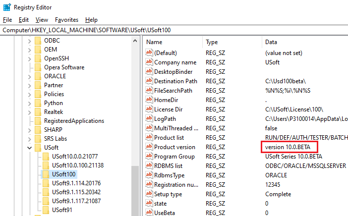

# USoft registry keys on Windows

When you install USoft on Windows, key information is stored in the registry editor at:

```
Computer\HKEY_LOCAL_MACHINE\SOFTWARE\USoft\*version*
```

where *version* is normally the USoft major release version without dot notation, for example:

```
USoft91
```

While it is customary and recommended to have only a single USoft installation on a server at any one time, it is possible to have several [different versions](/docs/USoft_for_administrators/Understanding_USoft/Versioning_of_USoft_Developer.md) concurrently. In this case you must ensure you are looking at the correct set of registry keys.

For each major release version, USoft Setup stores registry information for the most recently (or the only) installed patch under the name of the major version. Here is an example of registry keys for USoft 10.0.BETA:



The set of registry keys (on the left) is named:

```
Usd100
```

The letter patch of the USoft installation is listed as the value of the "Product version” key (on the right, highlighted). The *USoft installation directory* is listed as the value of the "Destination Path” key.


:::tip

As you can see, it is possible to have multiple sets of registry keys even for a single USoft major release version: in the example, there are 3 sets of registry keys with a name starting **USoft10…** .

:::

USoft registry keys are not generally intended to be modified in the Registry Editor even if this is physically possible.


:::note

Some teams like to set the **FileSearchPath**key to influence where USoft executables look for application flatfiles.

:::
