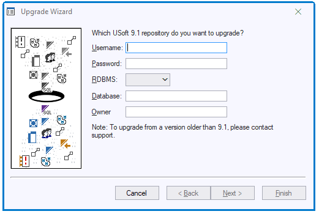

# Upgrading the Development environment to USoft 10.0

To upgrade to USoft 10.0, first [upgrade to USoft 9.1](/docs/USoft%20for%20administrators/Upgrading%20to%20USoft%2010/Upgrading%20to%20USoft%2091.md). Then, upgrade to USoft 10.0 as a separate action.

> [!WARNING]
> In USoft 10, **usergroups** and** table rights** have been moved from the Authorizer to the Definer. Usergroups are now called “roles”. The Upgrade tool moves this information automatically, but this process may require some manual checking and tweaking in your situation:
> **Make sure the Upgrade tool identifies your consumer application**
> The Upgrade tool usefully moves access rights information from (old) Authorizer to (new) Definer. But it does this only for what it identifies as your main consumer application, not for modules. It identifies the application to be upgraded as the first (or only) application registered in Authorizer as NOT running from flatfile.
> In summary: make sure that the application you want upgraded is the only application in Authorizer registered to run from repository.
> To get access rights of modules upgraded, run the Upgrade tool where you develop the module, then generate a flat file and make this file available to the consumer application. This way, you will be able to define Module Rights for consumed modules in terms of USoft 10 roles.
> **Make sure you synchronise with the new USAUTH.CON file**
> If you have declared USoft Authorizer as a module, you must Synchronise with the new USAUTH.CON file. The following tables are no longer in the module interface because they do not exist anymore in USoft Authorizer 10.0:
> T_AUTH_APPLICATION_TABLE
T_AUTH_COLUMN
T_AUTH_COLUMN_PRIVILEGE
T_AUTH_CONDITION
T_AUTH_TABLE
T_AUTH_TABLE_PRIVILEGE
T_AUTH_USERGROUP
T_AUTH_USER_USERGROUP

You are now ready to take the following steps to upgrade the Development environment to USoft 10.0.

## Step 1: Backup

Make a **backup** of your USoft 9.1 repository, using RDBMS vendor utilities. Refer to your RDBMS documentation for details of how to do this.

This is a security procedure. The only purpose of the backup is to enable you to restore the USoft 8 application in the case of major difficulties with the upgrade. Give some thought to this emergency plan: what steps would you take to clear the environment so that the backup would be successfully restored?

## Step 2: Violation reports of source repository

Make **violation reports** for relationships, constraints and columns in the source repository (= the repository before upgrade).

If there are any violations, fix them, and run and inspect the reports again, until you have no violations left.

For detailed instructions on this step, read the help topic How to make violation reports.

> [!NOTE]
> You may want to consider making an additional backup after fixing all violations.

## Step 3: USoft 10.0 installation

**Install** the USoft 10.0 products for which you have a license. Follow the instructions in the Setup wizard.

As of USoft Developer version 6.1, prior to upgrading, you must reinstall a License Server. Refer to the USoft Installation Guide for details.

## Step 4: Checklist

At this point, make a **checklist** for your specific environment. List application components that you know will require attention, or that you want to check before or after the upgrade.

Below is a list of known problems and workarounds, or issues that are known to require attention in some environments. Please consider if they should be on your checklist.

Carry out the actions on the checklist before or after this Step 4, as appropriate.

### Developer roles

For USoft Definer, most teams have assigned developers and other team members in Development to pre-defined USoft developer roles (called *user groups* in USoft 9.1, and *roles* in USoft 10.0). These assignments will automatically upgrade to USoft 10.0.

Some teams have *altered* the pre-defined USoft 9.1 access rights to USD (USoft Definer) for developers. This was possible in 9.1 Authorizer, but is no longer possible in USoft 10.0. Any such alterations will be **lost** on upgrade to USoft 10.0. Instead, developers will get the predefined USoft 10.0 access rights to USD. These access rights are [described here](/docs/USoft%20for%20administrators/Creating%20a%20USoft%20Development%20environment/Authorising%20team%20members%20for%20USoft%20100.md).

### USoft data export files

If you have produced data export files in a USoft tool for purposes such as backup or test initialisation, these files are not automatically guaranteed to be importable into USoft 10.0. This is particularly true of the older formats:

- .TDF files made with USoft Benchmark
- .EXP object shopping files made using Export Definitions in USoft Teamwork

but also applies to XML formats:

- .XML files made by calling XML.EXPORT
- .XML object shopping files made using Export Definitions in USoft Teamwork.

If the data contained in these files resides in the repository, make sure that you re-create the files as part of the upgrade effort. If the data resides only in the external files, you need to **convert** the files to USoft 10.0:

1. Using the USoft version you are upgrading FROM, create an empty account.

2. Import the file(s) into this account.

3. Run the upgrade procedure on this account.

4. Re-export the file(s).

### Upgrading Teamwork Object Shopping files (optional)

If you have Teamwork Object Shopping export files (.EXP) that you re-use on a regular basis, you should be aware that USoft 10.0 now only support the XML format.

The .XML format also minor improvements in the inclusion mechanism compared to the old .EXP format. The inclusion mechanism determines, on the basis of the elements in an Export Definition, exactly which objects are exported to file. For details, open the USoft 9 Additional Notes (available from the Start menu) and read the notes marked with OBJECT SHOPPING.

To upgrade your Teamwork export files from .EXP to .XML:

If the data resides in the repository:

1. Upgrade to USoft 10.0.

2. Produce an .XML version of the file. Choose Teamwork, Object Shopping, Definitions from the USoft Definer menu. Retrieve the corresponding Export Definition in USoft Teamwork, enter a filename and press OK.

3. In the file system, check that the new file is correctly produced, and remove the old .EXP file.

If the data resides only in the external file:

1. Using the USoft version you are upgrading FROM, create an empty account.

2. Import the file(s) into this account. Choose Teamwork, Object Shopping, Analyze and Import, and follow the instructions in the wizard.

3. Run the upgrade procedure on this account.

4. Produce an .XML version of the file. Choose Teamwork, Object Shopping, Definitions from the USoft Definer menu. Retrieve the corresponding Export Definition in USoft Teamwork, enter a filename and press OK.

5. In the file system, check that the new file is correctly produced, and remove the old .EXP file.

## Step 5: Upgrade procedure

**Upgrade** the application to USoft 10.0. Use the automated upgrade procedure as explained below in this section.

### What the upgrade procedure does

The upgrade routine will upgrade:

- USoft Authorizer.
- USoft BenchMark.
- USoft Definer.
- USoft Delivery Manager.
- USoft Service Definer
- USoft Windows Designer.
- USoft Web Designer.

### How to run the upgrade procedure

1. Start USoft Binder for USoft 10.0.

2. Choose Item, New from the menu. Check the Upgrade checkbox. Press the Add button.

The Upgrade Tool item appears in the item list.

Save work by pressing the Save button.

3. Double-click on the Upgrade Tool item.

The Upgrade application is opened.

4. Choose File, Start Upgrade from the menu. The Upgrade Wizard is displayed:



5. Type the user name and password you use when connecting to the database.

6. From the dropdown list, choose the RDBMS you are connecting to.

7. In the Database field, specify the connect string you use to identify the database to which you are connecting. For Oracle over SQL*Net V2, for example, this would be of the form:

```
<machine_name><database_sid>
```

See your RDBMS documentation for more information.

8. Press Next to continue. The second dialog is then displayed.

9. Click Finish to start the automated upgrade procedure. Allow time for it to complete.

10.When there are no errors, a message will be displayed saying "The upgrade procedure completed successfully.".If the upgrade fails for any reason, the reasons for failure will be written to a file name UPGRADE.LOG in the USoft Log directory. After checking the log file and fixing the reasons for the failure, the upgrade procedure can be started again. The upgrade procedure will automatically continue where it was left off.

## Step 6: Violation reports of target repository

Make **violation reports** for relationships, constraints and columns in the target repository (= the repository after upgrade).

If there are any violations, fix them, and run and inspect the reports again, until you have no violations left.

For detailed instructions on this step, read the help topic How to make violation reports.

## Step 7: Test

**Test** the effect of the upgrade:

1. Regenerate the CON and ESI flat files of your application.

2. Deploy the flat files in a test or acceptance environment or in a copy-of-production environment.

3. Test important user scenarios (use cases) either manually or, if you have structured USoft Benchmark tests, by running these tests.