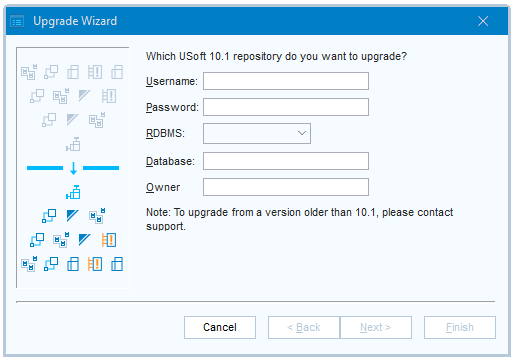

# Upgrading to USoft 11.0

## Development environment

:::warning

To upgrade to USoft 11.0, first [upgrade to USoft 10.1](/docs/USoft_for_administrators/Upgrading_to_USoft_10/Upgrading_to_USoft_101.md). Then, upgrade to USoft 11.0 as a separate action.

:::

### Step 1: Backup

Make a **backup** of your USoft 10.1 repository, using RDBMS vendor utilities. Refer to your RDBMS documentation for details of how to do this.

This is a security procedure. The only purpose of the backup is to enable you to restore the application in the case of major difficulties with the upgrade. Give some thought to this emergency plan: what steps would you take to clear the environment so that the backup would be successfully restored?

### Step 2: Violation reports

[Make violation reports]()****for relationships, constraints and columns in the source repository (= the repository before upgrade).

If there are any violations, fix them, and run and inspect the reports again, until you have no violations left.

### Step 3: Install USoft 11

**Install** the USoft 11.0 products for which you have a license. Follow the instructions in the Setup wizard.

Prior to upgrading, you must reinstall a License Server. Refer to the USoft Installation Guide for details.

### Step 4: Checklist (suggested)

We suggest you make a checklist of known issues that need double-checking when you upgrade your application. A list of problem areas that teams often want to check can be found in the "Step 4” section of [this article](/docs/USoft_for_administrators/Upgrading_to_USoft_10/Upgrading_the_Development_environment_to_USoft_100.md).

### Step 5: Upgrade

**Upgrade** the application to USoft 11.0. Use the automated upgrade procedure as explained below in this section.

### What the upgrade procedure does

The upgrade routine will upgrade:

- USoft Authorizer.
- USoft BenchMark.
- USoft Definer.
- USoft Delivery Manager.
- USoft Service Definer
- USoft Windows Designer.
- USoft Web Designer.

### How to run the upgrade procedure

1. Start USoft Binder for USoft 11.0.

2. Choose Item, New from the menu. Check the Upgrade checkbox. Press the Add button.

The Upgrade Tool item appears in the item list.

Save work by pressing the Save button.

3. Double-click on the Upgrade Tool item.

The Upgrade application is opened.

4. Choose File, Start Upgrade from the menu, or click the icon just below the menu:

The Upgrade Wizard is displayed:

5. Type the user name and password you use when connecting to the database.

6. From the dropdown list, choose the RDBMS you are connecting to.

7. In the Database field, specify the connect string you use to identify the database to which you are connecting.

8. Press Next to continue. The second dialog is then displayed.

9. Click Finish to start the automated upgrade procedure. Allow time for it to complete.

If there are no errors, a message will be displayed saying "The upgrade procedure completed successfully.".If the upgrade fails for any reason, the reasons for failure will be written to a file name UPGRADE.LOG in the USoft Log directory. After checking the log file and fixing the reasons for the failure, the upgrade procedure can be started again. The upgrade procedure will automatically continue where it was left off.

### Step 6: Violation reports of target repository

Make **violation reports** for relationships, constraints and columns in the target repository (= the repository after upgrade).

If there are any violations, fix them, and run and inspect the reports again, until you have no violations left.

For detailed instructions on this step, read the help topic How to make violation reports.

### Step 7: Test

**Test** the effect of the upgrade:

1. If you use flatfiles in Development, then re-generate these for your application. Deploy the newly generated files to test or acceptance environments or to a copy-of-production environment.

2. If you have a **runtime web application** in Development:

- In Service Definer, stop and de-install the Server responsible for the Page Engine.
- In Service Definer, re-install this Server, then “Publish And Restart” this Server.
- Stop and Remove the Rules Service responsible for Rules Engine access of the web application.
- Re-install and restart this Rules Service.
- Clear the Publication Directory where Web Designer published your webpages. Then, in Web Designer, re-publish.

3. Test important user scenarios (use cases) either manually or, if you have structured USoft Benchmark tests, by running these tests.

## Production environment

:::warning

To upgrade to USoft 11.0, first [upgrade to USoft 10.1](/docs/USoft_for_administrators/Upgrading_to_USoft_10/Upgrading_to_USoft_101.md). Then, upgrade to USoft 11.0 as a separate action.

:::

Re-release all deliverables in Development using USoft Delivery Manager.

On the Production machine, install USoft 11 and deploy the released deliverables.

Make sure you restart Page Engines and Rules Services.

Production environments contain not only application tables with end user data, but also USoft Authorizer tables. When you plan to upgrade the environment to USoft 11.0, you must plan to have these tables upgraded. To upgrade USoft Authorizer tables in Production, you can:

- Use the Upgrade tool from USoft Binder.