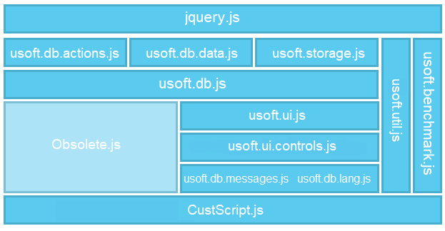

# Active web browsers

In USoft Web Designer 9, the creation of HTML has moved to the client. The server has become a hatch that serves files on request. The advantages of this approach are:

- The processing power of the client is used.
- The client has knowledge of the local conditions like type of browser, available resolution, locally stored data, etc.
- JavaScript can be used, which is a much more powerful language than XSLT which was used in USoft 8 to produce HTML server-side.
- Network load is reduced.

This innovation has been made possible by the recent sophistication of web client devices. The clients of today are no longer the simple machines they were a couple of years ago. Also, standards are now much better implemented, making it easier to create websites that can be interpreted by different browsers. Even smartphones have more than enough power to perform this task.

In the processing that USoft Web Designer 10 expects clients to perform, aspects of data interaction are carefully separated from user interface (UI) aspects. The latter are responsible not for content, but only for visual aspects and surface behaviour.

Data-related elements all use the same UDB library. This library, with calls starting with $.udb, is implemented in the "usoft.db.js" file. This library is documented in the UDB sections at the end of the [Web & App UIs subject](/docs/Web%20and%20app%20UIs).

UI-related elements all use the same UI library implemented in files called "usoft.ui[.*].js". This library is documented as the USoft UI library.

Any functions that existed in USoft 9 but have been superseded by more powerful functionality have moved to the "Obsolete.js" file. The "CustScript.js" file has not changed.

Overview of .js files enabling active web client interpretation 

## Supported browser versions

 

USoft 10 Web Designer supports recent versions of Edge, Opera, Firefox en Chrome browsers.
USoft 10 Web Designer has limited support for IE11.