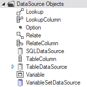
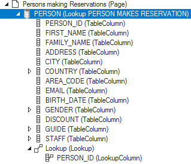
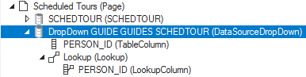
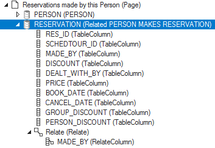
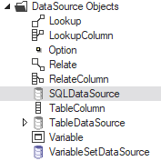

# Data sources

Data sources allow USoft web pages to access stored data. For you as a developer, they provide access to data with only a minimal need to code SQL statements manually.

Data sources allow your users query, view and manipulate data in web pages directly, but they also allow you indirectly to organise, access and program data behaviour in Javascript routines.

There are 3 main types of data source in USoft. The standard type that gives you the most low-code functionality is **TableDataSource.** Use TableDataSources as the standard type, unless you have special reasons to do otherwise.

|**Main data source type**|**Description**|
|--------|--------|
|TableDataSource|A data source generated automatically by USoft on the basis of your data model.|
|SQLDataSource|A data source created manually and defined as a SQL statement that you use for custom interaction with data in your web application.|
|VariableSetDataSource|A data source not based on your data model. This type is becoming obsolete.|

## Finding data source objects in Web Designer

Data source objects and related objects appear as classes in the DataSource Objects folder of the Controls catalog of Web Designer. This allows you to create your own subclasses of these controls and use them in customised pages:

In addition, TableDataSource objects appear by default in the default pages that USoft creates on the basis of the data model that you defined in USoft Definer. For example, here is a lookup page that contains a lookup data source (a type of TableDataSource, as explained below in this article) based on a relationship between the PERSON and RESERVATION tables:

## TableDataSources

TableDataSources are typed as **Info**, **Lookup**, **Related**, or **Dropdown** data sources. Each of these is discussed in a section below:

- **Info data sources** are the standard connection to data that are searched, selected or manipulated.
- **Lookup data sources** are for searching and selecting foreign key values from a lookup window (eg., selecting a Product for an Orderline).
- **Dropdown data sources** are for selecting foreign key values from a dropdown list (eg., selecting the Country of Origin of a Product).
- **Related data sources** are for accessing child data related to a currently selected parent (eg., all the Orders of a given Customer).

### Info data sources

An **info data source** based on a table T provides a standard connection to data stored in T so that these data may be searched, selected and manipulated in a web page.

Use an info data source unless you specifically need a lookup data source, a related data source, or a dropdown data source.

Info data source objects and the classes that type them are simply named after the database table they are based on ("PERSON"). In the Controls catalog, you also find classes starting with "Info..." ("Info PERSON") to signpost the difference with other types of data source.

### Lookup data sources

A **lookup data source** is typically used to look up parent data for use in the context of a child table. For example, when you add a new Reservation for an existing booker, maybe you look up the booker in a Person table for use in the Reservation.

In the Controls catalog, there is a Lookup data source available for each parent in each relationship of your data model. Default lookup pages contain a lookup data source by default.

What makes a TableDataSource a lookup data source is the presence of a Lookup child object containing one or more LookupColumn objects. This Lookup object is responsible for determining the way in which the lookup data are connected to the foreign keys at child level:

### Dropdown data sources

A **dropdown data source** is typically used to select a parent value for use in a foreign key field (that is, at child level). For example, when you add a new Scheduled Tour, maybe you look up the tour guide of that Scheduled Tour in a Guide parent table. This is similar to how a lookup data source works, but the user remains on the same page and just expands a dropdown list, instead of stepping out to a lookup page.

For each relationship in your data model that has Lookup Method = Dropdown List, default pages that have a foreign key field for that relationship contain a dropdown data source by default. A default data source has a Lookup object with one or more LookupColumn child objects. This Lookup object is responsible for determining the way in which the lookup data are connected to the foreign keys at child level:

### Related data sources

A **related data source** is typically used to provide access to child data for use in the context of corresponding parent data. For example, when a user has searched, selected or entered Person data, a next step might be to search, select or enter Reservation data in which that Person is the booker.

In the controls catalog there is a Related data source available for each child in each relationship of your data model. Default related pages contain a related data source by default. A related data source has a Relate object with one or more RelateColumn child objects. This Relate object is responsible for determining the way in which the related data are connected to the parent data they belong to:

## SQLDataSources

A [SQLDataSource ](/docs/Web_and_app_UIs/Data_sources/SQLDataSources.md)is essentially a SQL statement that defines some customised data interaction that you want in your web application.

Create a SQLData Source by creating a subclass of the SQLDataSource control class that you find in the Web Designer Controls catalog:

## VariableSetDataSources

**VariableSetDataSources** are used for page-level scripting: they do not connect to database data. Variable Set data sources can store any kind of variable.

A Variable Set data source holds only one record if it is used for variables procedural scripting (JavaScript). It may also serve as output data source for a SQL Statement, in which case it might hold more then one record. You cannot search a Variable Set data source.

:::note

VariableSetDataSources are becoming obsolete. The only reason to use them is to hold values that are not stored in the database but that you want to show to the user, for example, in TextColumnControls. But in USoft 10, the [UDB library](/docs/Web_and_app_UIs/UI_Library/USoft_controls_from_jQuery_udbControl.md) offers rich support for handling such values as well. Prior to USoft 9, VariableSetDataSources were essential to hold values during page navigation because the top-level document was replaced when you navigated to a different page.

:::

**Option controls**

In a USoft application, options (= possible values) for radio buttons and dropdown lists are often not painted at GUI level, but generated on the basis of allowed values in domains with Display Type = Check Box, Option Buttons, or Dropdown List Box.

But you may also use **option controls** at GUI level, for example if you want to:

- Restrict the number of allowed values in the domain. You could have a domain with 4 allowed values, but in a specific web page, you only want the user to be able to choose from 3 of these values. In this case, you can manually add options to a Variable or Table Column object, and then link the desired control with the associated data source items.
- Build your own option controls that are not linked to values in database columns.