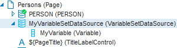

# How to define a Variable Set Data Source

To define a [VariableSetDataSource](/Web_and_app_UIs/Data_sources/Data_sources.md):

1. From the Web Designer catalog, open the page in which you want to define a variable set.

2. From the Controls tab of the catalog, drag a VariableSetDataSource object onto the main (Page) object in the object tree.

3. From the Controls tab of the catalog, drag a Variable object onto the new VariableSetDataSource object in the object tree.

4. For the inserted objects, change the Name property and optionally set other properties.

The top area of the object tree now looks like this:

A VariableSetDataSource can contain multiple Variables.