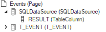
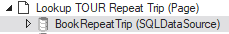

# SQLDataSources

This article is about a special type of data source called **SQLDataSource** that allows you to write your own SQL to get data from the database.

This is a temporary edit.

## When to use?

SQLDataSources are especially useful for more complex queries that you cannot easily express by [modifying the underlying SQL of standard TableDataSources](/docs/Web_and_app_UIs/SQL_and_Web_Designer/Modifying_underlying_SQL_of_TableDataSources.md). Complex join constructs, calls to RDMI components, and job calls (especially if you are interested in output data returned by the job) are in this category.

----

`USoft 9.x``{.vs_10}`

SQLDataSources are a USoft 10 feature. They are not available in USoft 9.x and earlier. To catch and use query result data in your USoft 9 web pages, see the [USoft 9 alternative to SQLDataSources]() below.

----

## Defining a SQLDataSource

To define a SQLDataSource:

1. 

2. 

3. 


:::tip

You can write any SQL statement, but it is customary to view data sources as a strategy for making data available in your web page. For this reason, to write  manipulation SQL (INSERT, UPDATE, DELETE statements), USoft suggests you use [executeSQLStatement actions](/docs/Web_and_app_UIs/SQL_and_Web_Designer/executeSQLStatement_actions.md) instead.

:::

## Catching a SQLDataSource result value

If you wrote a SELECT statement, you want to “catch” the retrieved data for use in your web page. Also, if you wrote an INVOKE or SELECT statement calling a job or RDMI component, you might want to "catch” returned output values.

To "catch” SQLDataSource result values, for each output column, you need to insert a TableColumn object:

1. From the Controls tab of the catalog, drag a **TableColumn** object onto the SQLDataSource object in the object tree.

2. For this new TableColumn object, change the name and optionally set other properties.

- Name the TableColumn after a column or column alias used in the SQLDataSource’s SQL property, e.g., **RESULT**.
- You do not necessarily need a TableColumn for each output column in the SQL statement. 
- Output columns in the SQL statement are matched to inserted TableColumns first by alias, then by name, and lastly by position (i.e., order of appearance in the statement).

The top area of the object tree should now look something like this:



## Executing a SQLDataSource

A SQLDataSource is only the definition of a SQL statement that you want to put to use in a web GUI.

To effectively put it to use, you need to **execute** the data source by calling **executeQuery().**

### Displaying a result value in a field

To display the result value of a SQLDataSource in a field:

1. Insert a in the web page.

2. Set its  property to the name of the SQLDataSource object and its  property to the name of the inserted TableColumn that maps to the result value.

3. Do something that executes the datasource:

- You can add an event listener, for example with Event Type = **load**, that calls the **executeQuery** action for the data source.
- You can set the **Initial State** property of the SQLDataSource to **QueryRecords**.

### Using the result value programmatically

To use the result value of a SQLDataSource programmatically, use code like the following snippet, which displays a result value in an alert box:

```js
$.udb('MySQLDataSource').executeQuery().then(function(dsc){
	alert(dsc.rows("current").cols("RESULT").val());
});
```

## Example: SQLDataSource embedded in a larger structure

This section shows an example of how you can enrich a standard structure of TableDataSources by embedding an added SQLDataSource in it. In this particular example, the SQLDataSource is responsible for calling a job. The successful execution of this job is a condition for navigating back to the original page from where you called the lookup.

A SQLDataSource with Name = BookRepeatTrip has a SQL statement that calls a job:

```sql
SELECT   BatchRunner.REPEAT_TRIP(
         :RES_ID RES_ID
,        :TOUR_ID TOUR_ID
,        'True' "-quiet"
)        AS RES_ID
```

This SQLDataSource is inserted in a standard lookup page (containing a standard lookup TableDataSource, not shown):



Through the following script, the Select button in the lookup page calls the job. This call returns a result value on success. If the job is successful, the user returns to the calling page, where the result value is used as a search condition:

```js
$.udb('BookRepeatTrip').executeQuery(
  {
    hostvars: {
      RES_ID: $.udb('../V_RESERVATION').rows('current').cols('RES_ID').val(),
      TOUR_ID: $.udb('TOUR').rows('current').cols('TOUR_ID').val()
    },
    success: function(){
      $.udb.acceptLookupValue().then(function(){
      $.udb('V_RESERVATION').executeQuery();});
    }
  }
)
```

## USoft 9 alternative for SQLDataSource


:::warning

On USoft 10, use a SQLDataSource. The explanation below is for the benefit of USoft 9 developers and developers dealing with upgraded USoft 9 applications that use this technique. This technique is likely to become obsolete in USoft 11.

:::

To "catch” result record values of a SELECT statement:

1. Insert a VariableSetDataSource object in your page.
2. Set the Output Data Source Name property of the executeSQLStatement() action to the name of this VariableSetDataSource.
3. Access the result data in the VariableSetDataSource as you would access data held by any other data source.