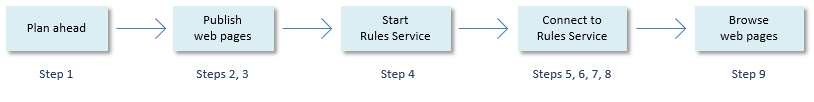

# Getting started with Web Designer

This help topic tells you how to publish and run an application in Development with USoft default web pages. This is your starting point for customising ("painting") these default pages in Web Designer. The next help topic helps you understand the Development environment you will have created.

Follow these steps to publish and run an application in Development with USoft default web pages.



After completing Step 9, if required, you can [upgrade to the HTTPS protocol](/Web_and_app_UIs/Getting_started_with_Web_Designer/Upgrading_to_the_HTTPS_protocol.md).

## Step 1. Planning ahead

1. Determine the name of the Application that you want to create web pages for.

**More on application names:** In USoft, application names provide a mechanism for keeping multiple different implementations based on the same data model and business rules. When you develop a data model and rules in USoft Definer, you work *across* any applications that use this model and rules, or could use it in the future: this is a repository-wide approach. But when you come to define interfaces that let users interact with the model and rules, such as web pages or other GUIs, or REST APIs, you have the option to create multiple applications with different names. This also allows you, in USoft Authorizer, to organise access rights separately for each application.

Applications are functionally different from each other. Choose an application name that reflects a functional subject (such as 'TRAVEL', 'HR' or 'REPORTING'), rather than an application name that reflects a technical reality, such as an RDBMS user name or a computername.

2. Determine the name and port number on your local machine that you want to allocate to the USoft **Rules Service** that will give access from the web pages to the user data and rules. This Rules Service will materialise as a Windows Service on your Windows system and will be visible in the Services panel.

The port number must be a port number not yet in use. For example: **7777**. Be sure to avoid port numbers that are generally in use, eg., **80, 443**.

It is customary to use as a Rules Service name the string "RulesService". The combination of Rules Service name, hyphen, and port number, eg., "RulesService-7777", is what the Windows service will be called. This combined name will appear in the Services panel.

In this case, we want the service to be optimally recognisable in the Services panel of your operating system, so we will favour **USoft-TRAVEL-rules** as a Windows Service name.

3. Determine the name and port number on your local machine that you want to allocate to the USoft **Server** that is to run your web pages. This Server will act like a web server. It will allows browsers to run your web pages through URL commands. Like the Rules Service, this Server will materialise as a Windows Services on your Windows system. Unlike the Rules Service, this server is a Java implementation published as a .JAR file.

The port number must be a port number not yet in use. For example:** 8090**. Be sure to avoid port numbers that are generally in use, eg., **80, 443**.

To make the server optimally recognisable in the Services panel of your operating system, we will favour **USoft-TRAVEL-server** as a Windows Service name.

4. Determine the folder on your local file system where you want Web Designer to publish your web pages. For example, if your application is called TRAVEL:

c:\\usoft\\publications\\TRAVEL\\webpages

5. Determine the folder on your local file system where you want to publish the .JAR file that defines the USoft web server. For example, if your application is called TRAVEL:

c:\\usoft\\servers\\TRAVEL\\

6. Decide if you want to use the HTTP protocol or the secured HTTPS protocol when browsing your web pages and letting others in your Development environment browse them.

If you want to use the HTTPS protocol, a **.pfx** certificate file is required with a Private Key.

### Summary of plan

Here is an overview of the decisions you have made in this Step 1: Planning ahead.

|**Item**|**Example value**|
|--------|--------|
|Application|TRAVEL  |
|Rules Service, port number|7777    |
|Rules Service, Windows Service name|USoft-TRAVEL-rules-7777|
|Page Engine, port number|8090    |
|Page Engine, Windows Service name|USoft-TRAVEL-server-8090|
|Publication folder|c:\\usoft\\publications\\TRAVEL\\webpages|
|Alternative template folder|c:\\usoft\\publications\\TRAVEL\\alt|
|Publication file path (for Page Engine server)|c:\\usoft\\servers\\TRAVEL\\|
|HTTP or HTTPS?|HTTP *  |


* If you require HTTPS, you will need a **.pfx** certificate file with a Private Key.

## Step 2. Setting up Web Designer (USoft Binder)

1. In the USoft Binder file that you use for your project, choose Item, New... from the menu.

The Add USoft Project Items dialog appears.

2. Click the Web Designer checkbox. Press the Add button.

A new Web Designer item appears in the list of Binder items.

3. Right-mouse-click on the new Web Designer item and choose Properties.

4. In the "App. Name" field, type the name of the Application you chose in Step 1, then press the OK button.

## Step 3. Publishing the default web pages

1. In the Binder file, double-click the Web Designer item you have created in Step 2. The Web Designer tool opens.

2. Choose Publish, New Publication Configuration... from the menu. Walk through the wizard steps, using also the tips below:

|**Item**|**Tip** |**Example**|
|--------|--------|--------|
|Publication Configuration Name|Any name that unique identifies this item|MyPubConfig|
|Publication Folder|A folder on your local development machine|c:\\usoft\\publications\\TRAVEL\\webpages|
|Alternative Template Folder|A folder near the Publication Folder|c:\\usoft\\publications\\TRAVEL\\alt|
|Application name|The Application name you chose in Step 1|TRAVEL  |
|Host name|"localhost"|localhost|
|Port number|The port number you chose in Step 1|7777    |


3. Choose Publish, Publish from the menu, or press the F8 key.

4. In the Publish dialog, set:

|**Item**|**Tip** |**Example**|
|--------|--------|--------|
|Object for Publish|"Application"|Application|
|Publication Configuration|The publication configuration you created in the previous step|MyPubConfig|


5. Press OK.

Default web pages are now created in the "Publication Folder" you just specified.

6. Inspect the result in the File Explorer. Go to the "Publication Folder". You can look up where this folder is by choosing Publish, Publication Configurations from the menu.

In the Publication Folder itself, in the WebSite subfolder, notice that a number of technical files have been created, including application.xml and application.html**.**

Also notice that **.XML** and **.JS** files have been created in a sibling folder named **\\xml**. These files contain information you defined in USoft Definer and that are relevant for the default web GUI.

## Step 4. Starting a Rules Service

Follow these steps to create and start a Rules Service that will let your web pages access user data and the Rules Engine that is active for these data.

1. In the USoft Binder file that you use for your project, choose Item, New... from the menu.

The Add USoft Project Items dialog appears.

2. Click the Rules Service checkbox. Press the Add button.

A new Rules Service item appears in the list of Binder items.

3. (Suggested:) Right-mouse-click on the new Rules Service item, choose Rename, and type the Rules Service name you chose in Step 1, for example, **USoft-TRAVEL-rules**‑**7777**. Save work.

4. Right-mouse-click on the new Rules Service item again. This time, choose Properties.

A property sheet appears for the Rules Service.

5. Fill out the Name and Port Number fields:

|        |        |
|--------|--------|
|Name    |USoft-TRAVEL-rules|
|Port number|7777    |


6. Press the Install button.

7. Press the Start button.

8. Press the Configure button.

An HTML-based wizard opens that enables you to configure and run the Rules Service. Follow the instructions in the wizard until you reach the screen with the Finish button.

9. Press the Finish button.

The "Rules Service overview" panel appears. Check that this overview shows an active Engine Connection for your application.

## Step 5. Setting up Service Definer (USoft Binder)

Follow these steps to allow yourself access to USoft Service Definer, the tool that will (in Steps 6-8) let you publish a USoft service acting as a web server to allow browsers to run your web pages.

1. In the USoft Binder file that you use for your project, choose Item, New... from the menu.

The Add USoft Project Items dialog appears.

2. Click the Service Definer checkbox. Press the Add button.

A new Service Definer item appears in the list of Binder items.

3. Right-mouse-click on the new Service Definer item and choose Create Tables.

Database tables are created for the USoft Service Definer tool.

## Step 6. Defining a USoft web server

Follow these steps to define a USoft web server that will let browsers run your web pages.

1. In the Binder file, double-click the Service Definer item you have created in Step 5. The Service Definer tool opens.

2. Choose Define, Servers from the menu.

3. In the Servers window, in the Name field, type a Server name, for example,

USoft-TRAVEL-server

4. Choose Record, Store from the menu. See that the Base URI field now has the following default value:

http://0.0.0.0:8090/

5. In this value, replace the digits '**8090'** by the port number you want to use for the service that acts as the USoft web server.

6. In the Publication File Path field, type the filepath to the location where you want the .JAR file to be published, for example:

c:\\usoft\\servers\\TRAVEL\\

7. (Suggested:) Set Log Level = Errors.

8. Save work. Leave the Servers window open. You need it again in Step 8.

## Step 7. New Page Engine service

1. Choose Define, Applications from the menu. Fill out the fields as follows:

|        |        |
|--------|--------|
|Application Name|TRAVEL  |
|Connection Name (in top half of "Defined Connections" tab)|myconnection1|
|Host Name (in bottom half of "Defined Connections" tab)|localhost|
|Windows Service Name|USoft-TRAVEL-rules-7777|


2. Choose Services, New Page Engine Service.

The New Page Engine Service dialog opens.

3. Fill out the fields as follows:

|        |        |
|--------|--------|
|Page Engine Service Name|myservice1|
|Publication Directory *(See Step 3, Publishing the default webpages)*|c:\\usoft\\publications\\TRAVEL\\webpages|
|Authentication|USoft   |
|Application Name|TRAVEL  |
|Connection|myconnection1|
|Server *(See Step 6, Defining a USoft web server)*|USoft-TRAVEL-server|


4. Press OK, and the new Page Engine Service will open.

In the catalog on the left-hand side (choose View Catalog from the menu if this catalog is not in view), you can expand nodes and see that you have now created an Application, a Connection, and a REST Service object, including necessary relationships between these objects.

In the opened REST Services window, you will find most of the information you entered in the "New Page Engine Service" dialog.

- The Page Engine Service Name you entered has been carried over at the top as "Service Name",
- The Publication Directory you entered has been used in the Fields tab.
- The Authentication you entered has been used is in the Annotations field.
- The Connection you entered has been used on the Connections tab.
- The Server you entered has been used on the Servers tab.

See that the REST service has been set to Correct = Yes. The service is autochecked because the default port of the rulesservice in the created myconnection1 connection matches the port that you specified in Step 4, Starting a Rules Service. If you want to use a different Rules Service instead, navigate to the connection via the catalog, and change the settings for the connection.

## Step 8. Publishing and starting the web server

Follow these steps to publish the USoft web server as a .JAR file:

1. Go back to the Servers window for the **USoft-TRAVEL-server** server.

2. Choose Actions, Install from the menu.

3. Choose Publish, Services menu. This will output the .JAR file and some other deliverables to the folder specified in the Publication File Path field.

4. Choose Actions, Start from the menu. This will start the Windows Service that acts as your USoft web server. You can view this service in the Services panel.

## Step 9. Browsing your web application

1. Open a browser.

2. In the Address bar, type:

http://*localhost*:*port-number*/*service*/*connection*

For example:

http://localhost:8090/myservice1/myconnection1

If the service only has a single connection, you can omit */connection*:

```
http://localhost:8090/myservice1
```

3. If required, as a next step, you can [upgrade to the HTTPS protocol](/Web_and_app_UIs/Getting_started_with_Web_Designer/Upgrading_to_the_HTTPS_protocol.md).