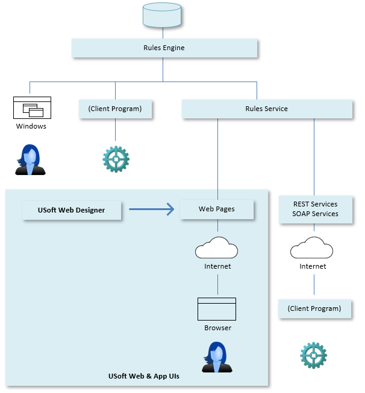

# Introducing USoft Web and App UIs

The USoft platform includes the possibility to realise data-intensive web user interfaces for interaction with humans. These interfaces are essentially **web pages** that enable users to query and manipulate business data in a browser.

USoft solutions have the distinctive feature of systematically interposing a functional software layer between the web application and the data. This layer implements (enforces) business rules and is referred to as the **Rules Engine**.

In web solutions, as opposed to non-web solutions, the Rules Engine is systematically served by a technical connectivity layer referred to as a **Rules Service**.

USoft delivers an open but integrated solution for the development and maintenance of web user interfaces complete with data storage, validation of all types of business rules, and generation of default interactive web pages to add, change, and search data. Connections between browsers and databases are set up automatically. The Rules Engine drives the application, and determines the best location to validate data, database calls, and the processing of business rules.

USoft web pages are developed in the Web Designer tool which is an integral part of the USoft platform.

Web Designer takes full advantage of the business logic laid down in the rules repository and builds web pages on top of this logic. Unlike other graphical web design tools, that know little or knothing about the structure of the data in the database and the business rules governing that data:

- At design time, Web Designer elegantly re-uses business logic to offer rich default web pages automatically.
- At runtime, web pages built with Web Designer connect with the rules engine, not directly with the database. Business logic is not locked inside the web application, so that it may be re-used by non-Web clients and by non-interactive Web clients (such as Web services and REST interfaces).

With Web Designer, maintenance becomes a process of rapid iterative development. Thousands of intricately interlinked rules are handled with ease, away from the concerns of web page look-and-feel.