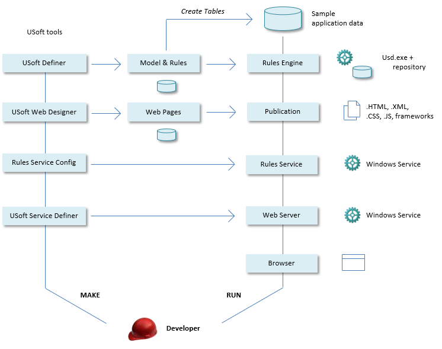

# Understanding the Development environment

This help topic helps you understand the Development environment for USoft Web Designer that you have created in the previous help topic.  

As a developer of a USoft web application:

**You create a data model and rules.**

- You use USoft Definer to create a data model and rules.
- You do this by defining such as objects as Tables, Columns and Relationships, Constraints and Batch Jobs.
- The result is a Rules Engine: a database that implements data integrity rules in reaction to a user's data manipulation operations.
- In Development, a Rules Engine runs from repository, so you don't need to generate a new flat file each time you make a change in the data model or rules.

- If you make changes that impact on the RDBMS, you must remember to re-run USoft's Create Table feature so that these changes are propagated to the RDBMS in Development. This applies only to certain changes in Tables, Columns and Domains, such as a table rename or the action of setting a column to NOT NULL (Mandatory = Yes).

**You design web pages.**

- You use USoft Web Designer to design, and then publish, web pages that allow user interaction with the Rules Engine.
- Each time you open Web Designer, an entire set of default pages based on the USoft Definer data model is ready for you to edit.
- If you make changes to the data model and rules, you must remember to re-open the Web Designer for your next design session, in order to get these changes to propagate to Web Designer's system of default pages.

**You configure and run a Rules Service.**

- The Rules Service is a Windows Service that connects the web server with the Rules Engine.
- You use USoft Rules Service Configurator to install, configure and start a Rules Service.
- If you make changes to the underlying data model, rules or web pages, you must restart the Rules Service. This is a single-click action: press the Restart button in the Rules Service configuration wizard.

**You define, install, configure and run a USoft web server.**

- You use USoft Service Definer to define, install and start a web server implemented as a Windows Service.
- The job of this service is to direct browsers from a set of surface web pages to underlying functionality: in this case, to a USoft Rules Service, that you have identified when defining the USoft web server.

- From the point of view of regular Web Designer development, creating the USoft web server is a one-time action. You do not need to restart this web server each time there are underlying changes. The web service notices timestamp differences and reads the new version of a web page that has modifications.

**You use a browser to test your development work.**

- If you have JavaScript changes, you may need to refresh the browser cache.

 