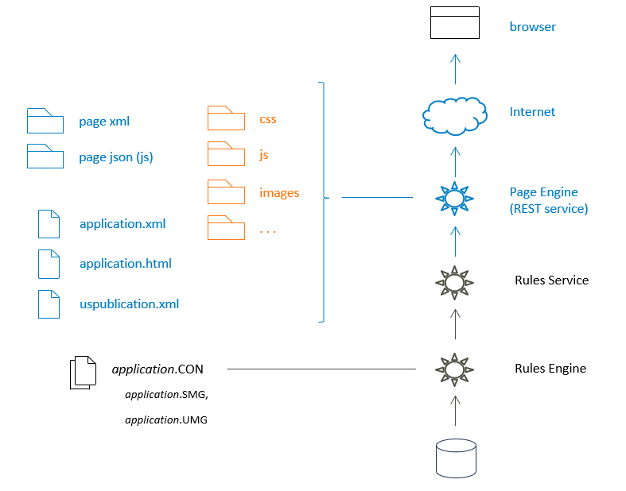
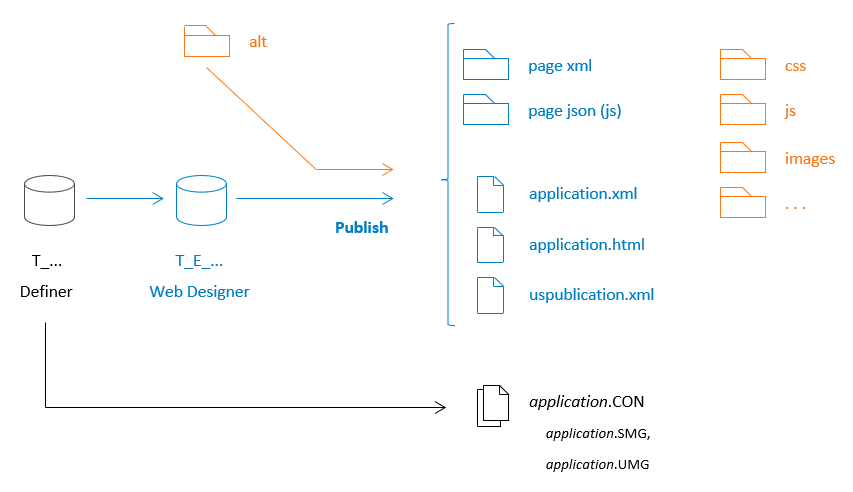

# Understanding the runtime technology stack

## Technology stack

A USoft interactive web application is made up of multiple layers of technology:

USoft interactive web application, technology stackIn *any kind of* USoft application, data are central. Anytime a user interacts with data, the **Rules Engine** is a broker that applies business rules to the data on behalf of the user. The workings of a Rules Engine are stored in a binary file generated from the USoft Definer tool and called “*application.*CON”. Additionally, for localisation, optional .SMG and .UMG files may provide translations of system messages and other end-user-facing text.

In each USoft *web* application (browser-based, REST API...) the Rules Engine is served by a **Rules Service.** You can configure Rules Services from USoft Binder or, programmatically, by editing Rules Service configuration files directly, or by using the USoft Blend scripting framework or Powershell scripts, or by a combination of both.

In *interactive* (page-based, browser-based) USoft web applications, if you choose to implement the GUI in USoft, then a **Page Engine** serves the end user GUI as pages that allow the user to interact with the Rules Engine by connecting with a Rules Service. The Page Engine is technically a REST service created with the USoft Service Definer tool.

In order to send and catch correct data query and data manipulation requests and responses from interactive web pages to and from the Rules Service, the Page Engine uses a collection of various files and folders placed in the file system of the web server.

Some of these files and folders (shown in a blue colour in the picture) are concerned primarily with data interaction. Thus, *page XML* and *page JSON* files hold information such as fields that a web page user can fill out, and how these fields map to columns in the database governed by the Rules Engine. Mostly, this functionality is generated from the USoft repository as metadata, but a small number of technical files is responsible for a thin HTMLJS wrapper that translate the data-oriented functionality to what a browser understands. The files and folders shown in blue are generated from the USoft Web Designer tool when you call Publish. Apart from the bootstrap HTML/JS, the web server does not supply HTML code directly; instead, the client browser produces all the required page-specific HTML code by executing layers of JavaScript against the delivered XML/JSON and by combining the output with CSS settings for visual styling.

USoft web applications are published on a standard web server. They are embedded in conventional .CSS and .JS technology. This allows USoft developers to style and customise web pages any way they see fit, and to include designed images, artwork and media. The files and folders shown in an orange colour in the picture are responsible for these non-USoft-specific additions. The intended use is that you register any such file-based additions in a folder referenced by Web Designer as being the **\\alt** folder or Alternative Template Folder. This ensures that Web Designer publishes a copy of these materials each time you call Publish.

Whenever the client requests a new page, the web server supplies the XML file and the JSON file for that page. These descriptions can be interpreted by the client browser without further conversion. This allows developers to execute and debug scripts painted on the page with ease, because this type of processing is done completely within the client browser. Browser debug facilities such as breakpoints are available for debugging page-level behavior.

Page JSON is cached on the client. On a second navigation to the same page, the definition is extracted from the cache and re-used. This reduces the network load and improves the performance.

## Publication process

The deliverables for USoft interactive web applications come from 3 sources:

- A datalogical layer (shown in black in the picture below) contained in the *application*.CON* file.*
- A core web UI layer (shown in blue in the picture below) ensuring correct input-output between Page Engine and Rules Service.
- An additional UI layer (shown in orange in the picture below) of file-based deliverables added at web server file system level.

USoft interactive web application, publication processThe datalogical layer is defined in the USoft Definer tool. This is the definition of the Rules Engine. This functionality is stored in repository tables starting with T_…, such as T_TABLE and T_CONSTRAINT. When you run Definer's "Generate flat files”, this generates an *application.*CON binary file for delivery.

The core web UI layer is defined in the USoft Web Designer tool. This is the definition of the Page Engine. This functionality is stored in repository tables starting with T_E_…, such as T_E_TYPE. When you run Web Designer’s "Publish”, this generates the files and folders shown in blue in the picture for delivery.

The additional UI layer (.CSS, custom .JS, images, media...) are added by Web Designer each time you run “Publish” on condition that you place these deliverables in the **\\alt** directory registered in Web Designer as being the “Alternative Template Folder”.

The picture visualises that the material offered by Web Designer is part derived from definitions made in Definer. This applies to data model definitions. When you make data model changes in Definer, you need to restart Web Designer so that these changes become available to Web Designer.