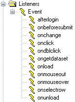

# Events and event listeners

This article discusses event handling in USoft web applications.

## Events and event types

If a user does something in a web page, an *event* takes place. Each event is of a specific *event type*. For example, an event takes place:

- When the user clicks or double-clicks an object (this event is of the **onclick** or **ondblclick** event type).
- When the user presses a key over an object (this event is of the **onkeypress** event type).
- When the user moves the mouse over an object (this event isof the **onmouseover** event type).
- After the browser has finished loading a web page (this event is of the **onload** event type).

## Event handlers

An *event handler* is a piece of software code that executes when an event of a given type occurs within the *scope* or *context* for which the event handler is defined ("where it is placed”).

A well-known example is an **onclick** event handler placed on a button control. This event handler executes when the user clicks that button, but not when he clicks a different button.

It is common for many event handlers, for example those of the **onclick** type, to be placed on a specific control in this way. However, you can place event handlers at much less specific levels, for example at the Page level, where an **onclick** handler would execute each time the user clicks anywhere in the page.

Some event types apply only in the context of a specific type of object. For example, the USoft-specific **getdataset** event type applies forceably to a data source.

## Event types supported

In USoft, you can create event handlers for any of the W3C standard HTML event types.

> [!WARNING]
> The **onbeforesubmit** event type****is the only exception: USoft does not post any forms in pages, and therefore event handlers of this type would never trigger. USoft adds a number of USoft-specific event types.

For information on W3C standard event types, see

```
http://www.w3.org
```

USoft adds event types of its own, as well as USoft-specific implementations of certain standard event types. Go to [UDB events](/docs/Web_and_app_UIs/UDB_Events).

> [!WARNING]
> The **onload** standard event type is not typically applied in USoft 10 applications anymore. With the advent of Ajax technology, pages load much less frequently than in the past. Prefer the USoft-specific [dataset](/docs/Web_and_app_UIs/UDB_Events/dataset.md)****event type.

Finally, you can also define additional event types of your own, and explicitly trigger events of that type by using the **handleEvent()** function.

You can refer to event type names case-insensitively. It is common for event type names to appear in all-lowercase spelling.

## Event listener objects

In a USoft web application, you implement event handling by inserting **event listener** objects that contain **actions**. The place in the object tree where you insert the event listener determines the scope (the context) of the event handling.

### Event listeners in catalog

For your convenience, the Web Designer catalog contains a number of ready-to-use event listeners:



You can create further event listeners as needed. To do this, right-mouse-click the Event node and choose New. Open the new event listener, rename it, and set its Event Type property to the event type you want to handle.

### How to insert an event listener in your web page

To insert an event listener:

1. From the catalog, open the page class where you want to handle the event.

2. In the object tree, select the object in the context of which you want to handle a given event type. For example, you could click on a button with the purpose of handling the **onclick** event type on that button.

> [!TIP]
> Be careful to select an object that makes sense for the event type. The USoft-specific **dataset** and **rowselect** events, for example, usually apply to specific data source objects. They could apply to the page as a whole, but not to other object types.

3. Choose Insert, EventListener from the menu. Alternatively, drag an Event Listener object from the Controls tab of the catalog (picture above).

4. For the inserted EventListener object, make sure the Event Type property is set to the (HTML) event type you want to handle.

5. Now insert one or more Action objects into the EventListener object. Do this via Insert, Action in the menu, or by dragging Action objects from the catalog.

> [!WARNING]
> If you attach multiple actions to an event listener, the second and subsequent actions will be performed regardless of whether the first action was successful. Because of this, a Next button with an onclick event handler that performs **commit()** followed by **navigateTo()** within the same event listener is bad design. If the commit fails because of invalid data, the user will navigate away and not get the chance to make any corrections, and the transaction will be lost.

## Custom events

In addition to the USoft predefined events, you can create custom events. You must set, trigger and remove these custom events yourself, using the appropriate **.on()**, **.off()** and **.trigger()** functions. Options can be passed to custom events by using the *options* parameter in the same way as with predefined events. In the following examples, a custom event called "myevent" is used.

*Example 1*

```js
$("#input").on("myevent", function(evt, options) {
  alert("This is a custom event on a UI element"); 
});

$("#input").trigger("myevent");
$("#input").off("myevent");
```

*Example 2*

```js
$.udb.on("myevent", function(evt, options) {
  alert("This is a custom event on the $.udb object"); 
});

$.udb.trigger("myevent");
$.udb.off("myevent");
```

*Example 3*

```js
$.udb("EMP").on("myevent", function(evt, options) {
  alert("This is a custom event on the EMP data source"); 
});

$.udb("EMP").trigger("myevent");
$.udb("EMP").off("myevent");
```