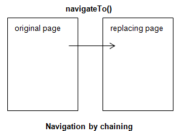

# Page chaining

Page chaining is a manner of realizing page navigation in Web Designer. The user is enabled to navigate directly from page A to page B. During navigation, data from page A is automatically carried over to page B. At any later time, data from page A are no longer available for B to refer to. This contrasts with page stacking.

> [!WARNING]
> **Edit** values are automatically carried over in this way, but **Search** values are not. To reproduce Search values from page A in page B, you need to write code that loops over them. An example is in
>  

Page chaining occurs when an element in the original page A uses **navigateTo()** to navigate to the replacing page B:

For each data source in B that has the same name as a data source in A, that data is carried over from A to B during navigation.