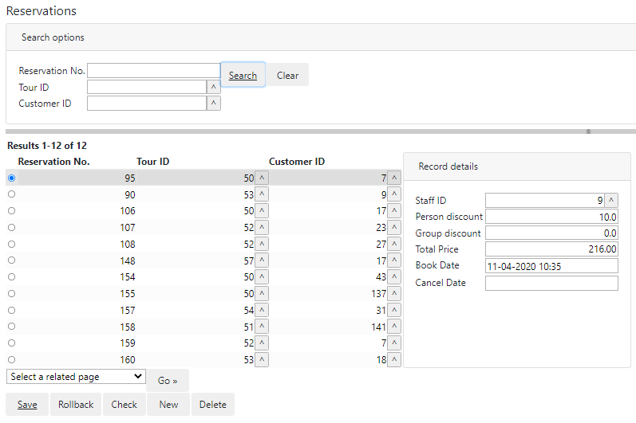
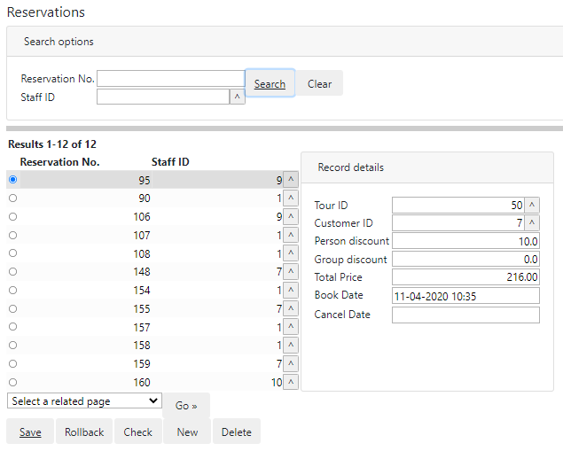

# Pattern 1: Single-record and multi-record areas

In this design pattern, some columns are displayed in a **multi-record** grid on the left, and other columns are displayed in a **single-record** side pane on the right. The side pane shows only information about the record that is currently selected in the grid.

The USoft default uses this design pattern. In the USoft default, key columns are in the grid and remaining columns are in the side pane. The columns in the grid also appear (this time, in a single-record display) in a Search area at the top. This enables users to query data by key values.

You can easily re-distribute columns across these areas to your liking. In USoft Definer, set **In Display Selection** for the columns, then re-start Web Designer, then re-publish.

In this article, we’ll first show you the USoft default. Then, we’ll show the effect of In Display Selection.

## USoft default

If you have the following column settings in USoft Definer:

|**Column prompt**|**Key** |**In Display Selection**|
|--------|--------|--------|
|Reservation No.|1       |(null)  |
|Tour ID |2       |(null)  |
|Customer ID|2       |(null)  |
|Staff ID|No      |(null)  |
|...     |...     |...     |

you get a display where Reservation No., Tour ID and Customer ID are displayed in the grid and in the Search area, and the remaining columns are in the side pane:

## In Display Selection

If you have the following column settings in USoft Definer:

|**Column prompt**|**Key** |**In Display Selection**|
|--------|--------|--------|
|Reservation No.|1       |**10**  |
|Tour ID |2       |(null)  |
|Customer ID|2       |(null)  |
|Staff ID|No      |**20**  |
|...     |...     |...     |

you get a display where Reservation No. and Staff ID are displayed in the grid and in the Search area, and the remaining columns are in the side pane. The values of In Display Selection are sequence numbers. Because Reservation No. has a lower value than Staff ID, Reservation No. is displayed first, and Staff ID is displayed second:

 